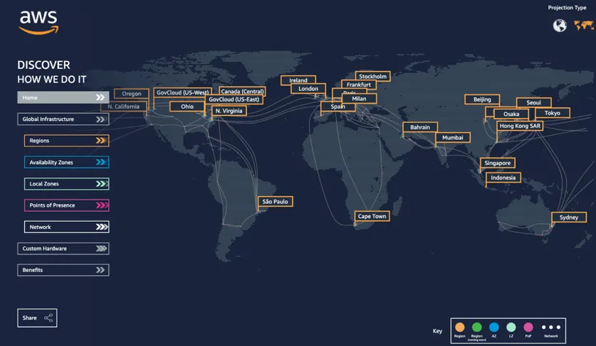

# 1. AWS Introduction

*AWS*

## AWS

> #### Amazon Web Services

#### AWS는 클라우드를 제공한다

#### 사용자의 요구에 따른 서버 또는 서비스를 제공한다

- 덕분에 웹사이트 운영을 소수의 개발자로 운영을 할 수 있도록 만들어 주었다

#### 아마존, 넷플릭스 같은 큰 기업의 웹 사이트에 도움을 주고 있다

#### AWS는 복잡하고, 확장이 가능한 애플리케이션을 만들 수 있도록 도와준다

#### 다양한 산업에서 사용이 될 수 있다

- IT 산업, 백업 및 저장소, 빅 데이터 분석
- 웹 사이트 배포, 모바일 또는 소셜 어플리케이션
- 게임 (게임 서버를 클라우드에서 실행 시키는 것)

## AWS Global Infrastructure

> #### AWS를 사용 함으로써, 어플리케이션을 전 세계 사람들이 사용할 수 있도록 만들 수 있다

### AWS Regions

-  `AWS Regions`으로 먼저 나뉜다
- Regions는 데이터 센터들의 클러스터 (무리) 
-  `AWS Regions`는 전 세계에 있고, 지역마다 이름을 붙여놨다
  - 예) us-east-1, eu-west-3
- Regions, 즉 AWS 지역들은, 지역들끼리 네트워크로 연결이 되어 있다
  - 여기서  `AWS Regions`는 AWS가 소유한 네트워크다
- 어느 지역을 선택했느냐에 따라, 서비스에 영향을 미칠 수 있다

#### AWS Region을 선택할 때 고려해야 하는 사항

- **데이터 관련한 국가의 법**
  - 국가마다 데이터에 관련해서 법이 다르다
  - 어떤 국가는, 국가의 허락 없이 데이터를 다른 국가에 보낼 수 없다
    - 예) 만약 한국 법에 의해 데이터를 한국 내에서만 사용 할 수 있다면, 어플리케이션을 만들고, AWS를 사용할 때에  `AWS Region`을 서울로 선택해야 한다
- **어플리케이션 이용자**
  -   `AWS Region`을 선택할 때에, 다수의 이용자들이 어느 지역에 머물고 있는지 확인해야 한다
  - 데이터 센터, 즉  `AWS Region`을 통해 선택한 지역과 가까울 수록, 대기 시간이 줄어들 수 있다
    - 예) 한국에서 어플리케이션을 출시하는데, 미국에 있는 `AWS Region`을 선택하면, 어플리케이션을 사용하는 시간이 오래 걸릴 수 있다
- **AWS이 제공하는 서비스가 해당 지역에 있는지 확인해야 한다**
  - 각 `AWS Region`마다 같은 서비스, 또는 최신화된 서비스를 갖춘 것이 아니다
  - 서비스는 조금씩 다를 수도 있고, 최신화된 서비스를 업데이트하는 시간이 각 지역마다 다를 수 있다
- **가격**
  - 지역마다 가격이 다르다
  - 다른 지역의 가격이 더 괜찮으면, 어플리케이션 성능을 포기하더라도, 다른 지역의 데이터 베이스를 사용할 수도 있다

### AWS Availability Zones / AWS Data Centers

- `AWS Availability Zones`은 하나의 `AWS Region`을 만들어 낸다
  - 위에 us-west-1이라는 `AWS Region`이 있다
  - us-west-1 에는 us-west-1a / us-west-1b / us-west-1c 로 나뉘어진 실제 데이터 센터가 있고, 이것을 `AWS Availability Zone`이라고 한다
- `AWS Availability Zones`는 최소 3개, 그리고 최대 6개의 데이터 센터를 가지고 있을 수 있다
- 그리고 이 데이터 센터들은 높은 대역폭과 초저시간 네트워킹에 연결되어 있다
- 이렇게 데이터 센터들을 나눈 이유는 재난을 피하기 위함이다
  - 하나의 데이터 센터에 재난이 일어나도, 다른 데이터 센터에는 데이터들이 남아있다

### AWS Edge Locations (Points of Presence)

- Amazon은 216개의 주둔지 (Points of Presence)가 있다
  - 이 216개의 주둔지는 42개국의 84개의 도시들 안에 있다
