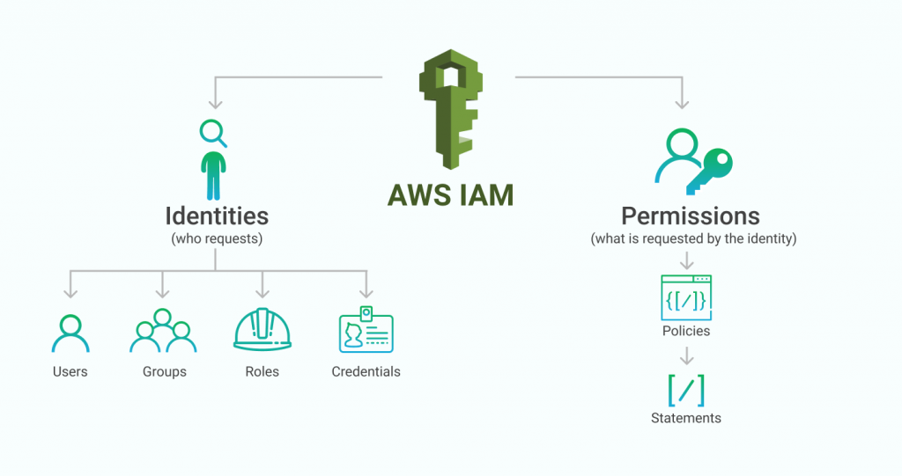
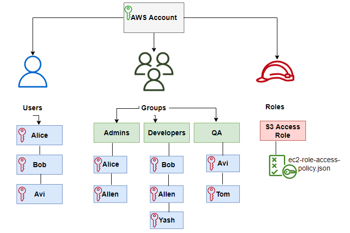
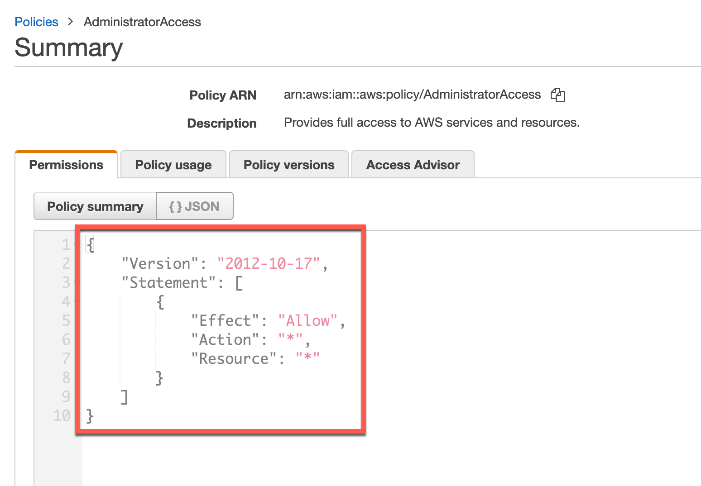
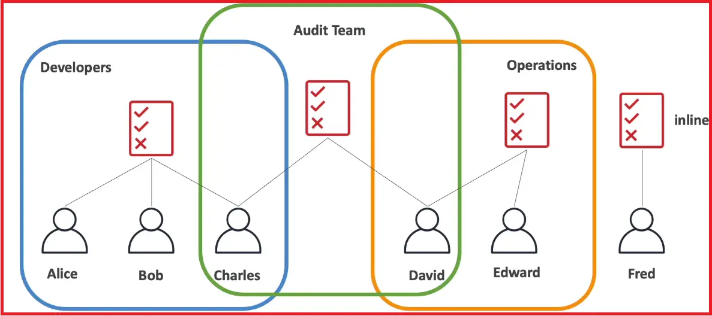
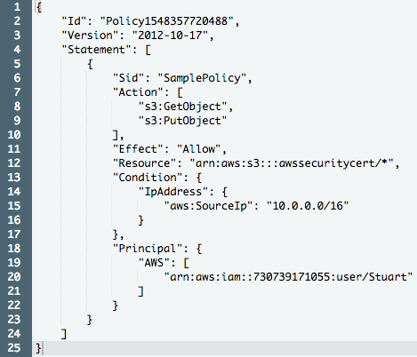

# 2. AWS IAM / CLI

*AWS*

## IAM

> ### Identity and Access Management
>
> #### 글로벌 서비스로, 모든 Region에서 사용을 할 수 있다

### Root Account, Users, Groups

- **Root Account**

  - 최고 관리자라고 생각하면 된다
  - 모든 권한은 Root Account에 있고, Root Account에서 Users 또는 Groups를 만들 수 있다

  

- **Users**

  - 단체 내에 속한 사람들이다
  - 유저들은 그룹으로 나뉠 수 있거나, 안 그래도 된다
  - 유저들이 복수 그룹 안에 들어가는 것은 가능하다

  

- **Groups**

  - 유저들이 포함되어 있다
  - 그룹 안에 그룹이 존재하는 것은 불가능 하다

### IAM : Permissions

- **사용자 또는 그룹의 권한을 정의하는 것이다**
- 유저나 그룹은 policies (정책)이라는 JSON 문서가 주어진다 (위의 그림)
- **Policies (정책)은 유저들의 권한을 정의해준다**
  - 어떤 기능을 사용할 수 있는지 표기해준다
  - 위 같은 경우 Action : "*" 으로 모든 기능을 사용할 수 있는 것이다
- 유저들에게 특정 기능, 즉 유저들이 정말 필요한 최소한의 기능만 사용할 수 있도록 한다
  - 모든 유저들이 모든 기능을 사용할 수 있으면, 비효율적으로 많은 비용이 들어갈 것이다

### IAM Policies Inheritance

- **정책들은 유저들이 속한 Group 내의 정책을 통해 유저들에게 상속할 수 있다**
- 또는 유저에게 따로 정책을 주어질 수 이다
  - User 개인에게만 주어지는 policy를 **Inline Policy**라고 한다

### IAM Policies Structure

- **ID** : 정책 확인자 (Option)
- **Version** : 정책 언어 (항상 2012-10-17을 포함)
- **Statement** : 한개 이상의 독립적인 내용 (필수)
  - **Sid** : Statement의 ID (Option)
  - **Effect** : 내용에서 접근을 허용하는 유무 (Allow, Deny)
  - **Principal** : 이 정책을 사용하는 account/user/role
  - **Action** : 해당 정책에서 허용 또는 거절되는 actions의 리스트
  - **Resource** : 해당 actions들이 적용되는 자원들의 리스트
  - **Condition** : 정책이 시행되는 컨디션 (옵션)

### IAM - Security

- **Password Policy**
  - 비밀번호를 설정할 때에 더 강력한 비밀번호를 만들 수 있도록 정책을 바꾼다
  - 실제로 AWS에서 user를 생성할 때 비밀번호 생성 설정을 조작할 수 있다

- **MFA (Multi Factor Authentication) - 2단계 인증**
  - 비밀번호가 탈취되더라도, 2단계 인증을 통해, 보안을 더 강화시킬 수 있다
  - 핸드폰 같은 기기를 통해 2단계 인증을 하면 된다
    - 여기서 기기가, 개인의 것이어야 한다

### User들이 AWS를 접속하는 방법

- **AWS Management Console**

  - AWS 사이트를 직접 이용하는 것이다
  - 비밀번호와 MFA를 통해 보호된다

  

- **AWS Command Line Interface (CLI)**

  - CLI, 터미널을 이용하여 AWS을 이용한다
  - access key를 통해 보호를 받는다
    - access key는 AWS 콘솔에서 제공이 되고, 유저들이 직접 access key를 관리한다
    - access key와 secret access key는 타인에게 공유가 되면 안 된다

- **AWS Software Developer Kit (SDK)**
  - AWS에서 직접 만든 터미널
  - access key를 통해 보호를 받는다

### IAM Roles

- AWS 서비스에 권한을 부여하는 것이다
  - 즉 AWS 서비스에 permissions를 부여하는 것

### IAM Security Tools

- **IAM Credential Report (account-level)**
  - Root-account에서만 볼 수 있는 것이다
  - 모든 유저들에 대한 정보를 볼 수 있다

- **IAM Access Advisor (User-level)**
  - 유저들이 어떤 권한이 주어졌는지, 또는 언제 서비스에 접근했는지에 대한 데이터를 보여준다
  - 이 정보를 통해, policies에 대한 것을 복습할 수 있다

### Summary

- **USERS** : 회사가 있으면, 회사의 직원들이 만들고 사용할 수 있는 계정 (Root-account를 회사라고 생각)
- **GROUPS** : 그룹에는 User들만 존재한다
- **POLICIES** : 그룹 또는 유저들에게 권한을 주는데 필요한, JSON 문서다 (권한을 정리한 문서)
- **ROLES** : 서비스의 권한을 주기 위해서는, AWS 서비스에서 AWS Roles를 생성해야 한다
  - 예) EC2 인스턴스를 생성하기 위함
- **SECURITY** : 비밀번호도 강력하면 좋지만, 2단계 인증 (MFA)도 추가로 사용하는 것을 권장
- **ACCESS KEYS** : CLI 또는 SDK를 사용하기 위해 필요한 키다
- **AUDIT** : IAM Credential Report / IAM Access Advisor

