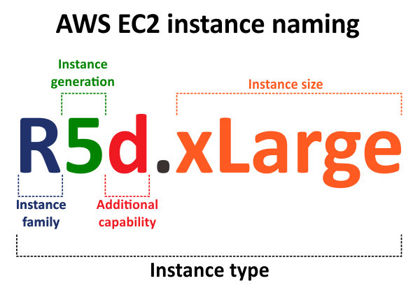
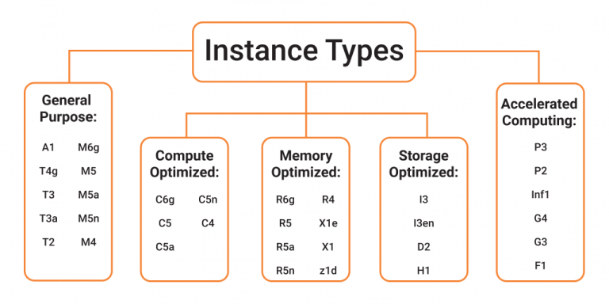
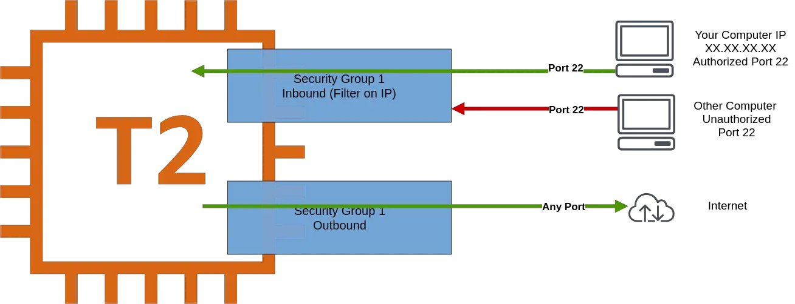
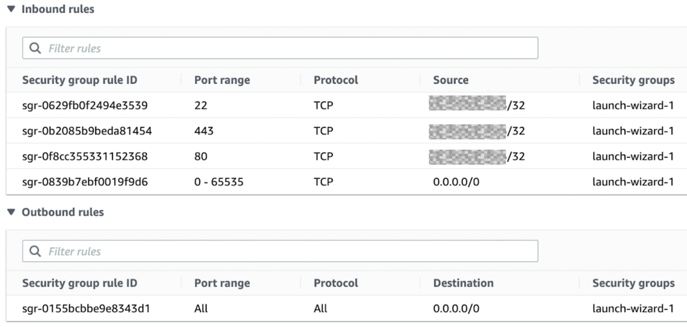

# 3. AWS EC2 기초

*AWS*

## EC2 (Elastic Compute Cloud)

> #### 서비스로 인프라를 작업하는 방법
>
> #### 인스턴스
>
> - 컴퓨터 한 대라고 생각을 하면 된다
> - 인스턴스의 갯수에 따라 컴퓨터 갯수가 정해진다

#### EC2는 해당 기능들을 포함하고 있다

- **EC2** : 가상으로 기기를 빌려주는 것
- **EBS (Elastic Block Storage)** : 데이터를 가상 드라이브에 저장하는 것
- **ELB (Elastic Load Balancer)** : 어플리케이션 트래픽을 자동으로 분산해준다
- **ASG (Auto-Scaling Group)** : 사용자 정의 정책, 상태 확인 및 일정에 따라 EC2 인스턴스를 자동으로 시작하거나 종료한다

#### EC2 사이징과 환경 설정 옵션

> 어플리케이션에 적합한 EC2 인스턴스를 선택할 수 있다 / 주문형 클라우드
>
> 즉, AWS에서 한번에 주문형 클라우드, 즉 가상 저장소를 쉽고 빠르게 만들 수 있다

- EC2 인스턴스로 선택할 수 있는 응용 체제는 Linux, Window 또는 Mac OS가 있다
- 가상 컴퓨터의 CPU를 설정할 수 있다
- 가상 컴퓨터의 메모리, RAM을 설정할 수 있다
- 저장 공간을 선택할 수 있다
  - 네트워크와 연결된 저장소 (EBS & EFS)
  - 하드웨어로 연결된 저장소 (EC2 인스턴스 저장)
- 네트워크 카드 : 속도, 공공 IP 주소
- Firewall rules : **Security Group**
- Bootstrap Script (처음 실행할 때 확인) : **EC2 User Data**
  - Bootstrap : 기계가 시작할 때에, 명령을 실행하는 것

### EC2 User Data

- 인스턴스가 시작할 때만 Bootstrap Script가 작동한다
- EC2 User Data는 부팅 테스크 (Boot Task)를 자동화 할 수 있다
  - 업데이트를 다운 받을 수 있다
  - 소프트웨어 다운로드를 받을 수 있다
  - 인터넷에서 명령 파일을 다운로드 받을 수 있다, 등
- EC2 User Data Script는 루트 유저만 작동 할 수 있다

### EC2 인스턴스 종류

- **R** : 인스턴스 클래스다 (일반 목적의 인스턴스)
- **5** : 세대 (AWS는 계속 인스턴스를 업데이트 시킨다)
- **d** : 추가적인 기능
- **xLarge** : 인스턴스 클래스 안의 사이즈
  - size가 클 수록 기능적인 면에서 더 좋을 것이다

#### EC2 인스턴스 종류 - General Purpose

- 웹 서버 또는 코드 저장소 같은 다양한 작접량을 처리할 때 유용한 EC2 인스턴스다
- Compute, Memory, Networking 간에 균형이 잡힌 인스턴스다

#### EC2 인스턴스 종류 - Compute Optimized

- 고성능 프로세서가 필요할 때에 사용되는 인스턴스다
  - 일괄 처리 작업량
  - 고성능 웹 서버
  - 고성능 컴퓨팅 (HPC)
  - 머신 러닝
  - 게임 등
- 주로 Compute Optimized 인스턴스는 C로 시작한다

#### EC2 인스턴스 종류 - Memory Optimized

- 굉장히 많은 양의 데이터를 처리할 때 Memory Optimized 인스턴스가 좋다
  - 고성능, 관계형, 비관계형 데이터 베이스
  - Distributed web scale cache stores
  - BI (Business Intelligence)에 적합한 인메모리 데이터 베이스
  - 체계가 없는 실시간 빅데이터
- Memory Optimized 인스턴스는 RAM의 앞 부분을 따서 R로 많이 시작하지만, 그보다 더 높은 메모리를 사용할 수 있는, X와 Z도 있다

#### EC2 인스턴스 종류 - Storage Optimized

- 로컬 저장소의 많은 데이터를 접근할 때 유용하다
  - 고주파 온라인 거래 프로세싱 (OLTP, Online Transaction Processing)
  - 관계형 & NoSQL 데이터베이스
  - 인메모리 데이터베이스을 위한 캐싱 (Redis)
  - 데이터 창고 어플리케이션
  - 파일 분산 시스템
- I, D, H로 주로 시작한다

## Security Groups

> #### Security Groups는 AWS의 네트워크 보안의 기본이다
>
> #### EC2 인스턴스들에 누가 들어오고, 나가는지, 트래픽을 통제한다
>
> #### 허용 규칙만 존재해서, 무엇이 허용되고, 안 되는지 쉽게 알 수 있다

#### Inbound : 외부에서 EC2 인스턴스를 접속하는 것이다

- 외부에서 EC2 인스턴스를 접속하기 위해서는, 최소한으로 방화벽이 열려있어야 한다
  - 즉, 허용된 외부의 컴퓨터만이 EC2 인스턴스를 접속하게 만들어야, 보안상 더 안전하다
- **port : 22**  -  SSH 라고하는 통신을 위해서 필요하다
- **port : 80 (HTTP)**  - 웹을 위해 통신을 하는 것이고, 0.0.0.0/0 으로 설정하면, 웹을 통해서, 누구나 EC2 인스턴스를 접속할 수 있다
  - 그 외에 허용 범위를 지정할 수 있다

#### Outbound : EC2 인스턴스가 외부에 접속하는 것이다

- EC2 인스턴스는 모든 외부와 접속을 할 수 있다

#### Security Groups의 규칙은 IP 주소, 또는 보안 그룹에 따라 참조될 수 있다

- 포트 접속을 조절한다
- IP 주소 범위에 따라 조절할 수 있다 - IPv4과 IPv6
- 인바운드 네트워크 또는 아웃바운드 네트워크를 조절 할 수 있다

#### 알아두면 좋은 것

- Security Groups는 다수의 인스턴스에 포함될 수 있다
- 지역을 바꿀 경우, 새 보안 그룹을 만들거나, 또 다른 VPC를 만들어야 한다
- SSH 접속을 할 때에 독립된 security group을 유지하는 것이 좋다
- 어플리케이션에 접속이 안 될 때, 특히 Time Out이 걸리면 Security Group에 문제가 있는 것이다
- 어플리케이션이 connection refused 에러를 주면, 어플리케이션 에러나 또는 실행이 아직 안 됬다는 것이다
- Inbound 트래픽은 기본적으로 모두 차단이 되어 있다
- Outbound 트래픽은 모두 기본적으로 허용이 되어 있다

#### 기본 포트

- 22 = SSH (Secure Shell)  -  리눅스 인스턴스에 로그인이 된다
- 21 = FTP (File Transfer Protocol)  -  파일을 File Share에 업로드 한다
- 22 = SFTP (Secure File Transfer Protocol)  -  파일을 업로드할 때 SSH를 사용한다
- 80 = HTTP  -  보안이 안 된 웹 사이트에 접속을 한다
- 443 = HTTPS  -  보안이 된 웹 사이트에 접속을 한다
- 3389 = RDP (Remote Desktop Protocol)

## 요금에 대해

### On-Demand Instances (온디맨드)

> 예시) 호텔에 언제든 가서 지내거나, 언제는 나올 수 있다 / 대신 원래 가격에서 돈을 지불해야 한다

- 사용한만큼 돈을 지불하는 것이다
  - 운영체제, 지역에 따라 비용이 다르다
- 제일 비싸지만, 선불 결제가 없다
- 짧게 쓰거나, 언제든 취소를 하고 싶을 때에 사용할 수 있는 요금이다
- 단기의 갑작스럽거나 예측할 수 없는 작업량 그리고 중단되어서는 안 되는 어플리케이션에 유용할 수 있다

### Reserved - 1 & 3

> 예시) 호텔에 갈 계획을 미리 짜고, 오래 머문다는 과정하에 할인을 받는 것이다

- 온디멘드 요금보다 최대 72% 할인을 받을 수 있는 요금이다
- 특정 인스턴스 속성을 정한다 (예. 인스턴스 종료, 지역, OS, Tenancy)
- 예약 기간을 명시한다 (1년 또는 3년)
  - 기간에 따라, 더 많은 할인을 받을 수 있다
- 요금 결제 방법에 따라 할인을 추가로 받을 수 있다 (선지급, 부분적 선지급, 후불)
- 인스턴스 범위를 지정한다 - Regional 또는 Zonal
- Reserved Instance 시장에서, 인스턴스를 사거나 팔 수 있다
- Convertible Reserved Instance : 특정 Reserved Instance
  - EC2 인스턴스 종류, OS, 범위, 임대기간을 바꿀 수 있다
  - 할인은 최대 66%다

### Savings Plans (절감형 플랜) - 1 & 3

>  예시) 호텔에서 특정 시간당 얼마를 내면서, 호텔 객실 어디서든 지낼 수 있는 것이다

- 장기간 사용량에 따라 할인을 받는 것이다 (Reserved Instance와 같이 최대 72% 할인을 받을 수 있다)
- 특정 종류를 사용할 것을 약속한다 ($10/hour for 1 or 3 years)
- EC2 Savings Plans 사용량을 초과할 경우, 초과한 사용량은 온디멘드 비용으로 처리한다
- 특정 인스턴스 Family 또는 AWS 지역에 묶여있다
- 자유로운 것
  - 인스턴스 크기 (ex. m5.xlarge, m5.2xlarge)
  - OS (ex. Linux, Windows)
  - Tenancy (Host, Dedicated, Default)

### Spot Instances (스팟 인스턴스)

> 예시) 호텔 객실을 경매로 방을 선택하게 만드는 것이다. 하지만 원래 선택했던 방에, 다른 사람이 더 높은 값을 부르면, 방을 빼야 한다

- 온디멘드 요금보다 최대 90% 할인을 받을 수 있는 요금이다
- 비용적인 측면에서 제일 효율성이 높다
- 최대 가격을 지정하는 것이라서, 최대 가격을 넘어갔을 경우, 넘어간 데이터는 모두 없어진다
- 실패에 회복력이 빠른 작업량에 도움이 된다
  - 일괄 작업
  - 데이터 분석
  - 이미지 프로세싱
  - 시작과 끝이 유연한 작업량
- 중요한 작업 또는 데이터베이스를 다룰 때에는 어울리지 않는 요금이다

### Dedicated Hosts (전용 호스트)

> 예시) 호텔 전체를 빌리는 것이다

- 고객 전용의 물리적 EC2 서버다
- 타사의 소프트웨어 라이센스를 사용할 수 있어, 고객이 보유한 소프트웨어 라이센스르 사용할 수 있도록 한다
- 요금 정보
  - 온디맨드 / Reserved
- 제일 비싼 가격의 요금이다
- 복잡한 라이센스 모델을 가진 소프트웨어에 도움이 된다
- 강력한 규제 또는 규정 준수 요구 사항이 있는 기업에 도움이 된다

### Dedicated Instances

- 사용자 전용 하드웨어에서 실행되는 인스턴스다
- 하드웨어를 같은 계정의 다른 인스턴스들과 공유할 수 있다
- 하지만 인스턴스 배치에 대해, 제어권이 없다

### Capacity Reservations

> 예시) 특정 기간 동안 호텔 방을 원래 가격으로 빌린다. 호텔에 없어도 그 가격을 내야 한다.

- 온디맨드 인스턴스를 특정 Availability Zone에 시간 제한 없이 예약을 하는 것이다

- 항상 EC2 용량에 접근을 할 수 있다

- 언제든 예약을 하거나 취소할 수 있지만, 할인은 없다

- Regional Reserved Instances와 Savings Plans을 합쳐서 요금 할인을 받을 수 있다

- 인스턴스를 사용하든, 안 하든, 온디맨드 요금으로 청구가 된다

- 특정 Availability Zone에서 단기간 그리고 지속된 작업량에 좋을 수 있다

  

