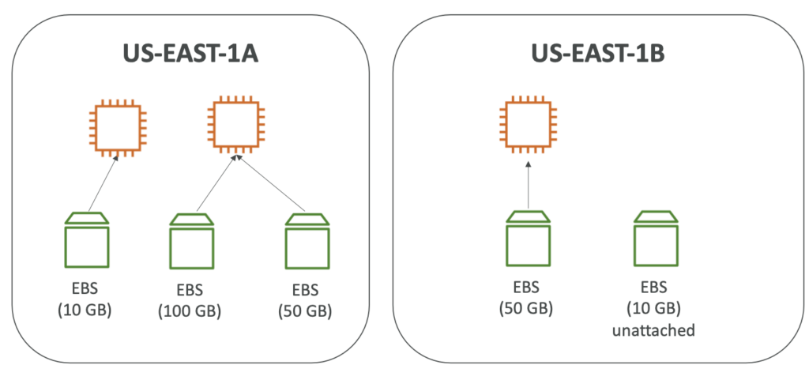
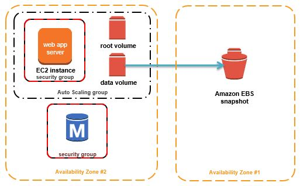
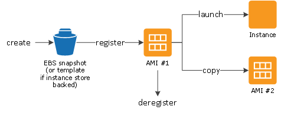
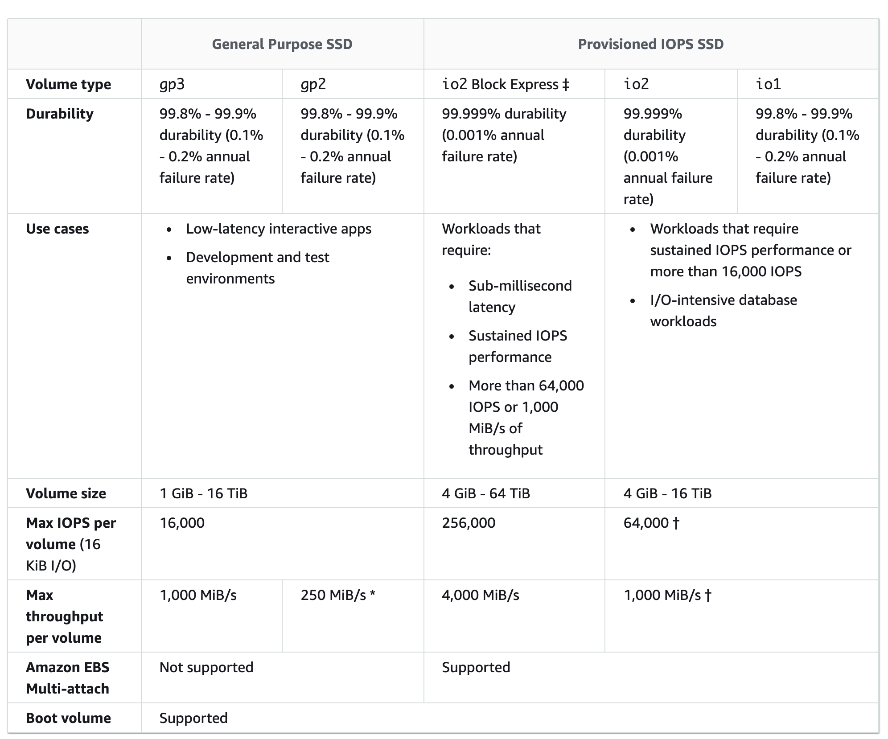
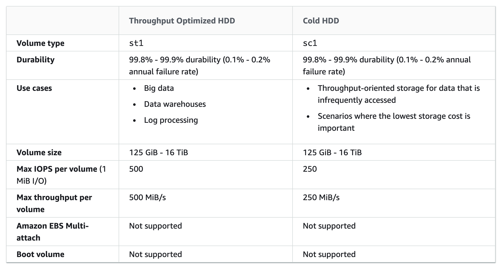

# 4. AWS EC2 인스턴스 저장소

*AWS*

## EBS Volume

> #### EBS (Elastic Block Store) Volume

#### EBS Volume은 인스턴스에 첨부할 수 있는 네트워크 드라이브다

- 네트워크의 USB라고 생각하면 된다
- 네트워크를 사용하여, 인스턴스와 연결을 할 때에 살짝의 지연시간이 발생할 수 있다
- Free Tier은 30GB의 General Purpose (SSD) 또는 Magnetic EBS 저장소를 사용할 수 있다

####  인스턴스가 없어지더라도, 인스턴스에서 생성했던 데이터를 유지시켜줄 수 있다

#### EBS Volume은 헌번에 하나의 인스턴스에 붙을 수 있다

- USB처럼 하나의 인스턴스에서 분리되고, 다른 인스턴스에 붙을 수 있다

#### 기본적으로, 특정 Availability Zone에 제한되어 있다

- us-east-1a 에서 생성된 EBS Volume은 us-east-1b 에서 사용될 수 없다
- 만약 다른 Availability Zone에서 사용하고 싶으면 **Snapshot (스냅샷)**을 해야 한다
  - Snapshot (스냅샷) : EBS Volume을 복제해서, 다른 AZ에서 사용하는 것이다

#### 저장 공간은 미리 설정을 해둬야 한다 (GB 사이즈 또는 Input/Output Operations Per Second/ IOPS)

- 미리 설정한 저장 공간에 따라 비용이 청구된다
- 드라이브의 용량은 늘릴 수 있다

## EBS - Delete on Termination attribute

> #### 연결되어 있는 인스턴스가 삭제되면, EBS Volume도 삭제 되는지, 유지 되는지 설정을 할 수 있다
>
> #### On으로 설정하면, 연결되어 있는 인스턴스가 삭제되면 EBS Volume도 삭제 된다

#### AWS 콘솔 또는 CLI에서 조작을 할 수 있다

- **root EBS Volume**의 디폴트는 **Delete on Termination**이 활성화 되어 있다
- 그 외에 디폴트 값은 **Delete on Termination**이 비활성화 되어 있다
  - 즉 인스턴스가 없어져도, 유지가 된다

## EBS Snapshots

#### EBS Volume의 백업을 만드는 것이다

- EBS Volume을 복제하는 것

#### volume을 떼고난 후 스냅샷을 하는 것을 권장한다

#### 스냅샷들은 다른 AZ 또는 Region에서 사용될 수 있다

- 다른 AZ 또는 Region에 스냅샷을 통해 저장하여, 재난을 피할 수 있다

### EBS Snapshot Archive (기록 보관소)

- 스냅샷을 **Archive Tier**로 옮기는 것이고, 75% 더 저렴하다
- 기록 보관소로 옮기는데 24시간에서 72시간이 걸린다 

### Recycle Bin for EBS Snapshots

- 스냅샷을 삭제하더라도, 특정 기간 내에 다시 복구할 수 있도록 따로 보관해준다
- 1일부터 1년까지, 보관 기간을 선택할 수 있다

### Fast Snapshot Restore (FSR)

- 초기치를 설정할 때에, 지연시간 없이 사용할 수 있도록 도와준다
  - 데이터가 많을 때 유용하다

## AMI

> #### AMI : Amazon Machine Image / AMI는 EC2 인스턴스를 작동시킨다
>
> 1. EC2 인스턴스를 만든다
> 2. 데이터 완정성을 위해 인스턴스를 중단시킨다
> 3. AMI를 만든다 - 이때 EBS 스냅샷도 생성된다
> 4. 인스턴스를 다른 AMI들을 통해 실행 한

#### AMI는 EC2 인스턴스의 맞춤화 (Customization)다 

- 개인의 소프트웨어, 환경 설정, OS, 모니터링 등을 추가할 수 있다
- 미리 만들어진 소프트웨어를 사용하는 것이라서, 부트 시간과 환경 설정을 더 빠르게 할 수 있다

#### AMI는 특정 Region을 위해 만들어 졌고, 다른 Region에 복사될 수 있따

#### EC2 인스턴스를 아래에 부터 실행할 수 있다

- **공공 AMI** : AWS 제공
- **개인의 AMI** : 개인이 만들고 유지를 한다
- **AWS Marketplace AMI** : 다른 사람이 만든 AMI를 사서 사용할 수 있다

## EC2 Instance Store

#### EBS volume들은 제한된 기능을 가진 네트워크 드라이브다

#### 즉, 고성능 하드웨어 디스크가 필요하다면 EC2 Instance Store를 사용한다

- 여기서 이 하드웨어 디스크들은 실제 물리 서버 (Physical Server)에 붙어 있다

#### 특징

- 입출력 (I/O) 성능이 뛰어나다
- EC2 Instance Store가 멈추면, 저장소를 잃어버린다
- 임시적인 컨텐츠, 캐시, 스크레치 데이터, 버퍼를 다루는 데이터에게는 좋을 수 있다
  - 하지만 하드웨어가 실패할 경우, 데이터를 잃어버릴 위험성이 있다
- 즉 백업이나 복제하는 것은 유저들의 몫이다

## EBS Volume 종류

> #### EBS Volume은 총 6개의 종류가 있다
>
> - gp2, gp3, io1, io2, st1, sc1
>
> #### EBS Volume은 크기, 처리량 (Throughput) 그리고 초당 입출력 작업량 (IOPS)를 따라 나눠진다
>
> #### gp2, gp3, io1, io2만 부팅 볼륨으로 사용될 수 있

### General Purpose (SSD) - gp2, gp3

- 가격면에서 효율적인 저장소고, 낮은 지연시간이 있다
- 다양한 작업량을 처리할 수 있다
- 시스템 부팅 볼륨, 가상 데스크톱, 개발과 테스트 환경을 위해 사용된다
- 1 GiB 에서 16 TiB 까지 사용할 수 있다
- **gp2**
  - 작은 gp2 용량은 3000 IOPS까지 burst된다
  - 용량들과 IOPS들은 **연결이 되어 있고**, 최대 IOPS는 16,000이다
  - 3개의 용량들이 있으면 한 개당 최대 5,334GB의 IOPS를 가질 수 있다
    - 5334 * 3 = 16,002

- **gp3**
  - 최신 General Purpose면서 3,000 IOPS와 125MiB/s의 처리량을 제공한다
  - 독립적으로 16,000 까지 IOPS를 증가시킬 수 있으면서, 1000 MiB/s 까지 처리량을 늘릴 수 있다
    - **연결되어 있지 않다**

### Provisioned IOPS (PIOPS) SSD - io1, io2

- 고성능 SSH 용량으로 더 높은 처리량과 더 낮은 지연시간이 필요로한 어플리케이션에 쓰인다
- 지속적인 IOPS 성능이 필요한 비즈니스 어플리케이션을 사용할 때 필요하다
- 데이터베이스에서 많은 작업량이 이루어질 때를 위해 설계가 되었다
- **EBS Multi-Attach를 제공한다**
- **io1 / io2 (4GiB - 16TiB)**
  - Nitro EC2 인스턴스의 최대 PIOPS는 64,000고, Nitro EC2 인스턴스가 없다면 32,000이다
  - 저장소 사이즈에서 PIOPS를 독립적으로 증가할 수 있다
  - io2의 내구성이 더 좋고, IOPS per GiB가 더 높다
- **io2 Block Express (4GiB - 64TiB)**
  - Sub-millisecond의 지연시간을 가지고 있다
  - 최대 PIOPS는 256,000이고 IOPS:GiB의 비율을 1,000:1 이다

### Hard Disk Drives (HDD) - st1, sc1

- 부트 볼륨일 수 없다
- 125 GiB에서 16TiB까지 가능하다

- **처리량(Throughput)에 최적화된 HDD - st1**
  - 저렴하고, 작업에 지속적으로 접근을 하고, 많은 처리량을 해결해야 할 때 사용될 수 있다
  - 빅 데이터, 데이터 창고, 로그 과정
  - 최대 처리량은 500MiB/s 이면서 최대 IOPS는 500이다
- **Cold HDD - sc1**
  - 제일 저렴하면서, 작업량에 덜 접속하는 어플리케이션을 위해 설계가 되었다
  - 지속적이지 않게 데이터를 접속할 때
  - 가격이 제일 저렴한 EBS Volume이 필요할 때
  - 최대 처리량은 250MiB/s고 최대 IOPS는 250이다

> #### EBS Multi-Attach - io1 / io2
>
> - 같은 EBS Volume을 같은 AZ에 있는 다수의 EC2 인스턴스가 사용할 수 있다
> - 각각의 인스턴스는 고성능의 volume의 읽고 쓰는 권한을 가지고 있다
> - 최대 16개의 EC2 Instance가 사용할 수 있다

## EFS (Elastic File System)

> #### 네트워크 파일 시스템, NFS로 관리되며 다수의 EC2에 장착될 수 있다
>
> - 컨텐츠 관리, 웹 서빙, 데이터 공유 등을 할 수 있다
>
> #### EFS는 다수의 AZ에 있는 EC2 인스턴스에 작동이 된다
>
> #### 비싸지만, 확장이 가능하고, 가용성이 높다 / 하지만 사용하면서 돈을 지불하기 때문에, 미리 메모리를 설정할 필요가 없다

#### NFSv4.1 프로토콜을 사용한다

#### EFS는 보안 그룹 (Security Group)을 통해서 EFS 접속을 통제한다

#### Linux 기반의 AMI와 호환이 가능하다 (not Window)

### EFS - Performance & Storage Classes

- **EFS Scale**
  - 1000개의 NFS 클라이언트와, 10GB/s 이상의 처리량을 얻을 수 있다
  - Petabyte-scale 네트워크 파일 시스템까지 자동으로 증가한다

- **Performance Mode (set at EFS creation time)**

  - **General Purpose (기본)** - 지연시간이 민감한 사례에 사용된다 (웹 서버, CMS, etc)
  - **Max I/O** - 높은 지연시간이 있지만 높은 처리량을 가지고 있다 (빅데이터, 미디어 프로세싱)

  

- **Throughput Mode**

  - **Burst** - 1TB = 50MiB/s + burst of up to 100MiB/s
  - **Provisioned** - 저장소 크기에 관계없이 처리량을 설정하는 것이다
  - **Elastic** - 자동으로 작업량에 따라 처리량을 늘리거나 줄일 수 있다

  

- **Storage Tiers** : 라이프 사이클 관리 속성 - 몇 일 후에 파일을 옮기는 것 

  - **Standard** : 파일에 지속적으로 접속할 때 유용
  - **Infrequent access (EFS-IA)** : 비용이 적고 라이프 사이클 정책을 활용해서 활성화 시킨다

- **Availability and durability**
  - **Regional** : 다수의 AZ
  - **One Zone** : 하나의 AZ, 개발을 할 때 유용하고, 기본적으로 백업을 하고, IA와 호환이 가능하다
