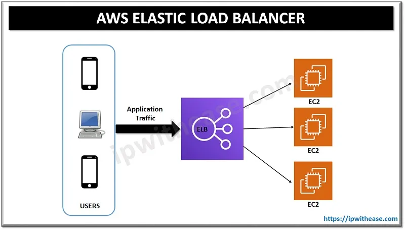
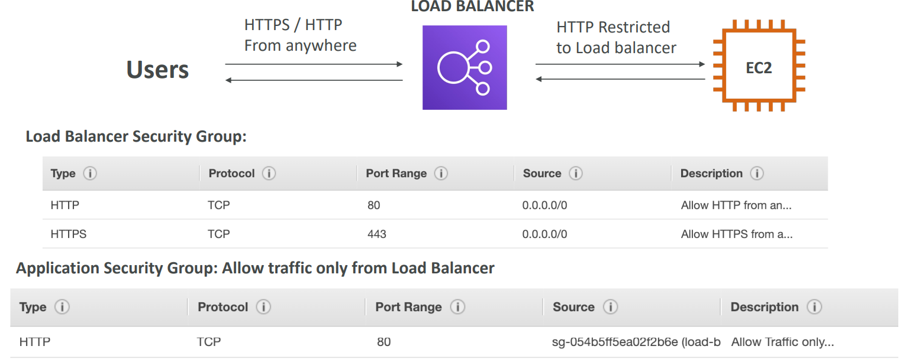
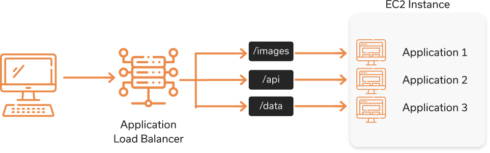
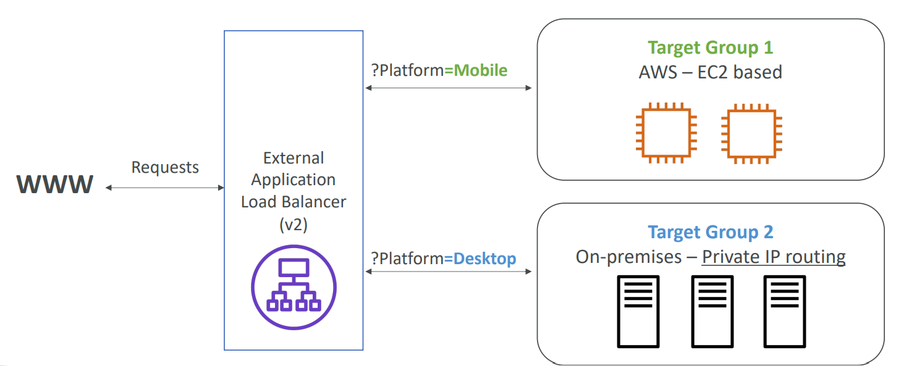
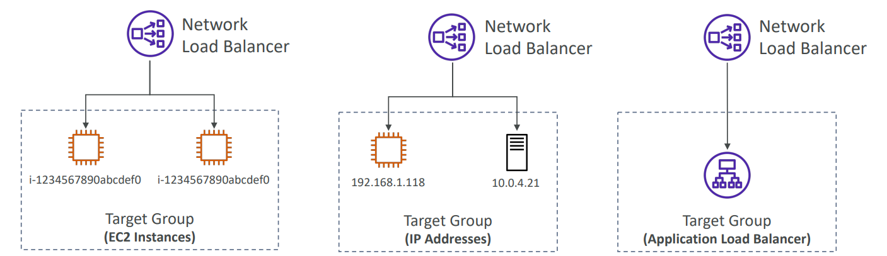
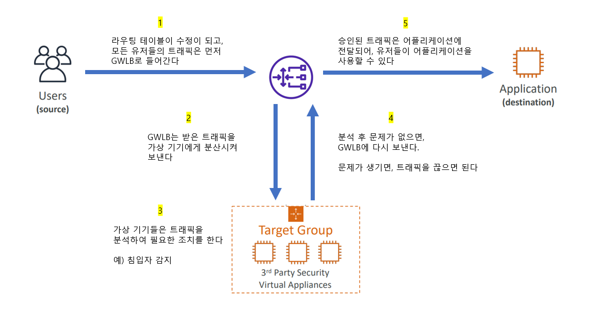

# 5. AWS ELB, ASG

*AWS*

## Scalability & High Availability

>  #### 확장성과 가용성

#### 수직 확장성 (Vertical Scalability)와 수평 확장성 (Horizontal Scalability)

- **수직 확장성은 인스턴스의 크기를 증가시키는 것이다**
  - 예를 들어 **t2.micro**를 통해 어플리케이션을 작동 시키다가, **t2.large**로 바꾸는 것이다
  - 주로 데이터 베이스와 같이 비분산 시스템에 수직 확장을 한다
- **수평 확장성은 인스턴스의 개수를 증가시키는 것이다**
  - 분산 시스템에 주로 사용이 된다

#### 가용성 (Availability)

- 높은 가용성 (High Availability)는 수평 확장과 비슷하다
- 높은 가용성이 있다는 것은 어플리케이션 또는 시스템을 2개 이상의 데이터 센터 (AZ)에서 작동을 시키는 것이다
- 높은 가용성의 목표는 데이터 손실을 극복하는 것이다
  - 데이터를 다른 분산 시키게 되면, 하나의 데이터 센터에 문제가 생기더라도, 다른 데이터 센터에 데이터가 있기 때문에, 데이터 손실을 피할 수 있다

#### EC2의 확장성과 높은 가용성

- 수직 확장성 : 인스턴스의 크기를 증가 시키는 것
  - 확장 전 : t2.nano - 0.5G of RAM, 1 vCPU
  - 확장 후 : u-1 2tb1.metal - 12.3 TB of RAM, 448 vCPUs
- 수평 확장성 : 인스턴스를 추가
  - Auto Scaling Group (자동 확장 그룹)
  - Load Balancer (로드 밸런서)
- 높은 가용성 : 같은 어플리케이션을 다수의 AZ에서 작동 시키는 것
  - Auto Scaling Group multi AZ (멀티 AZ의 자동 확장 그룹)
  - Load Balancer multi AZ  (멀티 AZ의 로드 밸런서)

## Elastic Load Balancing

> #### 로드 밸런스 (Load Balance)는 트래픽을 다수의 서버(ex. EC2 instance)들로 분산시켜주는 서버다 

### Load Balancer을 사용하는 이유

- 다수의 Downstream 인스턴스를 사용해서 부하를 분산시킨다
- 어플리케이션의 단일 접근 지점 (Single Point of Access, DNS)을 공개한다
- Downstream 인스턴스들의 실패를 처리한다
- 인스턴스들을 정기적으로 헬스 체그 (Health Check)를 한다
  - 이렇게 되면 어떤 인스턴스로 트래픽을 보낼 수 없는지 알 수 있다
  - 잘못된 인스턴스에는 트래픽을 보내지 않는다
- 웹사이트의 SSL (Secure Sockets Layer) Termination을 제공한다
  - SSL로 암호화된 데이터 트래픽이 해독되는 프로세스다 (HTTPS)
- 쿠키를 통해 보안을 강화할 수 있다
- 지역(zones)을 걸처 높은 가용성을 가질 수 있다
- 공공 트래픽을 개인 트래픽으로부터 분산시킬 수 있다

### Elastic Load Balancer을 사용하는 이유

- Elastic Load Balancer는 관리가 된 load balancer다
  - 즉 AWS가 ELB가 작동하는 것을 보장한다
  - AWS가 업그레이드, 유지보수 , 높은 가용성까지 다 관리해준다
  - 적은 환경 설정을 통해, ELB를 사용할 수 있다
- 자체 로드 밸런서를 직접 구현하는 것보다 확장성 측면에서 덜 번거롭다
- 다수의 AWS 서비스들과 통합이 되어 있다

### Health Checks

> EC2 인스턴스가 제대로 작동하는지 확인한다
>
> - 제대로 작동을 안 하면, 그 인스턴스에 요청을 못 하게 한다

- Port와 Route에서 Health Check이 이루어진다
- 응답이 200이 아니면, 인스턴스에 문제가 생긴 것이다

### Load Balancer의 종류

- **Classic Load Balancer, CLB (v1 - old generation) - 2009**
  - HTTP, HTTPS, TCP, SSL (secure TCP)
- **Application Load Balancer, ALB (v2 - new generation) - 2016**
  - HTTP, HTTPS, WebSocket
- **Network Load Balancer, NLB (v2 - new generation) - 2017**
  - TCP, TLS (secure TCP), UDP
- **Gateway Load Balancer, GWLB - 2020**
  - 3번째의 계층에서 동작한다 (네트워크 계층) - IP 프로토콜에서 작동

> 내부 (private) 또는 외부 (public) ELB로 설정할 수 있다

### Load Balancer Security Group (보안 그룹)

- Load Balancer는 모든 유저가 접근 할 수 있다
- Load Balancer에서 EC2로 접근할 수 있는 유저들을 나누게 된다

## ELB의 종류 in detail

### Classic Load Balancers (v1)

- TCP (Layer 4), HTTP 와 HTTPS (Layer 7)을 지원한다
- TCP 또는 HTTP 기반으로 Health Check을 한다
- 없어질 예정의 ELB다

### Application Load Balancer (v2)

- 7번째 계층만의 Load Balancer다 (HTTP)

- 컴퓨터 전방에 걸쳐 다수의 HTTP 응용 프로그램으로 라우팅 할 수 있도록 도와준다

  - 이 컴퓨터들은 **Target Groups**으로 그룹화가 된다

- 같은 EC2 인스턴스에서 다중 앱에 Load Balance 할 수 있다

- HTTP/2 와 WebSocket을 지원한다

- redirect도 지원한다 (HTTP에서 HTTPS로 트래픽을 자동 리다이렉트해줄 수 있다)

- 서로 다른 타깃 그룹에 기반하여 라우팅을 한다

  - URL 기반으로 경로 찾기 (example.com/images & example.com/api)
  - 호스트 이름을 기반으로 라우팅을 할 수 있다 (one.example.com & other.example.com)
  - Query String 또는 헤더 (Header)를 사용해서 라우팅을 할 수 있다 (example.com/images?id=123&order=false)

- 작은 규모의 서비스 또는 컨테이너 기반의 어플리케이션에 유용하다 (Docker 또는 아마존 ECS, Elastic Container Service)

- ECS의 동적 포트로 보내는 (redirect) port 매핑 기능을 가지고 있다

  

> #### Target Groups
>
> - 타깃 그룹은 EC2 인스턴스가 될 수 있다 (Auto Scaling Group을 통해 관리될 수 있다) - HTTP
> - EC2 테스크 (ECS가 관리한다) - HTTP
> - 람다 기능 (Lambda Function) - HTTP 요청은 JSON 이벤트로 변환된다
> - IP 주소 - 개인 IP 주소여야 한다
>
> ALB는 다수의 타깃 그룹으로 라우팅할 수 있다
>
> 타깃 그룹 레벨에서 Health Check을 한다

#### Query Strings / Parameter 라우팅

### Network Load Balancer (v2)

- 4번째 계층의 Load Balancer다
  - **TCP와 UDP** 트래픽을 인스턴스로 전달하는 역할을 한
  - 초당 수백만가지의 요청을 처리한다
  - 지연시간이 적다, 100ms (ALB는 400ms 정도다)

- AZ 당 한 개의 고정된 IP가 있다
  - 각각의 AZ에 하나의 Elastic IP를 할당할 수 있다
- **고성능 퍼포먼서 (extreme performance), TCP 또는 UDP 트래픽을 보면, Network Load Balancer를 사용하면 된다** (무료가 아니다)

> #### Target Groups
>
> - EC2 인스턴스
> - IP 주소 - 개인 IP 주소여만 한다
> - Application Load Balancer
>   - NLB 를 통해 고정 IP 주소를 받는다
>   - 그리고 ALB를 통해 HTTP 유형의 트래픽을 처리하는 규칙을 얻을 수 있다
> - Health Checks는 TCP, HTTP 그리고 HTTPS 프로토콜을 지원한다

### Gateway Load Balancer

- 제 3자의 네트워크 가상 기기들을 AWS에서 배포하고, 확장하고, 관리한다
  - GWLB는 방화벽이나, 침입자 감지 그리고 예방 시스템, Deep Packet 검사 시스템, 페이로드 수정 등을 할 수 있다
- 네트워크 계층의 Layer 3에서 동작한다 - IP 패킷을 위한 계
- **투명 네트워크 게이트웨이 (Transparent Network Gateway)와 Load Balancer의 기능을 한다**
  - **Transparent Network Gateway** - 모든 트래픽의 단일 진입/출구 역할을 한다
  - **Load Balancer** - 가상 기기에 트래픽을 분산시켜준다
- **GENEVE 프로토콜**을 **6081**에서 사용한다

> #### Target Groups
>
> - EC2 인스턴스
> - IP 주소 - 개인 IP 주소여야 한다
