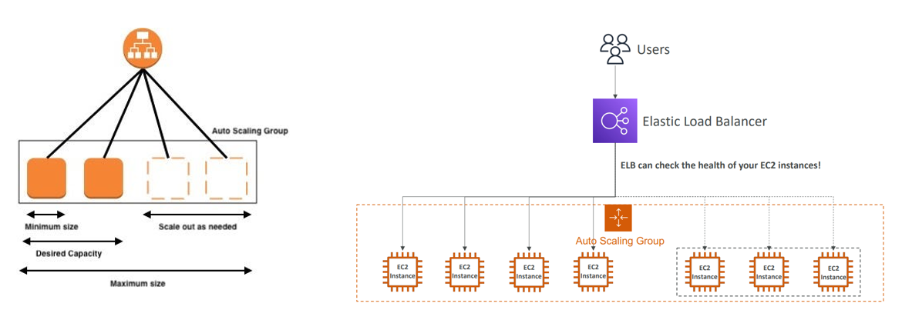
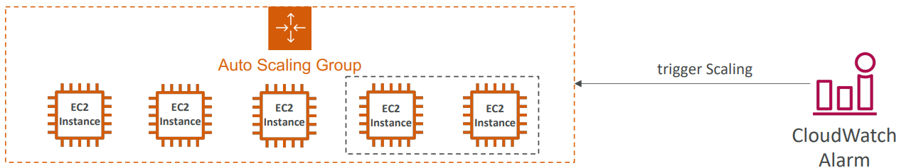

# 6. AWS ASG

*AWS*

## Auto Scaling Group

> #### 실제로, 상황에 따라 로드, 트래픽의 흐름은 일정하지 않다
>
> - 갑자기 트래픽이 많아질 수 있고, 줄어들 수 있다

### ASG의 목적

- 로드, 트래픽이 증가하면 **Scale Out (인스턴스를 추가)** 한다
- 로드, 트래픽이 감소하면 **Scale In (인스턴스를 제거)** 한다
- 최소, 또는 최대의 EC2 인스턴스가 작동하도록 도와준다
- 전의 인스턴스가 문제가 생겨, 연결을 중단했을 때, 새로운 EC2 인스턴스를 생성한다
- 이 모든 것을 자동화한다
- ASG는 무료지만, EC2 인스턴스에 따라 비용이 들 수 있다

- Load Balancer 없이도 가능하지만, Load Balancer를 통해 인스턴스의 상태를 확인하면서 자동으로 인스턴스 추가/삭제를 할 수 있다

### ASG을 만들

- **Launch Template**을 만들어야 한다
  - Launch Template은 ASG에서 EC2 인스턴스를 시작하는 방법에 대한 정보를 갖고 있다
    - AMI 또는 인스턴스 종류 / EC2 유저 데이터 / EBS Volumes / Security Groups (보안 그룹) / SSH Key Pair / EC2인스턴스의 IAM Roles / 네트워크 + Subnet 정보 / Load Balancer 정보
- 최소 크기 / 최대 크기 / 시작 크기
  - 위의 그림에서 Minimum Size, Maximum Size, Desired Capacity
    - 최소 크기 : 트래픽이 많이 적을 때, 최소 몇 개의 인스턴스를 사용할지
    - 최대 크기 : 트래픽이 많이 증가했을 때, 최대 몇 개의 인스턴스를 사용할지
    - 시작 크기 : 처음 시작은 몇 개의 인스턴스로 사용할지
- Scaling Policy (크기 조정 정책)

### Auto Scaling - Cloudwatch와 크기 조정

- ASG를 CloudWatch Alarm을 통해 크기를 조정할 수 있다
- CloudWatch Alarm은 매트릭을 관찰한다 (평균 CPU 또는 custom metric)
- ASG 인스턴스를 위해 평균 CPU 같은 메트릭을 계산하는 것이다
- CloudWatch Alarm을 통해 **scale-out** 또는 **scale-in** 정책을 나눌 수 있다

### Auto Scaling Group - Dynamic Scaling Policies

- **Target Tracking Scaling**

  - 기본값을 설정을 하는 것이다 (제일 쉬운 설정)

  - 평균 ASG CPU가 40% 정도 유지하면 좋은 것

    - 즉 40%보다 훨씬 떨어지면, scale-in 을 할 것
    - 40% 보다 훨씬 높아지면 scale-out을 할 것

     

- **Simple/ Step Scaling**

  - Cloudwatch의 알람이 작동될 때, 인스턴스를 추가 또는 없애는 것
    - CPU가 70%가 넘었을 때나 CPU가 30% 아래로 떨어질때, CloudWatch의 알람을 작동 시키기
      - 70%를 넘으면 2개의 인스턴스를 추가하기
      - 30% 아래로 떨어지면, 1개의 인스턴스를 없애기

- **Scheduled Action**
  - 어플리케이션 사용 패턴을 예측한 것을 바탕으로 미리 크기 조정을 예상하는 것이다
  - 예) 토요일 오후 1시, 5시 사이에는 트래픽이 증가할 것이다

### Auto Scaling Groups - Predictive Scaling

- 미리 Load, 트래픽을 예상하고, 크기 조정을 스케줄을 해 놓은다
- 예를 들어, 수요일에 아이유 콘서트 티켓을 오픈할 때, 수요일에 맞춰서 Scale-Out을 한다

### 크기 조정을 위한 좋은 참고 메트릭

- **CPUUtilization** : 인스턴스의 평균 CPU 사용량
- **RequestCountPerTarget** : EC2 인스턴스 당, 요청의 횟수를 안정화시킨다
- **Average Network In/ Out** : 어플리케이션이 Network를 사용할 때
- **Any custom metric**

### Auto Scaling Groups - Scaling Cooldowns

- 크기 조정이 일어나고 난 후에, 쿨링 다운 기간이 있다 (기본은 300초로 세팅되어 있다)
- 쿨링 다운 기간 동안에는 ASG가 새로운 인스턴스를 만들거나, 인스턴스를 종료하지 않는다
  - ASG가 쿨링 다운을 하면서, 메트릭을 안정화 시킨다

### Auto Scaling - Instance Refresh

- 목표는 Launch Template을 업데이트하고, 새로운 EC2 인스턴스를 생성하는 것이다
  - Launch Template이 업데이트 되었을 때, EC2 인스턴스를 삭제하고, 다시 만드는 것이 아니다
  - 즉 최소의 Healthy percentage를 만든다
  - 그 퍼센트가 몇개의 인스턴스가 한번에 삭제될 수 있을지 알려준다
  - 인스턴스가 삭제될 때마다, 새로운 인스턴스가 업데이트 된 Launch Template을 가지고 생성이 된다
- EC2 인스턴스가 트래픽을 처리할 준비가 될 만큼 충분한 시간을 갖도록 워밍업을 지정할 수 있다

