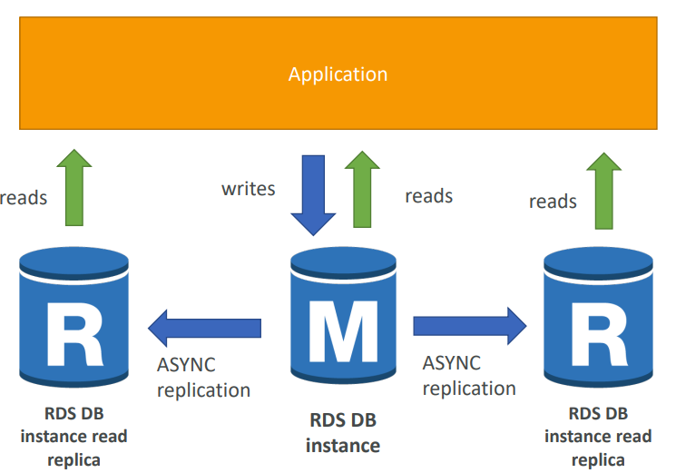
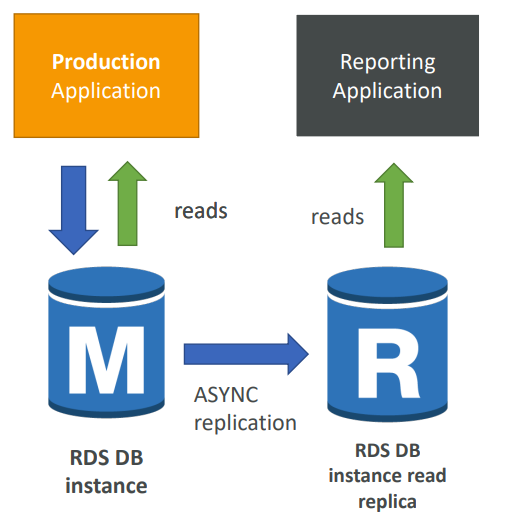
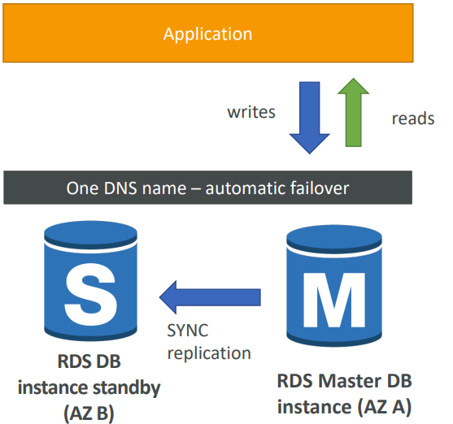
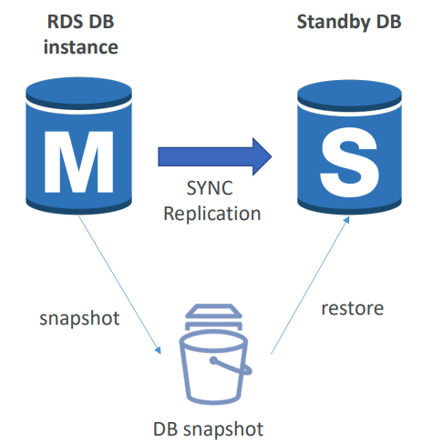

# 7. AWS [RDS, Aurora, ElastiCache]

*AWS*

## Amazon RDS

> #### RDS : Relational Database Service
>
> Query 언어가 SQL인 데이터베이스 (DB)를 위한 관리된 DB 서비스다
>
> 클라우드에 DB를 생성할 수 있도록 도와주면서, AWS가 관리를 해준다
>
> - Postgres / MySQL / MariaDB / Oracle / Microsoft SQL Server / Aurora (AWS Proprietary Database)

### DB를 EC2에 배포하는 것보다 RDS를 사용하면 좋은 점

- RDS는 관리가되는 서비스고 아래와 같이 추가 기능들을 제공해준다
  - 운영체제 보수 및 공급을 자동화해준다
  - 지속적으로 백업을 해주고, 특정 시간대의 데이터를 복원시켜준다 (Point in Time Restore)
  - 대시보드들을 관찰해준다
  - 데이터 읽기 성능을 향상시키기 위해 복제본을 읽는다
  - 다수 AZ에 설치를 해서, 재난에 대비한다
  - 업그레이드를 위한 유지 관리 창이 있다
  - 크기 조정이 가능하다 (Vertical Scaling, Horizontal Scaling)
  - EBS에 의해 저장소가 백업이 된다 (gp2 또는 io1)
- 하지만 인스턴스로 SSH(Secure Shell)를 할 수 없다

### RDS - Storage Auto Scaling

- 동적으로 RDS DB 인스턴스의 저장소를 늘려줄 수 있다
  - 즉 자동으로 DB 저장소를 확장시켜준다
  - 수동으로 DB 저장소를 확장하는 불편함이 없다
- **그러기 위해 저장소의 최대 저장 용량을 설정해야 한다**
- 아래의 상황에 자동으로 저장소를 수정한다: 
  - 저장소에 남는 공간이 10%로 밖에 없을 때
  - 낮은 저장소가 5분 동안 지속 되었을 때
  - 수정한지 6시간이 지났을 때
- 작업량이 예측 불가할 때, 매우 유용하다
- 모든 RDS DB 엔진에 지원이 된다 (MariaDB, MySQL, PostgreSQL, SQL Server, Oracle)

#### RDS Read Replicas for read Scalability

- 최대 5개의 읽기 전용 복제본을 만들 수 있다
- 같은 AZ에 있거나, AZ가 교차되거나, Region이 교차될 수 있다
- 복제본들은 모두 **ASYNC**이다
  - 즉 모든 정보들을 복제하는 것이다
  - 읽기 전용 복제본을, 메인 데이터베이스로 승급시킬 수 있다
  - 하지만 이때 메인은 읽기 전용으로 바뀐다
  - 어플리케이션이 연결을 업데이트해야, 읽기 전용 복제본들을 활용할 수 있다

#### RDS Read Replicas - Use Cased

> 아래 이미지에서 Production Application과 Reporting Application에서 메인 DB를 모두 사용하면, 서버 과부하가 걸릴 수 있다
>
> 그래서 복제본을 만들어서 메인 DB에 집중이 되는 것을 피해, 과부하를 줄인다
>
> 즉 Reporting Application은 메인 DB에 작업량을 넣는 것이 아니라, 읽기 전용 복제본에 작업량을 투입하는 것이다

- 읽기 전용 복제본은 **SELECT** 즉 읽기만 가능하다

#### RDS Read Replicas - Network Cost

- RDS Read Replicas를 같은 Region 안에서 사용하면 비용이 들지 않는다
- 반대로, 다른 Region을 통해 RDS Read Replicas를 사용하면 비용이 들어간다

### RDS Multi AZ (Disaster Recovery)

> 아래 이미지에서 **M**에서 데이터가 바뀔때마다 **S**도 바뀌게 된다
>
> 하지만 Read Replicas와 다른 점은, 어플리케이션은 Master DB 인스턴스만 사용할 수 있다
>
> RDS DB 인스턴스 Standby는, 마스터 DB에서 문제가 생겼을 때, 대체로 사용되는 DB 인스턴스가 된다

- Standby DB 인스턴스를 사용함으로써 가용성을 늘리는 것이다
- 확장을 위해 사용되는 DB가 아니다
- Read Replicas를 Multi AZ for Disaster Recovery로 설정할 수 있다

#### RDS - From Single-AZ to Multi-AZ

> DB를 멈출 필요는 없다
>
> 마스터 DB를 스냅샷을 하고, 스냅샷을 한 DB를 새로운 AZ에 넣는다
>
> 그렇게 되면 두 개의 DB는 SYNC가 된다
>
> - 즉 마스터에서 데이터가 바뀌면, standby DB도 바뀌게 된다

## Amazon Aurora

