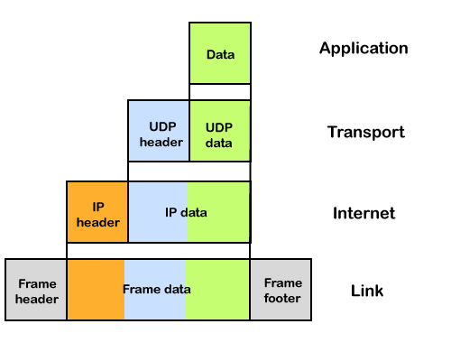
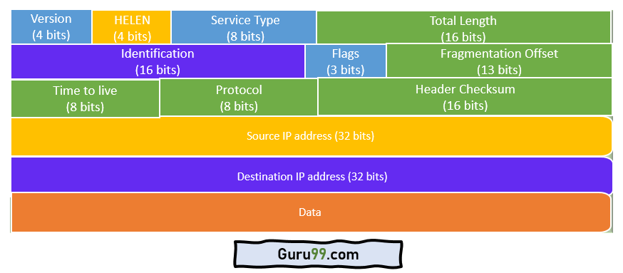
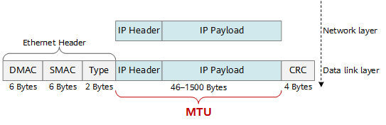
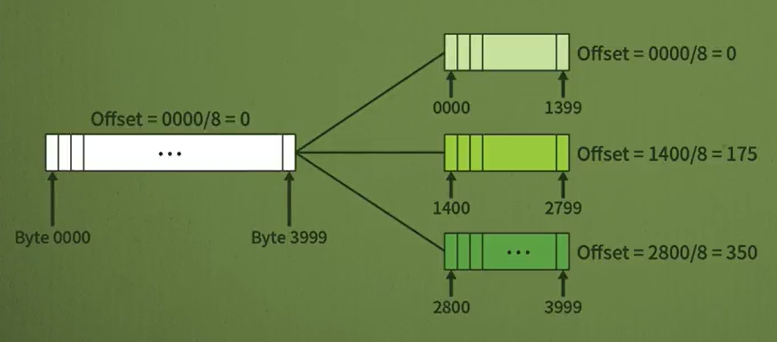
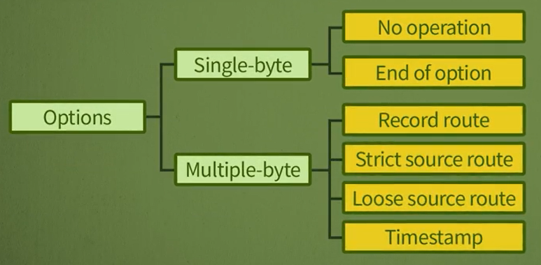

# 네트워크 - 이동 전화와 인터넷 프로토콜

*K-MOOC - 네트워크 기초*

## 네트워크 프로토콜

> #### 연결지향 (Connection-oriented) 프로토콜과 비연결형(Connectionless) 프로토콜이 있다

### 연결지향 프로토콜

- 데이터를 전송하기 전에 연결 설정을 하고 데이터를 보낸다
- 데이터가 생기면 원격지에 연결 설정하고, 연결이 잘 된다는 것을 확인하고 데이터를 보내는 것

### 비연결형 프로토콜

- 연결 설정 없이, 데이터가 생기면 바로 보내는 형태이다

- **비연결형 프로토콜의 대표적인 프로토콜은 인터넷 프로토콜 (IP)이다**

## 인터넷 프로토콜 (Internet Protocol, IP)

> #### 비연결형 프로토콜의 대표적인 프로토콜, 데이터가 생길 때, 연결 설정 없이 바로 보내는 것
>
> #### Unit Data Transfer라고 한다

### IP 패킷의 형태

> #### IP 프로토콜은 연결 설정이 없어서, 패킷을 보내도 목적지에 잘 갈 수도 있고 중간에 없어질 수도 있다

- 즉 **unreliable, 신뢰성**이 떨어지는 프로토콜이다

  - **Best-Effort Delivery**라고도 이야기 한다

- 하지만 만약에 없어지면, 다른 계층에서 데이터를 재전송을 하여, 데이터가 사라지는 것을 방지할 수 있다

- **에러 제어**와 **흐름 제어**를 하지 않는다

  - 헤더만 확인하고, 데이터에 에러가 있는지는 확인을 안 한다
  - 에러가 검출되면 그냥 없애 버린다 (Discard)
  - 에러 제어나 흐름 제어는 다른 계층에 해당되는 프로토콜에서 한다

- **IP의 제일 좋은 점은, 네트워크를 가장 효율적으로 사용할 수 있다**

  - 패킷을 전달할 때에, 가장 좋은 길로 전달함으로 효율성이 아주 좋다
  - IP에서 패킷을 **IP패킷** 또는 **IP데이터그램**이라고 부른다

  

### IP의 header

#### 버전 (Version : VER)

- IP 프로토콜의 버전: IPv4 또는 IPv6

#### 헤더의 크기 (Header Length : HLEN)

- 헤더의 크기는 정해져 있지 않다 (헤더의 크기는 20 ~ 60바이트이다)
- 어디까지가 헤더고, 어디서부터가 데이터인지 알려 주는 필드다

#### 서비스 (Service Type)

- IP 패킷의 서비스 형태
- 응용서비스마다 주요하게 다루어야 할 특정으로 지연시간, 신뢰성, 처리량 등 어떤 특성을 고려해야 할지 알려 주는 필드
  - reliable한 것을 원하는 것인지, Throughput이 높은 것을 원하는 것인지
  - 이메일을 보내는 것일 수도 있고, 원격지 로그인을 하는 것일 수도 있고, 실시간으로 데이터를 주고 받아야 하는 것일 수도 있다. 즉 각각의 특성을 고려해줄 수 있는 것이 **서비스 타입**이다

#### 전체 길이 (Total Length)

- IP 패킷의 전체 길이를 나타낸 것

#### 생존 시간 (Time to live : TTL)

- IP 패킷 / 데이터그램이 지나가는 최대 홉(Hop)의 수
- 라우터를 지나갈 때마다, 1씩 감소한다.
- 생존 시간이 0이 되면, 해당 데이터를 폐기한다
  - 해당 패킷이 잘못되어, 최종 목적지에 도달하지 못 하고, 계속 돌아다니는 것을 방지하기 위해서 데이터를 아예 없애버리는 것이다
  - 만약 최종 목적지에 도달하지 못 하게 되면, 이 데이터는 필요 없는 데이터가 되어 버리는 것이다.

#### 프로토콜 (Protocol)

- IP 계층 위에 존재하는 상위 프로토콜이 무엇인지 알려준다
  - TCP에 전달 해야 하는가? UDP에 전달해야 하는가? ICMP에 전달해야 하는가? 등등

#### 체크썸 (Check Sum)

- 헤더에 에러가 났는지 안 났는지 확인하는 것이다
- 전체 헤더를 16비트 단위로 구분하여 보수로 취하고, 0이 나오면 에러가 없는 것
  - 10과 5라는 라는 데이터를 더해서 나오는 보수는 -15
  - 10 + 5 + (-15) = 0
  - 해당 데이터는 에러가 없음
- 0이 아닌 다른 결과가 나오게 되면 헤더에 에러가 있다는 것으로 판단하고, IP 패킷을 버린다

#### 송신자 주소와 목적지 주소

- 송신자와 목적지의 IP 주소
  - 누가 누구한테 보내는지 명시하는 것

## 단편화와 옵션 in IP패킷 헤더

- Ethernet을 사용하게 되면 데이터가 1500바이트를 넘을 수 없다

  - 최대 데이터가 1500바이트라는 것을 **MTU (Maximum Transfer Unit)**이라고 한다

#### Fragmentation (단편화)

- IP 패킷이 MTU를 넘었을 때, 네트워크에서 전송할 수 있는 크기로 자른다

#### 플래그 (Flag) in IP패킷 헤더

- IP패킷 헤더를 보면 플래그가 있다
- 플래그는 3비트로 구성이 되어 있고, 첫 번째 비트는 사용하지 않는다
- 두 번째 비트
  - 값이 1이면 단편화 하지 말라는 의미다
  - 즉 IP패킷을 안 잘라도 된다는 것이다
- 세 번째 비트
  - 1이면 단편이 더 있음을 의미한다 (들어와야 할 데이터가 더 있다는 의미)
  - 0이면 마지막 단편이라는 것을 의미한다
  - 단편화가 안 되어 있으면 다 0이다

#### 단편화 위치 값 (Fragmentation offset) in IP패킷 헤더

- Connectionless이니깐 IP패킷이 단편화 되어 있고, 목적지에 보내졌을 때, 순서대로 도착을 안 할 수 있다
- 해당 IP패킷이, 전체의 데이터의 어떤 위치인지 알려 준다
- 첫 번째부터 시작하여 8바이트 단위로 표시한다
  - 바이트 순서에서 8로 나눈 숫자가 들어가게 된다

#### 옵션 (Option) in IP패킷 헤더

> 옵션은 최대 40바이트까지 가능하다
>
> 실질적으로 들어가는 옵션은 4가지다

- **Record Route**
  - 어느 통신 장치를 지나가야 하는지 IP 주소를 저장하는 것
- **Strict Source Route**
  - 어느 통신 장치를 거쳐가라고 명시해 놓는 것
- **Loose Source Route**
  - 다른 통신 장치를 거쳐가도 되지만, 해당 IP 주소는 꼭 거쳐 가라고 명시하는 것
- **Timestamp**
  - 통신장치를 지나갈 때, 몇 초대 지나갔는지 명시하는 것

