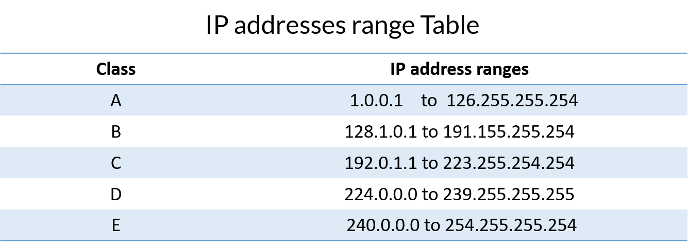
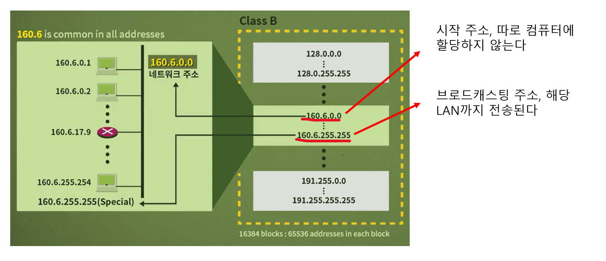
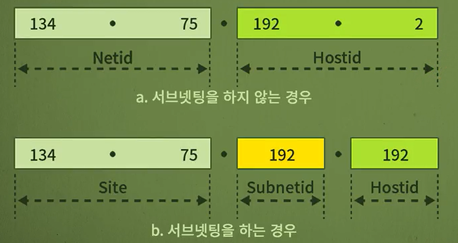
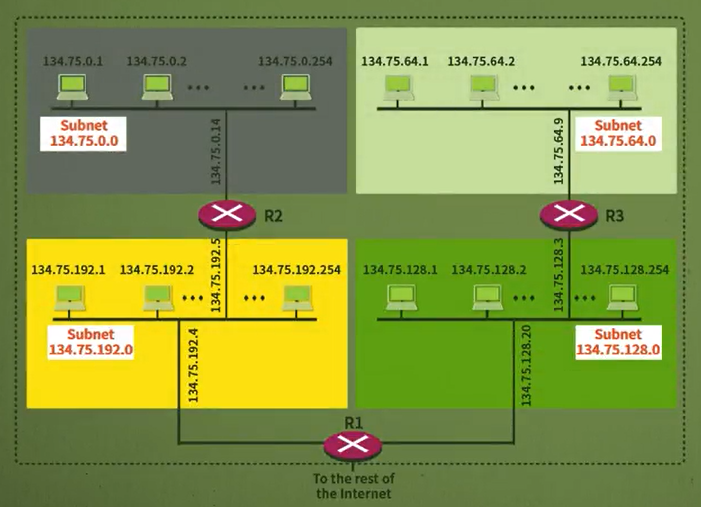

# 네트워크 - IP 주소와 서브넷

*K-MOOC - 네트워크 기초*

## IP 주소

> #### 인터넷 프로토콜 주소로, 인터넷에서 사용되는 주소다

- 네트워크 주소를 통해 송신자와 수신자를 구별할 수 있다
- IP 주소는 중복될 수 없으며 32비트 주소를 사용한다
- 일일이 2진수로 표기하기 어려워서, 한 바이트 당 10진수로 표기한다 (위의 그림 같이)
  - 그리고 바이트들을 경계하기 위해서 중간에 `.`(점)을 찍는다
  - 점을 찍는 것을 **Dotted-Decimal Notation (DDN)**이라고도 부른다

### 클래스 구분 주소 (Classful addressing)

> #### Class A, B, C, D, E, 5개의 클래스로 구분한다
>
> Why?
>
> - 네트워크의 규모는 다 다르다 (대기업인 경우 네트워크의 규모는 크고, 스타트업은 네트워크의 규모가 작다)
> - **규모가 큰 네트워크는 Class A**
> - **규모가 작은 네트워크는 Class C**

#### Class A, B, C 는 유니캐스트이다

- 데이터를 주고, 받는 사람이 각각 한 명일 때

#### Class D 는 멀티캐스트이다

- 데이터를 보내는 사람은 한 명이지만, 받는 사람이 여러 명일 때

#### Class E 는 reserve이다

- 미래를 대비해, 만들어 놓은 클래스이다

### Netid 와 hostid

- 각 클래스 마다, 네트워크 ID와 호스트 ID가 차지하는 바이트 수가 다르다
- **Netid** : 각 네트워크를 구분하는 네트워크 식별자
- **Hostid** : 네트워크 내의 호스트를 구분하는 호스트 식별자 (컴퓨터에 할당되는 부분)
- **사용하지 않는 주소**
  - 이진수가 다 `0`이거나, `1`인  주소는 사용하지 않는다
    - `1` : 브로드캐스트 주소다
    - 즉 IP 주소에서 2개의 주소는 빼고 할당을 한ㄷ
  - `127`로 시작하는 주소
    - 테스트 용이다 / 주로 loopback으로 사용하게 된다

### 서브넷 주소설정 (Subnetting)

> #### 기관, 회사 내에 여러 개의 서브 네트워크로 구성할 수 있다

- Hostid의 일부분을 서브넷ID로 사용하는 것이다
  - netid와 hostid만 사용하게 된다면, 기간, 회사 내에 여러 개의 부서들의 IP주소를 구분할 때 어려움이 있을 수 있다
- 예시) 134.75.0.0 을 사용한다
  - 134.75.0.1 부터 134.75.255.254 를 모두 사용 하는 것이 아니다
  - **134.75.1.0 은 기획부 / 134.75.2.0 은 영업부 / 134.75.3.0 인사팀** 
    - 위와 같이 나누어서 컴퓨터에 할당을 한다
    - 이렇게 하면, 해당 IP주소가 어느 팀인지 알 수 있다

#### 서브넷 마스크 (Subnet Mask)

> #### 정말 순수한 hostid 부분이 어딘지를 구분해 준다

- 어디까지가 netid고, 어디부터가 hostid인지 구분해주는 것

