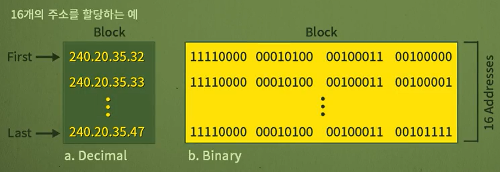

# 네트워크 - 가변길이 주소

*K-MOOC - 네트워크 기초*

> 전에는 못 느꼈는데, 이번 강의를 들으면서 조금 햇깔렸다

## 가변길이 주소지정 (Classless addressing)

> #### 클래스가 없는 IP주소다

- **Classful addressing**은 네트워크 규모에 따라 클래스를 나눠서 IP주소를 할당할 수 있다
  - 하지만 이렇게 나누어 주다 보니, IP주소를 할당하는 데에 한계치가 생기게 되었다
  - 왜? 인터넷을 사용하는 컴퓨터가 지속적으로 증가하고 있다

- 그래서, IP주소가 필요한 만큼 할당하는 방식으로 가변길이 주소, 즉 Classless Addressing이 나타났다
  - 기존 4 바이트를 가지고 나눠주던 IP주소가, 클래스를 없애니 훨씬 많아지게 되었다

### 가변길이 주소 할당 규칙

- **2의 N승이어야 한다**
  - 딱 10개는 안 되고, 8개 (2 ^ 3) 또는 16개 (2 ^ 4)는 된다
- **할당한 주소는 연속해서 받아야 한다**
- **시작 주소는 할당하는 주소의 수로 나누어 떨어진다**
  - 밑에 제일 끝 숫자 `32`가 16과 나누어 떨어진다
  - 그리고 그 이후로 16개를 할당할 수 있다
  - 여기서 16개는 `32` 이후로 연속으로 `47`까지 연속으로 IP주소를 할당해준다
  - 단, classful 주소와 같게, 첫 번째 주소와 마지막 주소는 할당할 수 있다!
  - 즉 실제로 컴퓨터에게 할당할 수 있는 IP주소는 여기서는 14개이다

### 마스크

> 네트워크ID (netid)와 호스트ID (hostid)를 구별하는 것

- **시작주소와 마스크**가 주어져야 한다
  - 240.20.53.36 / 28
    - 시작부터 28비트까지는 네트워크 부분이고, 마지막 4비트는 호스트 부분인 것

### 서브네팅

> classful 주소와 같이 한 그룹 안에 팀 별로 주소를 나눌 수 있다
>
> 그렇게 해야, 라우팅이 더 편해진다 (주소를 더 쉽게 찾을 수 있으니깐)

- `Nsub` : 내가 할당해야할 IP주소의 개수
- 예시) 24.36.15.0 / 26 (총 64개의 IP주소를 할당할 수 있음)
  - 32개, 16개, 16개 씩 팀 별로 IP주소를 할당한다
  - 내가 할당하고 싶은 IP주소들의 개수 log2로 계산하고, 32를 계산한 값과 빼면 된다
    - **32 - log 2 32** = 32 - 5 = 27
    - **32 - log 2 16** = 32 - 4 = 28
    - **32 - log 2 16** = 32 - 4 = 28
  - 즉 각각의 마스크는 27, 28, 28이 나온다

