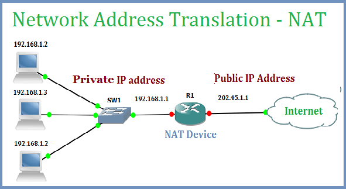
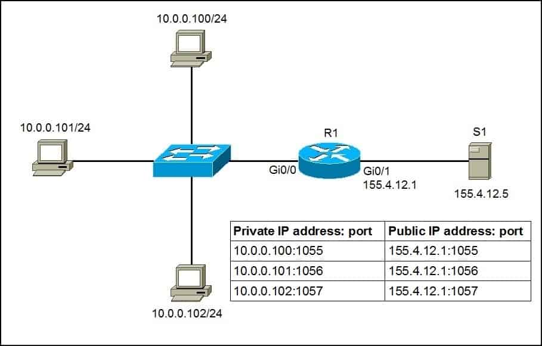

# 네트워크 - DHCP와 NAT

*K-MOOC - 네트워크 기초*

## DHCP의 필요

> #### Dynamic Host Control Protocol
>
> #### IP 주소를 자동으로 할당해주는 프로토콜

- 소규모의 네트워크 경우 각각 IP주소를 직접 분배와 관리가 가능하다
- 하지만 네트워크 규모가 커지면, 직접 IP주소를 분배와 관리하기 어려워 DHCP가 사용된다

#### DHCP는 정적 + 동적으로 IP주소를 할당할 수 있다

- 정적 : 특정 컴퓨터에는 특정 IP주소를 할당
- 동적 : 상황에 따라 IP주소가 바뀔 수 있는 것
  - 보통은 동적으로 주소 할당을 많이 한다

## NAT의 필요

> #### Network Address Translation

- Classful IP주소로 시작해서, Classless IP주소가 만들어졌다
  - 이유는 관리해야하는 IP주소가 그만큼 급격히 많아졌기 때문이다
- 그래서 같은 네트워크를 사용하는 그룹 내에서는 내부적으로 IP주소를 사용하게 되었다
- 그리고 **외부로 나갈 때에 IP주소를 바꿔주는데, 이 바꿔주는 것을 NAT**라고 한다

#### 내부 비공인 주소

- 외부로 나갈 수 없는 주소
- 중복이 이러날 수 있다
- NAT
  - 내부 주소를 외부에서 못 쓰도록, 내부적으로 IP주소를 NAT가 할당을 한다

#### 외부 공인 주소

- NAT을 통해 내부에서 외부로 나갈 때에, IP주소가 바뀐다

- 외부로 나갈때에는 공인된 하나의 주소를 사용할 수 있고, 이것을 NAT 기능을 가지고 있는 라우터가 가능하게 해준다
  - 예) 집에 들어오는 인터넷을 IP주소가 하나 (공인주소)
    - 집 안 `(내부)`에 다수의 컴퓨터들/ 기기들에게 IP주소를 할당
    - 중앙에서 NAT라우터가 공인주소를 비공인주소로 변경해준다

#### 하지만 내부에서 여러대의 기기 중 한 기기씩만 데이터를 하나의 공인 주소로 보낼 수 있었다

- 즉 하나의 컴퓨터가 공인 주소를 사용하고 있을 때에, 다른 컴퓨터는 그 공인 주소를 사용하지 못 한 것
- 그래서 다른 공인 주소를 사용할 수 있도록 **Pool로 운영해서 사용**을 했다
  - 예시) 1000대의 컴퓨터가 비공인 IP주소를 사용
    - 1000대는 100개의 공인 IP주소를 사용할 수 있다
    - 즉 동시에 100개의 공인 IP주소를 사용할 수 있도록 **Pool**로 운영

#### PAT (Port Address Translation)

- 내부의 여러대의 컴퓨터가 하나의 공인 IP주소를 사용할 수 있도록 만들었다
  - 동시에 하나의 공인 IP주소를 사용하되, 각각 공인 IP주소에 포트번호를 할당하는 것
  - 그렇게 되면 내부의 여러대의 컴퓨터는 하나의 공인 IP주소를 사용하게 되는 것이다

