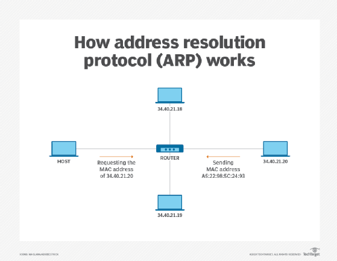
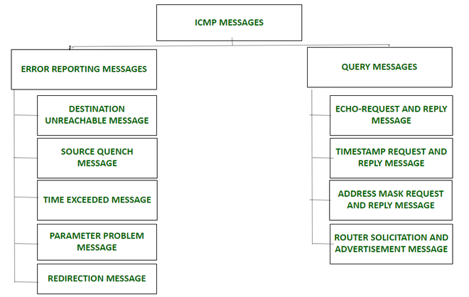

# 네트워크 - 주소 매핑과 에러보고

*K-MOOC - 네트워크 기초*

## 주소 매핑 (Addressing Mapping)

> #### 인터넷에 접속된 컴퓨터를 구분하는 IP 주소 (바뀔 수 있는 주소)
>
> #### LAN에 접속된 컴퓨터를 구분하는 MAC, Ethernet 주소 (공장에서 나오는 고정 된 주소)
>
> - 즉 컴퓨터에는 2개의 주소가 있다
> - 그리고 상대방에게 메세지를 보내기 위해서, 2개의 주소 모두 필요하다
> - 이 주소를 찾는 것을 주소 매핑이라 한다

#### 정적 매핑 (Static Mapping)

- 사용자가 IP 주소와 MAC 주소를 모두 수작업으로 입력하는 것
- 두 개의 주소를 다 기억하는 것이 어렵다
- 그리고 주소가 바뀔 수 있다 (주소가 고정적이 아니다)
  - DHCP를 통해 IP주소가 바뀌거나, 사용자가 직접 바꿀 수 있다
  - LAN카드를 바꿔서 MAC 주소가 바뀔 수 있다

#### 동적 매핑 (Dynamic Mapping)

- **Address Resolution Protocol (ARP)**
  - IP 주소에 대응하는 MAC 주소를 구하는 프로토콜
  - 상대방의 IP주소를 통해 MAC 주소를 찾는 것
  - 방법
    - 상대방의 IP 주소를 브로드캐스트를 하고, 해당 IP 주소를 가진 컴퓨터가 다시 유니캐스트로 자신의 MAC 주소를 알려준다
    - 그리고 로컬 (LOCAL)의 캐시라는 곳에 저장을 해둔다

- **Reverse ARP**
  - 상대방의 MAC 주소를 통해 IP주소를 찾는 것
  - 많이 사용되지 않는다

## 에러보고 (ICMP)

> Internet Control Message Protocol
>
> IP 프로토콜이 가지고 있는 단점을 보완하기 위해 만들어졌다

- IP 프로토콜은 에러 제어를 하지 못 한다
- IP 프로토콜에서, 버려진 패키지들 대해서, 송신자가 메세지를 받아야 한다
  - TTL이 0으로 되면 IP 프로토콜은 그냥 버려진다
  - IP 패킷은 헤더만 체크섬을 하고, 헤더에 에러가 있으면 그냥 버려진다
- **관리 기능, 에러 보고 기능을 제공한다** (에러를 단순히 보고만 한다)
  - 에러 보고 : Error Reporting Messages
  - 관리 기능 : Query Messages

### 에러 보고의 5가지 기능

- **Destination Unreachable Message**
  - 구체적인 정보는 모르지만, 목적지에 못 보낸 것
  - IP 패킷을 전달할 수 없어, 패킷을 폐기했을 때

- **Source Quench Message**
  - 라우터나 컴퓨터는 혼잡이 발생할 때에도 패킷을 폐기한다
  - IP는 흐름제어를 하지 않는다, 대신 ICMP가 송신자에게 송신지 조절 메세지를 전송한다

- **Time Exceeded Message**
  - TTL 이 0이 되면 IP 패킷이 없어진다
  - 이처럼, 시간 초과 메세지를 송신지로 보낸다
  - 또한, 메세지를 단편화 (Fragmentation)을 했는데, 모두 안 보내졌을 때
    - 도착을 한 단편화 된 메세지들을 다 폐기하고, 시간 초과 메세지를 보낸다

- **Parameter Problem Message**
  - IP헤더의 여러 필드 중 버전 필드에, 이상한 필드가 들어왔을 때
    - 예) IPv4 또는 IPv6가 있어야 하지만 존재도 안 하는 IPv10이 들어왔을 때

- **Redirection Message**
  - 잘 못된 라우터로 패킷을 정할 경우, 방향을 재설정을 해준다
  - 그렇게 되면 다음부터는 그 방향으로 패킷을 보내게 된다

### Query Messages

- **Echo-request and reply message** (가장 많이 사용하고 있다)

  - 네트워크에 문제 여부를 확인시켜 주는 것
  - 예) A가 B와 소통을 할 수 있는지 **echo-request**를 보낸다. A와 B가 연결이 되어 있고, B가 활성화 되어 있으면 B는 **echo-reply**를  보내게 된다

  

- **Timestamp Request and Reply Message** (지금은 거의 사용 안함)

  - ICMP query message가 두 시스템 간에 왕복하는데 소요된 시간 또는 시간차를 파악 하는 것

- **Address Mask Request and Reply Message** (지금은 거의 사용 안함)
  - 로컬 네트워크에서 사용하는 **subnet mask**를 확인 하는 것 

- **Router Solicitation and Advertisement Message**
  - 라우팅 정보를 확인, 즉 LAN에 라우터가 존재하는지 확인하는 것이다
    - Router Solicitation Message를 브로케스트를 한다
    - 메세지를 받은 라우터는 라우팅 정보를 router advertisment message를 통해 보낸다

