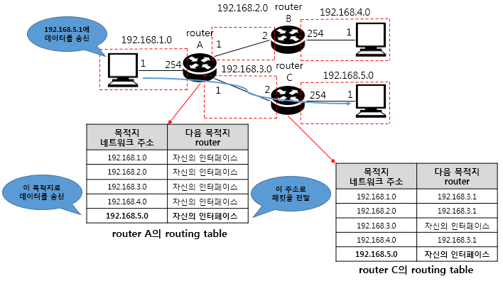
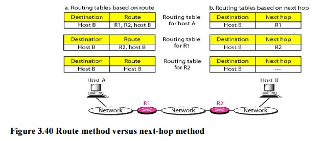
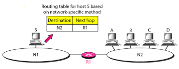
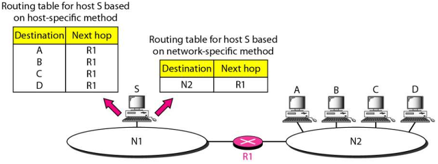
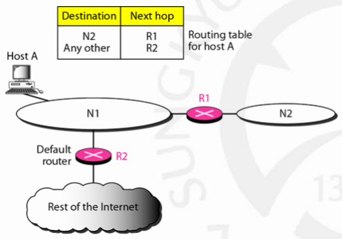

# 네트워크 - 패킷 전달

*K-MOOC - 네트워크 기초*

## 패킷의 처리

> #### 패킷을 송신하고 수신하는 데에는 여러 개의 통신 장치들을 거쳐가게 된다
>
> #### 그 뿐만 아니라 다양한 네트워크도 거치게 된다

#### 송신자

- IP패킷을 보낼 때에, 헤더 (header)에 송신자 주소와 수신자 주소를 넣어서 보낸다
- 어느 경로를 통해서, 최종 목적지까지 도착할 수 있을지 경로를 정한다
  - 경로 설정은 **Best Pass**라고도 한다
- 결정을 하기 위해서 **라우팅 테이블**을 사용한다
  - 송신자는 최종 목적지의 IP주소를 보고, 어느 경로가 제일 좋을지 라우팅 테이블을 기반으로 경로를 설정한다

#### 수신자

- 목적지에 도달하면, 수신자는 헤더를 확인해서, 자신의 주소와 같은지 확인을 하면 된다

#### 중간 통신 장치

> 라우터들은 라우팅 테이블을 기반으로 데이터를 보낸다

- 헤더를 확인해서 목적지 주소를 본다
- 자신의 라우팅 테이블에서 어디로 보낼지 판단하고, 보낸다
- 이것을 처리해주는 장치가 **라우터**이다

## 패킷의 전달

### 직접 전달 / 간접 전달

> 라우팅을 사용되는 원칙은 직접 전달에는 크게 영향을 미치지 않는다

- 직접 전달  :  LAN 내부에 있을 때. 즉 같은 네트워크 안에 있을 때에는 통신 장치를 따로 거치지 않고, 바로 데이터를 전달 할 수 있다
- 간접 전달  :  중간 통신 장치를 거쳐서 가야할 때. 즉 라우터를 거쳐서 데이터를 전달할 때

### 원칙 : Next-hop forwarding

- 송신자로부터 경로가 지정되어 데이터가 전달 되었다면, **next-hop forwarding**은 다음 목적지만 설정해 주는 것
  - 즉 다음 노드만 명시하는 것이다
  - Next-hop forwarding 예)  `Host A  ▶️  R1  ▶️  R2  ▶️  Host B`
    - Host A에서 R1 으로 가라고 명령
    - R1에서 R2로 가라고 명령
    - R2에서 Host B로 가라고 명령
- Next-hop forwarding 원칙을 사용하지 않게 되면, 라우팅 테이블의 사이즈가 증가하게 된다
  - Next-hop forwarding의 라우팅 테이블은 목적지 주소와, 다음 노드의 주소만 필요하게 된다

### 원칙 : 네트워크 주소 명시 (Network-specific method)

> IP주소는 네트워크ID와 호스트ID로 나누어져 있다
>
> 그 중 네트워크ID는, 그 네트워크에 소속되어 있는 모든 기기들이 동일하게 갖게 된다

- 호스트ID를 빼고, 네트워크ID만 보게 되면, 또 라우팅 테이블의 사이즈가 줄어들게 된다
- 사진 예시) A, B, C, D 모두 같은 네트워크를 사용한다
  - 각각의 컴퓨터의 주소를 다 아는 것보다, 네트워크ID만 사용함으로서, 그 네트워크에 데이터를 전달할 수 있다

### 원칙 : 호스트 주소 명시 (Host-specific method)

> 일반적으로는 네트워크 주소만 명시를 한다
>
> 특별한 목적이 있을 때에 호스트 주소까지 표현을 한다

- 호스트로 명시되어 있는 것은 우선권을 가지게 된다
- 즉 호스트로 명시되어 있는 것을 기준으로 라우팅 테이블이 적용이 된다

### 원칙 : 디폴트 지정 (Default method)

- 인터넷에 있는 모든 목적지를 지정할 수 없다
- 외부 인터넷에 나갈 때에는 특정 라우터 하나만 거쳐 나간다.
  - 이때 기본 값을 라우터를 지정해주는 것이다
  - 즉 외부로 나갈 때에는, 해당 라우터를 거쳐가라는 것을 명시해준다
