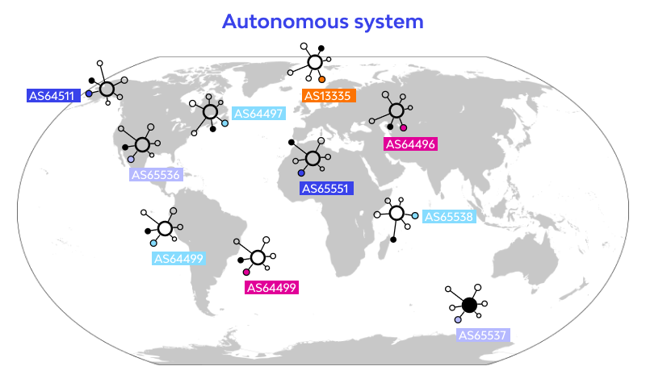
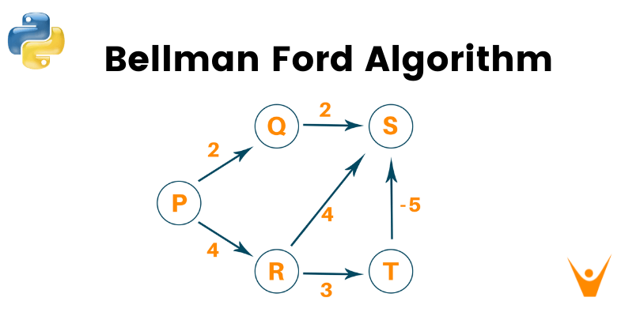

# 네트워크 - 라우팅 프로토콜과 거리벡터 라우팅

*K-MOOC - 네트워크 기초*

## 라우팅이란?

> #### 송신지에서 목적지까지 여러 개의 경로가 있는데, 경로를 설정해 주는 것이 라우팅이다
>
> #### 그리고 라우팅을 전문적으로 처리해 주는 장치는 라우터다
>
> #### 🚨 라우터들은 라우팅 프로토콜을 통해서 라우팅 테이블을 만든다
>
> - 라우팅 테이블 기준으로 패킷들이 전달 되고, 그 라우팅 테이블을 만드는 것이 라우팅 프로토콜

## 정적 라우팅

#### 사람이 직접 라우팅 테이블을 입력하는 것이다

#### 자동으로 라우팅 테이블이 갱신되지 않고, 보통 호스트 컴퓨터에서 사용된다

## 동적 라우팅

#### 주로 동적 라우팅을 사용한다

#### 자동으로 라우팅 테이블을 주기적으로 갱신하는 것

- 라우팅 테이블에 목적지 주소와 Next Hop이 들어간다
- 목적지 주소와 Next Hop은 지속적으로 갱신이 되는데, 이것을 자동으로 한다

## 유니캐스트 라우팅 프로토콜

> #### 유니캐스트는 1 대 1로 정보를 주고 받을 때 사용되는 라우팅 프로토콜
>
> #### 즉 목적지가 1개인 것

## 멀티캐스트 라우팅 프로토콜

> #### 송신자는 1, 수신자는 여럿일 때 사용되는 라우팅 프로토콜
>
> #### 여기서 수신자들은 하나의 그룹에 속해있다 (즉 하나의 네트워크 안에 있는 호스트들)

## 자율 시스템 (AS: Autonomous System)

> #### 자율 시스템은 하나의 네트워크와 네트워크 안에 있는 라우터의 집합으로 구성된다
>
> #### 그리고 자율 시스템 끼리, 즉 AS와 AS끼리도 연결이 되어 있다
>
> - 그래야 인터넷(네트워크와 네트워크 간의 연결)을 구축할 수 있다

- AS 번호가 주어지고, AS 번호가 같은 라우터들끼리 라우팅 정보를 주고 받는다
- AS 번호를 통해 네트워크 경계선을 만들 수 있다
- 트래픽을 줄일 수 있다

### 내부 게이트웨이 프로토콜 (Interior Gateway Protocol : IGP)

- **자율 시스템 내부에서 사용되는 프로토콜**
  - IS-IS, OSPF, IGRP, EIGRP, RIP 등
  - AS 내부에서는 여러 프로토콜을 사용해도 된다

### 외부 게이트웨이 프로토콜 (Exterior Gateway Protocol : EGP)

- **자율 시스템 간에, 즉 AS와 AS끼리 연결하기 위해 사용되는 라우팅 프로토콜**
  - BGP
  - AS와 AS 사이에서는 하나의 프로토콜을 사용해야 한다

## Distance Vector Routing (거리 백터 라우팅)

> #### Bellman-Ford라는 알고리즘을 사용한다
>
> - 최적의 경로를 최단거리로 나타낸 알고리즘
> - 실제로 RIP에서 사용되고, IGRP (Interior Gateway Routing Protocol)라는 프로토콜도 해당 알고리즘을 많이 사용한다

- 각 라우터, 즉 노드들은 자신들과 인접한 라우터 또는 라우터들의 정보만 알 수 있다
  - 예시) `P`는 `Q`와 `R`에 대한 정보 밖에 모른다
- 한 라우터는 인접하지 않은 라우터의 데이터를 모르니, 인접한 라우터를 통해 다른 라우터의 정보를 얻는다
  - 예시) `P`는 `R`을 통해 `S`와 `T`에 대한 정보를 얻을 수 있다
- 이렇게, 라우터끼리 주기적으로 다른 라우터에 대한 정보를 주고 받는다
- 이러한 정보를 통해 최적의 경로를 구할 수 있따
  - 예시) `P`에서 `S`에게 정보를 넘겨야 할 때에
    - `P`   ▶️   `R`   ▶️  `T`   ▶️  `S` 가 최적의 경로가 된다

