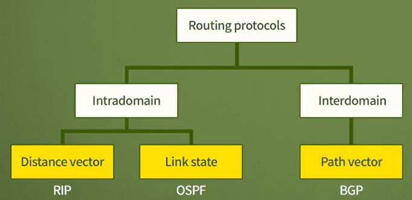
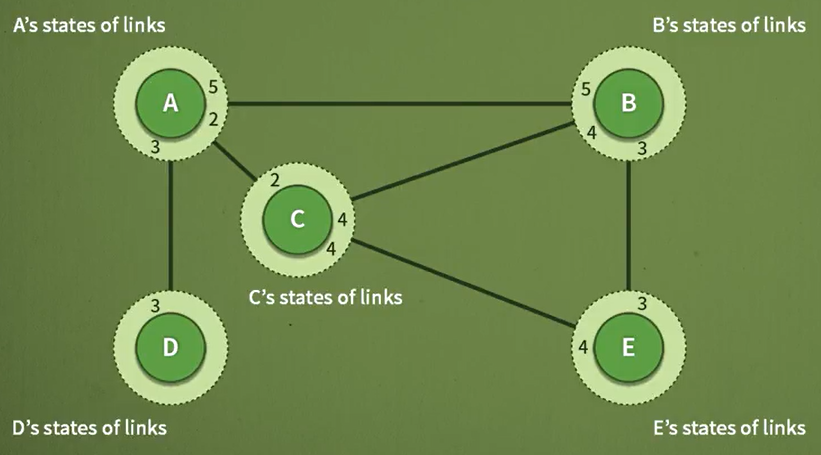
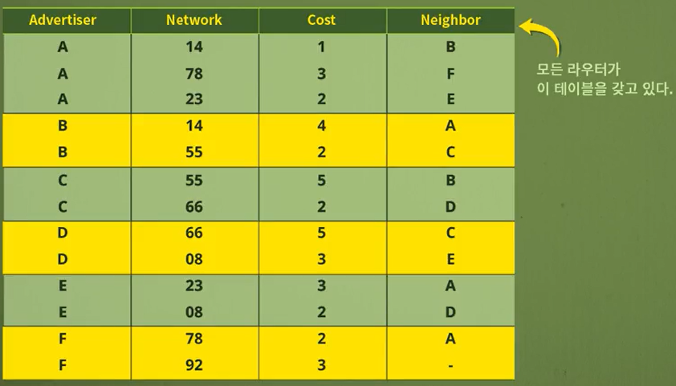

# 네트워크 - 링크 상태 라우팅과 경로벡터 라우팅

*K-MOOC - 네트워크 기초*

## 링크 상태 라우팅 (Link State Routing)

> #### 링크 상태에 따라 라우팅 테이블을 교환하는 주기가 바뀌게 되는 것
>
> #### 모든 노드가, 즉 라우터들이 네트워크 전체 구성도를 만들어서 경로를 구한다
>
> #### 다익스트라 알고리즘을 사용하여 라우팅 테이블을 구축한다

- 미리 네트워크 안에 노드와 링크, 토폴로지가, 어떻게 이루어졌는지 구성도를 만든다
- 그 구성도를 가지고 정보를 최종 목적지까지 전달할 수 있는 경로를 설정한다
- 그리고 경로를 결정할 때에는 `다익스트라 알고리즘`, 즉 최단경로 알고리즘을 사용한다

### OSPF (Open Shortest Path First)

> 링크 상태 라우팅에서 사용되는 프로토콜

- 네트워크가 있으면, 그 네트워크 안에 있는 노드들은 같은 구성도를 각자 가지고 있다
  - 구성도는 네트워크의 노드와 링크들을 그려낸 것
- 그려놓은 구성도를 기반으로 다익스트라 알고리즘을 사용하여 데이터를 최종 목적지에 전달할 수 있는 최단 경로를 찾는다
- **각 노드마다 이미 네트워크 전체의 구성도를 가지고 있어, 주기적으로 노드끼리 정보를 주고 받지 않아도 된다**
  - 하지만, **노드들의 링크 상태가 바뀌게 될 때마다, 구성도를 바꿔야 한다**

> #### **구성도를 그리는 방법**
>
> - 노드들의 링크 상태가 바뀔 때에만, 노드들끼리 정보를 주고 받는

- 각 노드끼리 정보를 주고 받는다
  - 각 노드가 어느 노드와 인접해 있는지 정보를 주고 받게 되면 구성도를 만들 수 있다
  - 예시)
    - `A`는 처음에 `E`가 존재하는지 모른다
    - 하지만 `A`와 인접한 `C` 또는 `B`를 통해서 `E`의 존재 여부를 알 수 있다

> #### **Flooding**
>
> - 노드의 정보를 주고 받는 방법

- 각 노드 당, 인접한 노드들의 정보를 공유하다 보면, 네트워크의 구성도를 그릴 수 있다
- 여기서 정보를 공유하는 Flooding 방법을 사용한다
  - `A`가 자기 자신과, 인접한 노드들의 정보를 네트워크에 있는 모든 노드들에게 뿌린다
  - 그렇게 되면 모든 노드들은 `A`가 어느 노드와 인접해 있는지 알 수 있게 된다
  - 이것을 `A`만 하는 것이 아닌, 모든 노드들이 자신의 인접한 노드들의 정보를 공유한다
  - 그렇게 되면, 모든 노드들은 같은 정보를 가지게 되고, 그 정보를 정리해서 **링크 상태 데이터베이스**를 만든다
- **링크 상태 데이터 베이스**
  - 모든 라우터들이 동일하게 가지는 테이블이고, 네트워크 구성도라고 생각하면 된다
  - 모든 노드들이 이 데이터 베이스를 가지게 된다

### Distance Vector vs Link State

- **거리 백터**
  -  내가 가진 정보를 노드끼리 공유를 하는 것
  - 거리 백터는 Bellman-Ford 알고리즘을 사용한다
- **링크 상태**  
  - 네트워크가 어떻게 구성되어 있는지, 미리 구성도를 만드는 것
  - 즉 네트워크 안에 노드와 링크, 토폴로지가 어떻게 구성되어 있는지 미리 만들어 놓는다
  - 링크의 상태가 바뀌거나, 끊어지면, 다시 구성도를 그리게 된다
  - 링크 상태는 다익스트라 알고리즘, shortest-path spanning tree를 이용한다

## 경로 백터 라우팅 (Path Vector Routing)

> #### 도메인하고 도메인 사이에 사용되는 라우팅 방법
>
> #### 모든 경로를 명시한다
>
> - 목적지까지 어떤 도메인을 거쳐서 간다 라는 경로를 다 명시한다

### BGP (Border Gateway Protocol)

- 경로 백터 라우팅을 위한 프로토콜

### 사용하는 이유

- **Loop Prevention (루프 방지)**

  - 경로 백터 라우팅은 모든 경로가 나온다
  - 즉 경로가 돌고 도는 것을 방지할 수 있다

  

- **Policy Routing (정책 라우팅)**

  - 인터넷은 최적의 경로를 선택해서 패킷을 전달한다
  - 그러다 보니, 다른 네트워크를 거쳐서 갈 수도 있다
  - 하지만 다른 네트워크를 거쳐 간다는 것은, 그 네트워크의 자원을 사용하는 것
  - 즉 경로를 명시해, 경로를 조절해서 경로를 설정할 수 있게 해준

