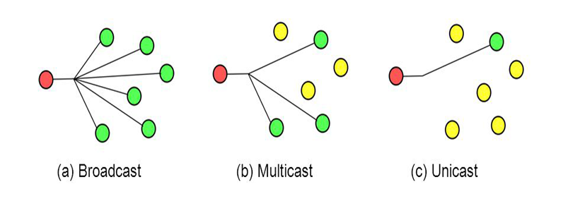
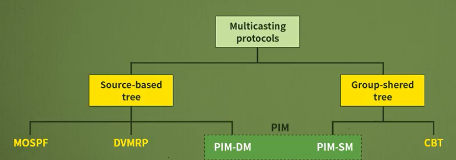

# 네트워크 - 멀티캐스팅

*K-MOOC - 네트워크 기초*

## 멀티캐스트

> 유니캐스트는 송신자 하나, 목적지 하나
>
> 브로드캐스트는 송신자 하나, 목적지가 전부 다
>
> 멀티캐스트는 송신자가 하나고, 목적지가 여럿이다

#### 즉 멀티캐스트는 송신자가 특정 다수의 수신자와의 통신 형태를 말한다

- 다수이지만, 전체는 아니다!

## 멀티캐스트 그룹의 가입과 탈퇴

> #### 패킷이 복사가 되는데, 특정 그룹에게만 복사되어 가기 위해서, 그룹에 가입된 곳에만 패킷을 보낸다

### IGMP (Internet Group Management Protocol)

- 라우팅은 상관 없지만, 멀티캐스트 그룹의 가입 또는 탈퇴만을 관리해주는 프로토콜이다
- 그리고 컴퓨터들의 그룹 가입 또는 탈퇴 여부를 라우터에 전달을 한다
- **즉 라우터와 말단에 있는 컴퓨터 사이에서 동작을 한다**

#### Query

- 라우터에서 컴퓨터의 가입 여부를 확인한다
  - 컴퓨터가 켜져 있는지, 꺼져 있는지 확인을 한다
- General query message는 모든 그룹의 구성원들에게 보내진

#### Report

- Query message에 응답을 하는 

- 컴퓨터에서 라우터에 응답을 하거나, 응답을 하지 않는다
  - 응답을 하면, 아직 켜져있는 상태
  - 반대로 응답이 없으면 라우터는 컴퓨터가 꺼져있다고 생각을 한다
- 응답을 하지 않는 경우, 라우터 데이터베이스에서 제거를 한다

## 멀티캐스트 라우팅

> #### 멀티캐스트 라우팅에서는 라우터가 각 그룹에 대한 하나의 최적 경로를 가진다

### 송신자 기반 트리 (Source-based Tree)

> #### 송신자를 시작으로, 멀티캐스트와 연결되어 있는 경로를 만드는 것
>
> - 모든 송신자가, 자신의 기준으로 멀티캐스트 트리를 만들어 놓았을 것이
>
> #### 즉 라우터들이, 자신을 기준으로 경로를 그리는 것이다 (Tree)
>
> #### 그리고 경로를 만들어주는 프로토콜이 MOSPF, DVMRP, PIM-DM이 있

#### MOSPF (Multi Open Shortest Path First)

- OSPF (최단 거리 구하는 것)을 기반으로 멀티캐스팅으로 확장을 했다

#### DVMRP (Distance Vector Multicast Routing Protocol)

- RIP 같은 거리 백터 라우팅 방식을 확장한 것이다

#### PIM-DM (Protocol Independent Multicast-Dense Mode)

- RIP나 OSPF를 사용하는 프로토콜

### 그룹 공유 트리 (Group-shared Tree)

> #### 다른 컴퓨터들이 트리 하나를 공유한다는 뜻이다
>
> - 그룹 당, 최상단에 위치하는 라우터, 코어 라우터가 트리를 만들어 놓고, 트리를 공유한다
> - 즉, 멀티캐스트 그룹 당 하나만 필요하
>
> #### 즉, 제일 상단에 통신 장치에게 패킷을 보내주면, 그 통신 장치가 알아서 목적지들에게 보내준다

#### 트리를 만드는 프로토콜은 PIM-SM, CBT이 있다
