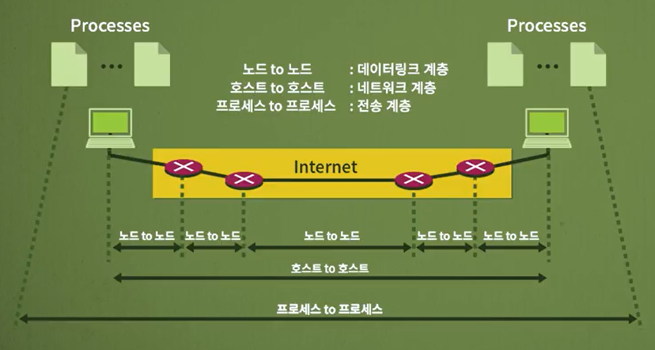
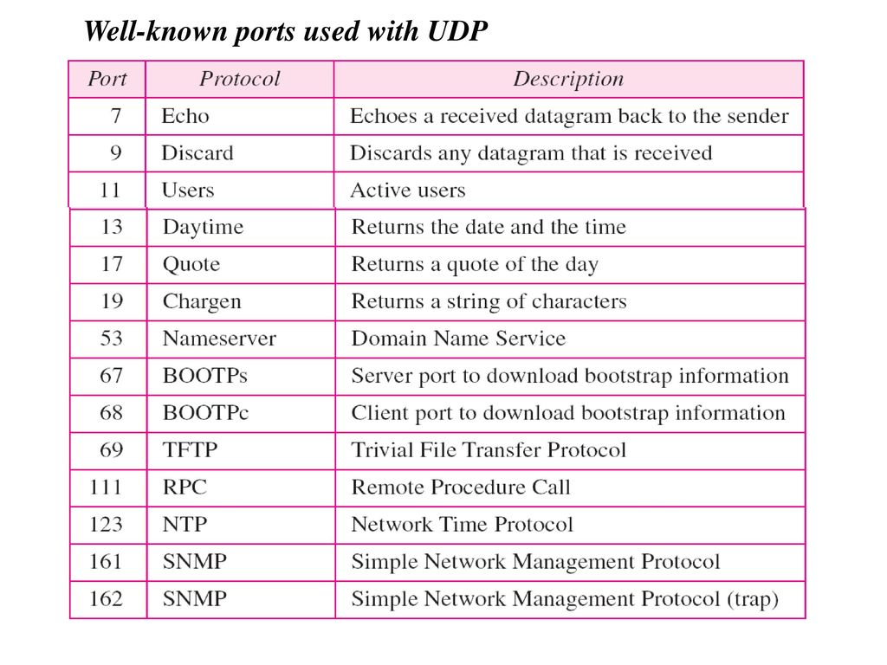

# 네트워크 - 전송 프로토콜과 UDP

*K-MOOC - 네트워크 기초*

## 전송 프로토콜 (Transport Protocol)

> #### 프로세스와 프로세스 간의 통신을 관장하는 계층
>
> #### 포트 번호가 프로세스 간의 전달에 사용된

- **데이터 링크 계층** : 노드와 노드 사이의 프레임 전달 관여
  - 에러제어가 제일 중요한 기능
- **네트워크 계층** : 호스트와 호스트 사이의 패킷 전달 관여
  - 라우팅, 제일 좋은 경로를 설정하는 것
- **전송 계층** : 프로세스와 프로세스 사이의 정보 교환 
  - 호스트 안에서 돌아가고 있는 네트워크와 관련된 프로그램들 간의 정보 교환
  - 예) 호스트 컴퓨터까지 패킷을 네트워크 계층이 관리해주고, 그 이후로, 패킷을 컴퓨터 내에 있는 브라우저로 보낼지, 파일 다운로드하는 프로그램으로 보낼지, 이메일 하는 대로 보낼지 구분해준다

### 클라이언트 / 서버 구성

> #### 프로세스 간의 통신은 클라이언트와 서버의 구성을 통해 이루어진

#### 클라이언트

- 받고 싶은 데이터를 요청하고, 응답을 받는다

#### 서버

- 클라이언트에서 받고 싶어하는 데이터를 요청 받으면, 그 데이터를 응답해준다

### 포트 번호

> #### 전송 계층에서 사용하는 주소다
>
> #### 물리적인 것이 아닌 논리적인 포트번호다
>
> #### 특정 호스트에서 실행되고 있는 프로세스를 구분하기 위해 사용한다
>
> - 포트 번호는 16비트 정수로, 0에서 65535 사이의 값을 갖는다
>
> #### 서버 쪽에서 사용되는 포트 번호와, 클라이언트 쪽에서 사용되는 포트 번호가 있다

#### 서버 포트 번호 (Well-known port numbers)

- 서버는 24시간 365일 돌아가기 때문에 똑같은 포트 번호를 가지고 있다
  - 왜냐하면, 해당 어플리케이션을 언제든지 사용할 수 있도록 도와준

#### 클라이언트 포트 번호 (ephemeral port number)

- 임시로 사용자에게 포트 번호를 부여해 주는 것이다
  - 사용자는 계속 서비스를 사용하지 않는다
  - 즉 서비스를 사용할 때에는 포트 번호를 받게 되고, 사용하지 않을 때에는 포트 번호가 소멸된다

#### IANA (Internet Assigned Numbers Authority)

> well-known과 registered 포트는 지정된 포트 번호라서, 엄격하게 관리가 되고 있다
>
> dynamic 포트는, 사용자에게 임시적으로 주어지는 포트 번호라서, 특정 프로세스에 메여있지 않

- **Well-known ports**
  - 0 ~ 1023이 할당되어 인터넷 서비스를 위해 사용
- **Registered ports**
  - 기업 또는 기관에서의 임시 개발이나 특정 응용을 위해 사용되는 포트 번호
- **Dynamic ports**
  - 49152 ~ 65535의 범위로 사용자에게 임시적으로 주어지는 포트 번호

## UDP (User Datagram Protocol)

> #### 간단한 요청, 응답을 하는 서비스에 사용된다
>
> #### 응용 계층에서 할 수 있는 것들을, 전송 계층에서 하면 효율성이 떨어져서, 하지 않는다
>
> #### 멀티캐스팅 할 때에 효율적이다
>
> - 연결 설정을 하지 않아도 된다
> - RIP 라우팅 프로토콜에서도 라우팅 정보를 주고 받기 위해 사용할 수 있다

#### 비연결형 프로토콜으로 신뢰성이 떨어진다

- Connectionless

#### 수신자의 상태 상관없이, 데이터를 그냥 보내고, 중간에 문제가 생기면 바로 폐기해 버린다

- 에러제어, 흐름제어, 재전송 X

#### 효율성이 굉장히 좋다 / 오버헤드가 작다

- 비연결형이기 때문에, 연결 설정을 할 필요가 없다

- **오버헤드**  :  특정  기능을 수행하는데 추가적으로 들어가는 간접적인 시간, 또는 메모리를 뜻한다
  - 예) 원래 1초로 완료할 수 있는 것을, 간접적인 요소 때문에 3초가 걸렸다면, 2초가 오버헤드가 된다
    - `3초 (실제 걸린 시)` - `1초 (원래 걸리는 시간)` =  `2초 (오버헤드)`

### UDP에서 사용되는 well-known 포트

- 위 리스트에서 제일 잘 알려진 것이 **UDP 53** 이다
  - **DNS (Domain Name Service)**  :  웹 사이트 주소 (www.---)를 입력하면, 그것을 IP주소로 바꾸고, 반대로 IP주소를 사이트 주소 (www.---)로 바꿔주는 것
- **SNMP (161, 162)  |  Simple Network Management Protocol**
  - 인터넷을 사용하는 통신 장치들을 관리하기 위해 만든 프로토콜

### UDP datagram

> #### UDP는 8바이트의 고정된 헤더를 갖고 있다
>
> #### 체크섬도 존재하지만, 그것은 선택이 가능하다
>
> - 데이터에 에러 여부를 체크해주는 것
>
> #### 이처럼 데이터의 에러를 확인해 주는 계층은 전송 계층과, 데이터링크 계층에서 해줄 수 있다

#### 체크섬

- 가상 헤더를 만들어서 계산을 한다
- 가상 헤더는 IP 패킷의 헤더에서 가지고 온 정보로 구성되어 있다
  - 송신자 IP 주소, 목적지 IP 주소, 프로토콜 필드, 전체 길이 필드 

