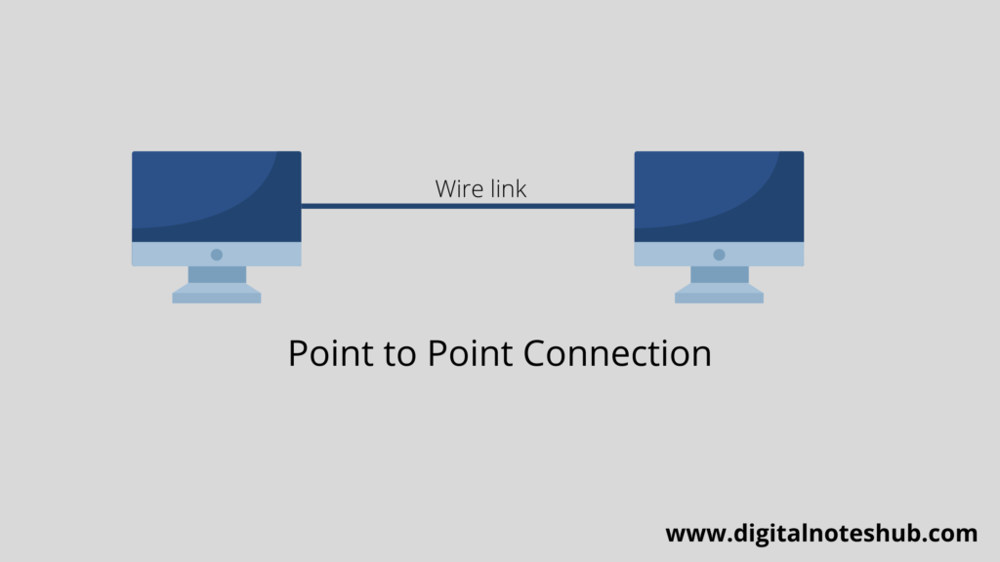
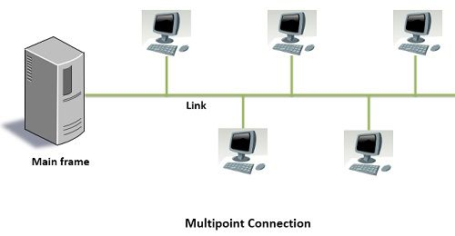
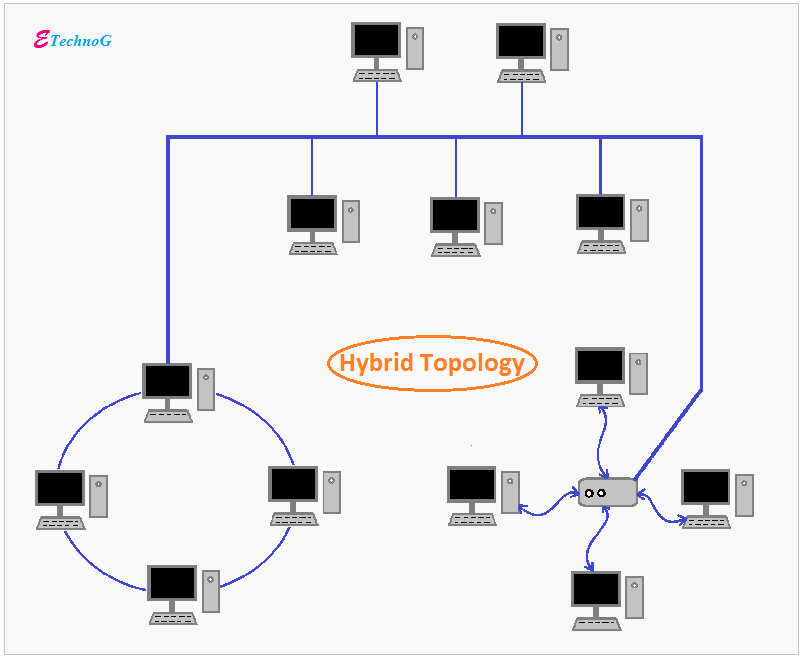
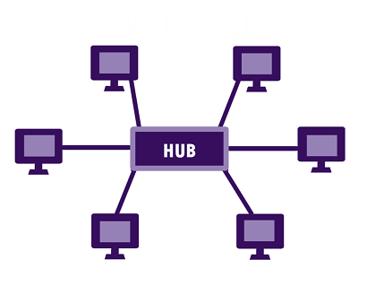
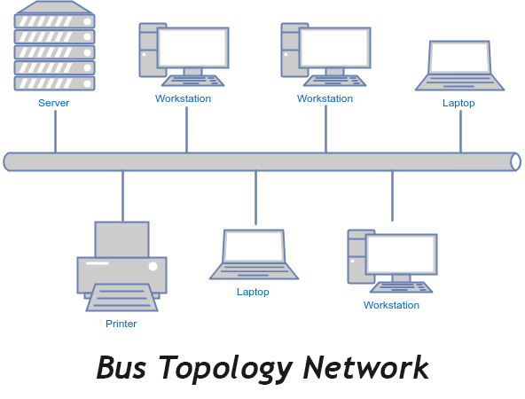
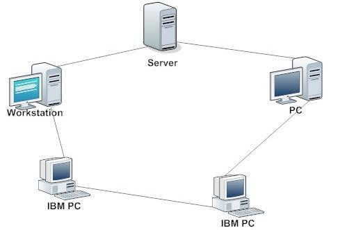
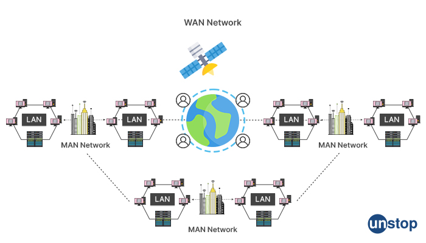

# 네트워크 기초

*K-MOOC - 네트워크 기초*

## 네트워크의 구성 요소

> #### 노드들이 링크를 통해 연결되어 한 덩어리를 이루는 것이 네트워크다

#### 노드

- 장치들
- 예시) PC, 서버, 라우터, 스위치

#### 링크

- 노드들을 연결해주는 링크

## 좋은 네트워크의 조건

- #### 성능 (Performance)

  - 처리량 (throughput) : 단일 시간에 얼마나 많은 데이터를 처리할 수 있는가? (더 많은 데이터를 처리할 수 있으면 좋은 것)
  - 지연시간 (delay) : 데이터를 응답하는데 걸리는 시간 (지연시간이 늘어날 수록 유저들이 싫어한다)
    - 경유시간 : 한 장치에서 다른 장치로 데이터가 전달되는 시간
    - 응답시간 : 요청과 응답에 소요되는 시간

- #### 실뢰성 (Reliability)

  - 장애빈도, 장애 발생 후 회복시간이 빨라야 한다
  - 아무리 데이터를 빠르게 처리를 한다 해도, 네트워크에 계속 장애가 생긴다면 유저들을 불편을 느낄 것이다 (신뢰성이 떨어지는 것)

- #### 보안성 (Security)

  - 외부에서의 침입을 막는 것
  - 외부에서 침입을 받으면, 유저들의 데이터들이 유출이 될 수 있다

## 링크의 연결 형태

- #### 일대일 포인트 연결 (Point-To-Point)

  - 데이터를 보내면, 데이터를 받는 매체가 하나인 것
  - 예시) **컴퓨터**와 **프린트**의 연결

- #### 멀티 포인트 연결 (Multipoint 또는 Multidrop)

  - 데이터를 보내면, 하나의 링크로, 여러 매체가 데이터를 받을 수 있는 것
  - 예시) 강의 같이, **교수**가 데이터를 **여러 학생들**에게 전달하는 것
  - 예시 2) 하나의 본체로 여러 모니터를 사용하는 것 (듀얼 스크린)

## 네트워크 구조

#### 네트워크 토폴로지 (Topology)

- **노드와 링크의 배치 형태를 토폴로지라고 한다**
- 토폴로지는 4개의 형태로 분류가 된다
- 그리고 모든 노드가 링크를 통해 연결이 되어 네트워크를 만든 것 같이, 네트워크 토폴로지도 모두 연결이 되어 있다
  - 위의 그림 같이

#### 토폴로지 4가지 형태

- ##### **Star (성형)**

  - 각 장치가 중앙의 장치에 일대일로 연결이 되어 있는 것

  

- ##### **Bus (버스 형태)**

  - 케이블 하나의 여러 개의 컴퓨터들이 연결되어 데이터를 공유하는 것이 버스 형태의 네트워크 토폴로지다

- ##### **Ring (링 형태)**

  - 장치들이 서로 링처럼 연결이 되어 있다
  - 링을 따라 한쪽 방향으로 데이터가 전달된다

- ##### **Mesh (그물, 망)**

  - 위에 세가지 형태의 네트워크 토폴로지가 아니면, 대부분이 그물형의 네트워크 토폴로지다
  - 그냥 모든 장치가 일대일로 연결이 되어 있는 것이다

## 네트워크 분류

#### 네트워크의 크기, 소유권, 구조를 고려해서 통상적으로 분류를 한다

- 연결된 노드와 링크들이 얼마나 많나?
- 네트워크의 소유주가 누군가?

#### LAN, MAN, WAN

- ##### Local Area Network

  - 로컬의 기준은 매우 애매하다
    - 한 사무실이 될 수도 있고, 건물이 될 수도 있고, 캠퍼스가 될 수도 있다
  - 정해진 기준은 없지만, 멀지 않은 거리에 링크를 통해 연결되어 있는 노드들을 말한다

- ##### Metropolitan Area Network

  - 대도시 규모 (서울)

- ##### Wide Area Network

  - 전국, 전세계 등으로 규모가 제일 큰 기준
  - 인터넷 같은 경우 WAN으로 분류할 수 있다
    - INTERNET : 네트워크와 네트워크가 연결되어 있다

