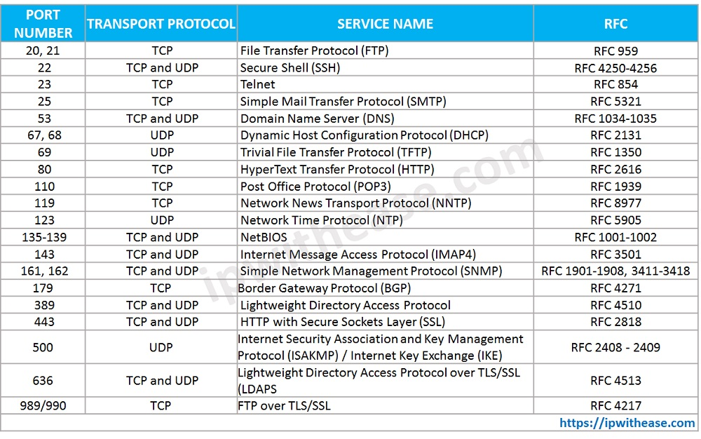
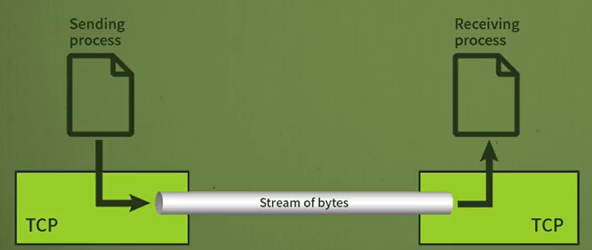
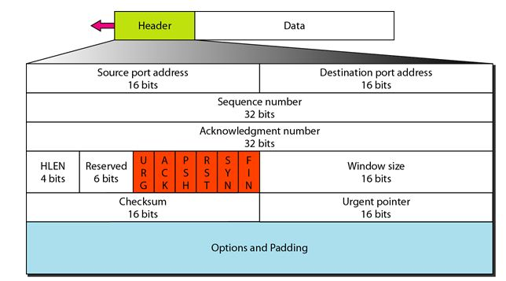
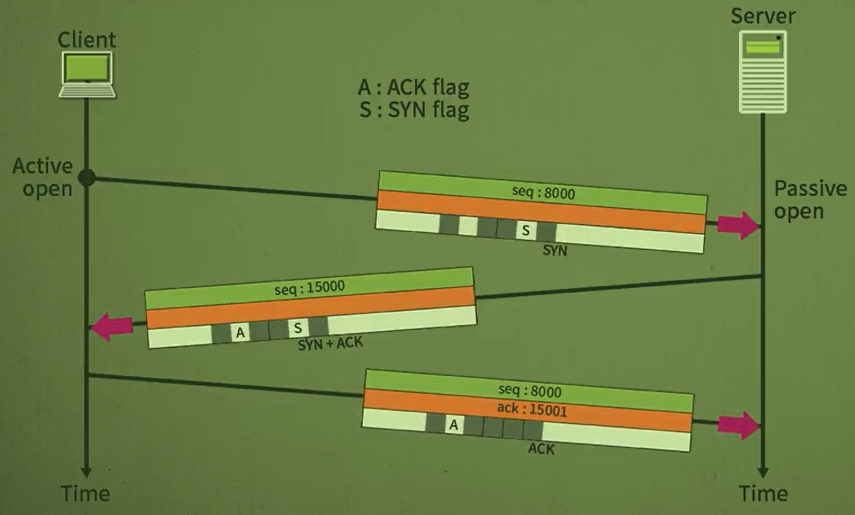
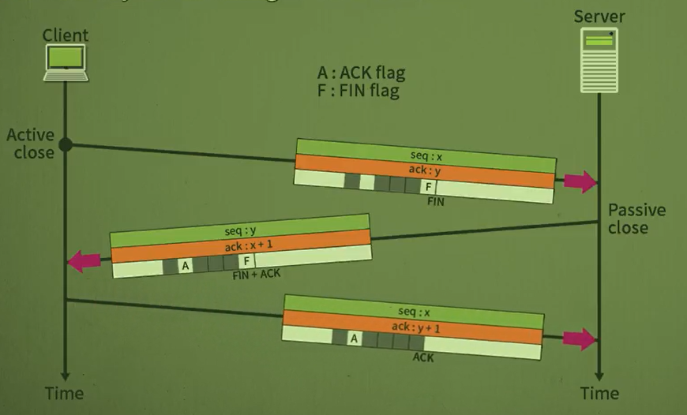
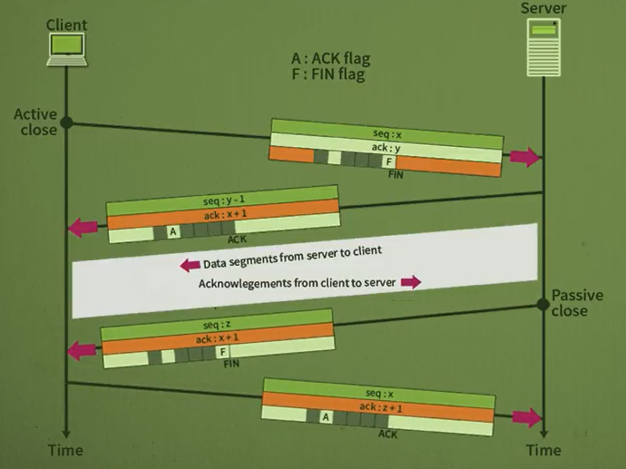
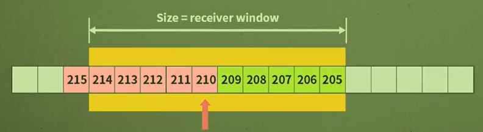

# 네트워크 - TCP 프로토콜

*K-MOOC - 네트워크 기초*

## TCP의 기능

> #### Transmission Control Protocol
>
> #### 전송계층 (Transport Layer)에서 가장 핵심적인 역할을 한다

#### IP 프로토콜은 신뢰성이 떨어진다 | 프로세스 간의 신뢰성 있는 서비스를 제공해준다

- 즉 패킷이 중간에 문제가 생기거나, fragmentation이 발생하면 순서가 바뀌거나 아예 없어질 수도 있다
- **TCP는 이러한 문제들이 생기면, 손실된 패킷을 복구하여, 다시 보낼 수 있도록 한다**
- **Fragmentation의 순서가 바뀌면, 순서를 다시 제대로 맞추는 역할도 한다**

#### Connection oriented 서비스를 제공한다

- 데이터를 보내기 전에 연결 설정을 하고, 연결이 잘 됬다는 것을 확인하면 데이터를 보내게 된다
- **데이터를 보내면, 목적지에서 ACK을 통해 데이터를 잘 받았는지 확인할 수 있다**
- IP나 UDP (Connectionless)는 이러한 기능이 없다

#### TCP도 프로세스 간의 통신을 하기 위해 포트 번호를 사용한다

- 이메일을 보낼 때에 SMTP는 TCP를 이용한다
- DNS는 UDP가 안 되었을 때에, TCP를 사용한다

#### 스트림 전달 서비스

- 데이터의 바이트들을 순서대로 목적지에 전달되도록 해준다

### TCP 특징

- **TCP는 바이트에 번호를 부여한다**
  - 순서가 달라도 나중에 바이트의 번호를 보고 순서대로 나열할 수 있다
  - **흐름제어** : 수신자가 자신의 버퍼 상태를 보고 송신자에게 자신의 상태를 전달. 이를 통해 송신자가 수신자에게 보내는 바이트를 제어를 할 수 있다
  - **에러제어** : 특정 바이트의 번호가 안 들어왔으면, 확인을 할 수 있다
- **ACK 사용**
  - ACK 번호는 누적 값으로, 해당 번호 이전 값들은 잘 받았다는 의미를 두고 있다
  - 예시 ) ACK 번호가 100번이면, 0~99바이트까지 수신자가 잘 받았다는 것을 의미한다

## 세그먼트 형태

> #### TCP 메세지의 형태, 즉 TCP 메세지의 전체

#### Source Port Address (송신자 포트 번호)

#### Destination Port Address (수신자 포트 번호)

#### Sequence Number

#### Acknowledgment number (ACK)

- 수신자 쪽에서 바이트 몇 번까지 잘 받았는지 송신자에게 전해주는 

#### HLEN (Header Length)

- 헤더는 20바이트지만, 옵션까지 최대 60바이트까지 존재할 수 있다
- 그래서 헤더의 길이를 표시하는 필드가 필요하

#### Control Field (제어 필드) - 어떤 세그먼트인 것을 나타내는 필드

*이미지 빨간 부분*

- ##### URG (urgent) - 1비트 

  - 해당 TCP 세그먼트를 우선적으로 보내야 한다는 필드
  - 해당 필드가 있으면, 빨리 보내야 한다는 것을 알 수 있음

- ##### ACK (Acknowledge)  - 1비트 

  - 이 필드가 세트가 되면, **Acknowledege number** 필드가 의미를 갖게 된다

- ##### PSH (Push)  - 1비트

  - TCP에서는 버퍼링을 하는데, 버퍼링 없이 데이터를 보내라는 신호
  - 바로바로 데이터를 보내야 할 상황에서 사용된다

- ##### RST (Reset)  - 1비트 

  - 연결을 재설정 해야 하는 것
  - 오랫동안 통신을 안 했을 경우 재설정을 해야 한다

- ##### SYN  - 1비트 

  - 연결을 설정하는 필드

- ##### FIN (Finish)  - 1비트 

  - 연결을 종료를 알리는 필

#### Window Size

- 버퍼의 크기다
- 흐름 제어를 하기 위해, 수신자 쪽에서, 지금 비어있는 용량이 어느 정도인지 송신자에게 보낸다
- 이를 통해 송신자가, 얼마만큼 바이트를 보낼 수 있을지 알 수 있다

#### Checksum

- TCP는 무조건 검사가 필요하다
- 가상 헤더를 포함하여 계산을 한다
- 에러를 확인해야, 나중에 데이터를 재전송할 수 있다

#### Urgent Pointer

- URG 가 셋팅되면,  바이트 어디까지가 빠르게 보내져야하는 알려주는 필드
- 예시) urgent pointer가 100이면, 100바이트까지 긴급데이터라는 것을 의미한다

## 연결 설정과 해제

> #### TCP 연결 설정은 Three-way handshake을 통해서 연결을 한다
>
> #### TCP 연결 해제는 Three-way handshake 또는 Four-way handshake를 사용할 수 있다

#### 연결 설정 : Three-way handshake

1. 클라이언트에서 연결을 하기 위해 SYN 세그먼트를 전송
2. 서버에서 `1번`을 잘 받았다는 것과, 클라이언트와의 연결을 위해 SYN와 ACK를 포함한 세그먼트를 전송
3. 클라이언트는 `2번`을 잘 받았다는 것을 ACK 세그먼트를 통해 서버에게 전달

> 이렇게 총 3번 왔다갔다 해서 Three-way handshake이라고 한다

#### 연결 해제 : Three-way handshake

> FIN을 의미하는 신호를 보낸다
>
> FIN을 보낼 때에 바로바로 연결을 끊는

1. 클라이언트에서 FIN 세그먼트를 서버에게 전송한다
2. 서버는 `1번`을 잘 받았고, 연결을 끊기 위해서 ACK와 FIN이 포함되어 있는 세그먼트를 클라이언트에 전송한다
3. 클라이언트는 `2번`을 잘 받았다는 ACK 세그먼트를 서버에 보낸다

#### 연결 해제 : Four-way handshake

> 서버에서 ACK와 FIN을 한번에 다 보내는 것이 아니다
>
> ACK를 보내고, FIN을 보내기 전에 보낼 데이터들을 다 보낸다

1. 클라이언트에서 연결 해제를 위해 FIN을 보낸다
2. 서버는 `1번`을 잘 받았다는 의미로, ACK 세그먼트를 보낸다
3. 서버에서 클라이언트 쪽에, 보낼 데이터들을 다 보내면, 클라이언트 쪽에 FIN을 보내 연결을 해제한다
4. 클라이언트는 `3번`을 잘 받았다는 의미로 ACK 세그먼트를 서버에 보낸

## 흐름 제어

> #### 보낼 수 있는 데이터의 양을 파악하는 것

- 송신자 쪽에서 너무 많은 데이터를 보내게 되면, 수신자 쪽에서 버퍼가 넘쳐서 손실이 일어날 수 있다
- 이것을 방지하기 위해, 수신자의 버퍼 용량을 송신자에게 보낸다
- 그렇게 하면 버퍼 용량에 맞춰서, 송신자가 데이터를 보낼 수 있다

#### 슬라이딩 윈도우 프로토콜

- 흐름제어를 하기 위해 사용하는 프로토콜
- TCP는 바이트 단위로 윈도우 크기 (Window Size), 수신 가능한 데이터 양,을 명시한다
- 윈도우 크기는 시간에 따라 변할 수 있다
