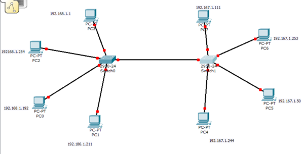
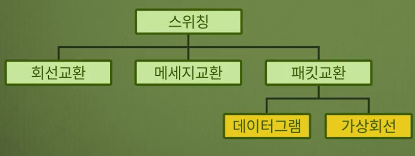
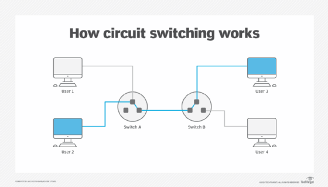
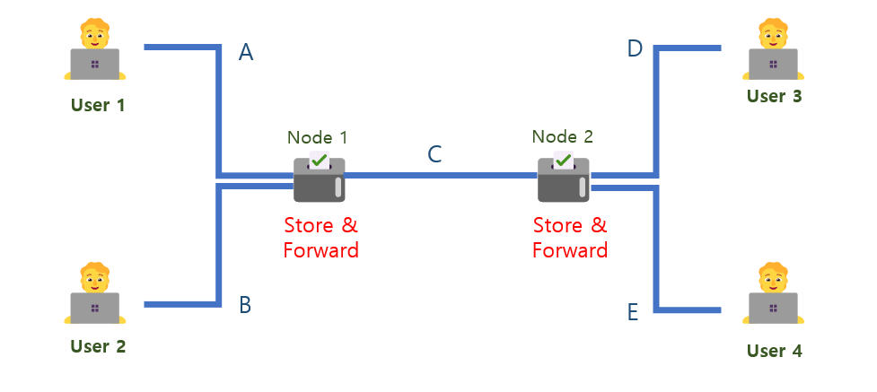
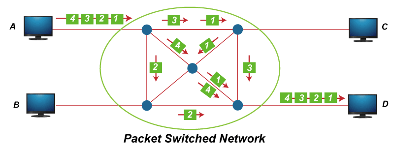
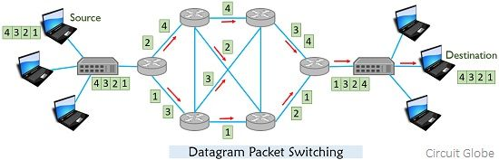
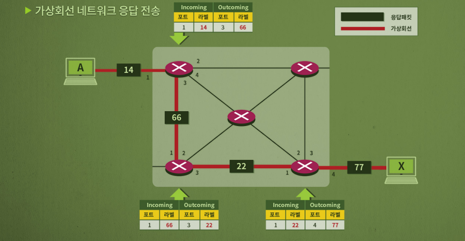
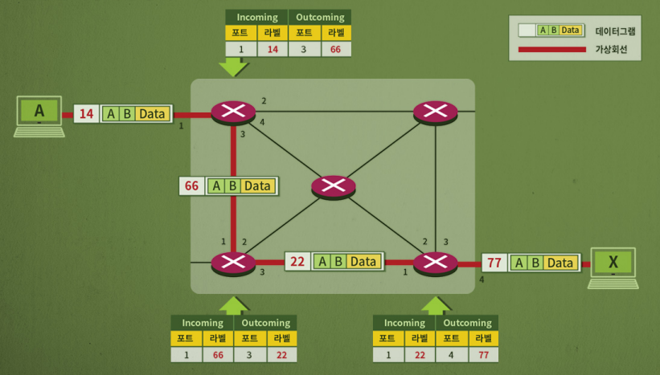

# 네트워크 스위칭 방법과 종류

*K-MOOC - 네트워크 기초*

## 스위칭의 필요성

> #### 스위칭은 노드와 노드 사이의 링크를 임시적으로 잠깐 연결해주는 것이다

- 여러 개의 장치가 있을 경우, 링크 (선)이 있어야 장치들을 연결하여 데이터를 주고 받을 수 있다
- 즉 장치가 많아질 수록 링크 (선)이 많아져야 한다
  - 링크 (선)이 많아진다는 것은 **비용**이 더 많이 들어간다는 것이다
  - 항상 링크 (선)들이 사용되는 것은 아니다. 
- 데이터를 주고 받을 때 비용을 줄이고, 사용되는 링크 (선)을 더 **효율적**으로 사용하기 위해 **스위치**를 사용한다

## 스위치 방식의 종류

#### 스위치 방식의 종류는 회선교환, 메세지 교환, 패킷교환 이 있다

##### 패킷교환은 데이터그램과 가상회선으로 다시 나눌 수 있다

### 회선 교환 (Circuit Switching)

- 회선 교환은 물리적인 **선**을 생각하면 된다
- 회선 교환은 데이터를 주고 받을 **두 장치 / 사람**에게 선을 할당하는 방식을 말한다
  - 두 사람만 사용하니, 다른 사람들은 그 선을 사용을 못 한다
  - 예) 위 사진에 user 2와 user 3이 스위치를 통해 선이 연결되어 있다. 즉 user 1과 user 4는 데이터를 주고 받지 못 한다.
- 대표적인 네트워크는 **PSTN (Public Switch Telephone Network)**이다

#### 특징

- 두 명에게만 선을 할당을 했으니, 데이터를 주고 받는 속도가 일정하다
- 송신자와 수신자가 누군지 찾는 속도는 느리지만, 한번 찾고, 연결이 되어 있으면 지연 시간이 없다
- 하지만 한번 연결이 되면, 선을 이용하는 것이기 때문에, 데이터가 공유가 안 되어도 비용이 발생한다는 단점이 있다
  - 예) 전화를 하는데, 말이 없어도 비용은 발생한다

### 메세지 교환 (Message Switching)

- 회선 교환은 선을 사용하는 두 유저들 사이에 있는 모든 선을 이용한다
  - 이렇게 되면, 놀고 있는 선들이 생기게 된다
  - 예) 회선 교환의 사진에, user 1과 switch A 사이의 선 / user 4와 switch B 사이의 선
- 이것을 개선하기 위해 메세지 교환 네트워크가 사용되고 있다
  - 데이터를 보낼 때, 데이터가 보내는 동안에는 다른 사람이 선을 사용을 못 한다
  - 데이터가 다른 노드로 보내지면, 다른 유저가 그 선을 사용할 수 있다
  - **Store & Forward** 방식

#### 사진 설명

1. `User 1`이 `User 3`에게 메세지를 보낸다 / 동시에` User 2`가 `User 4`에 보내려고 한다
2. 먼저 `User 1`의 메세지가 Node 1에 도착한다 / `User 2`는 `User 1`의 메세지가 Node 2에 도착할 때까지 기다린다
3. `User 1`의 메세지가 Node 2로 **Forward** 되고 **Store** 된다 / User 2의 메세지가 Node 1에 **Store** 된다
4. `User 1`의 메세지가 `User 3`에게 전달이 된다 /` User 2`의 메세지가 Node 2에 **Forward** 되고, Store 된다
5. `User 2`의 메세지도 `User 4`에게 전달이 된다

> 즉 공통으로 사용되는 선은 C다.  
>
> **회선 교환**이었으면, User 2는 User 4에게 데이터를 전송하려고 했으면 User 1의 데이터가 User 3에게 전달이 완료될 때까지 기다려야 했을 것이다.
>
> 하지만 **메세지 교환**을 통해 데이터가 노드에서 다른 노드로 전달 될 때까지만 기다리면 된다.
>
> - 즉 선을 보면 회선 교환은 3번을 기다려야 하면, 메세지 교환은 1번만 기다리면 된다

#### 특징

- 링크, 선들을 더 효율적으로 사용할 수 있다
- 하지만 각 노드(통신 장치)에 데이터를 저장하고, 다음 노드에 보내는 방식인 것이 큰 단점이다
  - 데이터가 계속 커지면, 데이터를 전송하는 속도는 더 느려진다

### 패킷 교환 (Packet Switching)

- 중간 중간에 있는 노드 (통신 장치)가 저장할 수 있는 크기로 데이터를 잘라서 보내는 것이 패킷 교환이다
  - 자르는 단위를 **패킷**이라고 한다
  - 위에 패킷 교환 사진에 1, 2, 3, 4로 표시된 네모들이 모두 **패킷**이다
  - 그리고 패킷들을 표시하기 위해서 헤더를 포함하여 부가적인 정보를 추가한다

- 메세지 교환처럼, 한 패킷을 보낼 때에 사용되고 있는 선은 사용하지 못 한다

#### 특징

- 군집성 있는 (Bursty)한 트래픽 전송에 적합하다
  - Bursty : 데이터가 갑자기 집중적으로 한번씩 소규모로 발송이 되는 것)
- 두 장치가 하나의 전송속도를 갖지 않는다. 즉, 우선순위 적용이 가능하다

#### 데이터그램 방식

- 사용자 메세지를 잘라서 보내는 것. 각 패킷을 독립적으로 처리한다
- 연결설정과정이 없다
- 목적지만 정해놓고 메세지를 보내서, 항상 같은 경로로 전송되지 않는다
  - 패킷마다의 경로가 달라져서, 도착할 때에는 패킷의 순서가 뒤바뀔 때도 있다
- 장점 : 네트워크를 효율적으로 사용할 수 있다
  - 패킷을 보낼 때에, 어는 경로가 더 빠르고 효율적인지 계산을 하며 보낸다
- 단점 : 패킷이 순서대로 도착한다는 보장이 없어서, 어느 지점에서 순서대로 맞춰줘야 한다

#### 가상회선 방식

- 개념적으로 회선 방식 (Circuit Switching)과 비슷하다
- 하지만 패킷 교환의 가상회선 방식은, 패킷 단위로 데이터가 전송이 됨으로, 선이 공유가 가능하다
- 데이터가 순서대로 전송이 된다
- 위에 사진과 같이, Label을 붙여서, 어떤 선을 통해 데이터를 어디로 전송할지 표시를 한다

#### MPLS (Multiple Protocol Label Switching)

- 데이터그램의 큰 문제점은 패킷이 들어왔을 때, 어디로 보내야 할지 결정하는 과정에서 시간이 걸린다
- 가상회선 같은 경우, Label을 붙여서 보내서, 데이터 전송 속도가 빠르다 (이미 어디에 보낼지 결정이 되어 있다)

