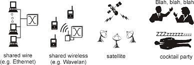
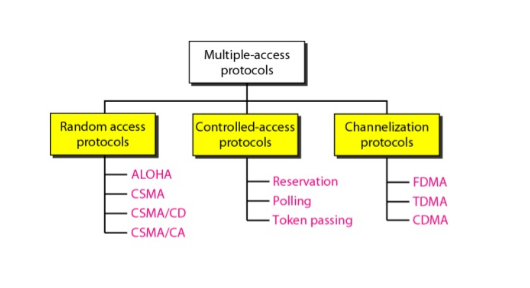
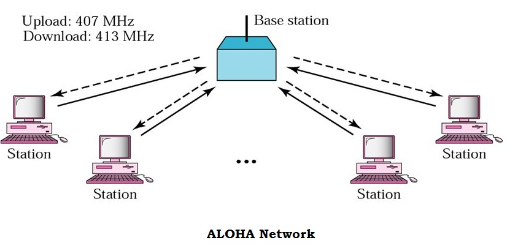
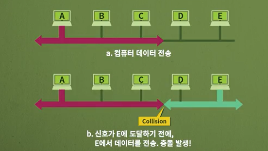

# 네트워크 - 다중 접속 프로토콜

*K-MOOC - 네트워크 기초*

## 다중 접속

> #### 매체 (연결 선, 또는 공기)에 여러 대의 컴퓨터들이 접속을 해서 데이터를 보낼 때 발생할 수 있는 문제이다.

- 사람들이 얘기를 할 때에, 동시에 얘기를 하면 누가 무슨 얘기를 하는지 잘 모를 때를 생각하면 된다
- 즉 컴퓨터는 지능이 없어서, 데이터가 섞이게 되면 데이터를 구분할 수 없다

> #### 계층 : 다중 접속은 주로 데이터 링크 계층에서 수행을 한다

- 데이터 링크 계층은 에러 제어, 흐름 제어, 접근 제어가 중요하다
- 여기서 다중 접속에서 얘기하는 것은 **접근 제어**다
- 여러 컴퓨터가 매체 (연결 선)을 접근하는 것을 제어를 해야, 데이터를 주고 받을 때에 충돌을 피할 수 있다

## 다중 접속 통제 방법

### 무작위 접근 (Random Access Protocol)

- 매체 (연결 선)을 무작위로 접근을 하는 것이다
  - 데이터를 보낼 때에 컴퓨터가 자기가 매체를 접근하고 싶을 때, 마음대로 접근을 하는 것
- 누가 먼저 매체를 접근할지, 순서가 없기 때문에 **경쟁 (Contention)**을 하게 된다
  - 어떤 컴퓨터가 매체에 접속을 했을 때, 다른 컴퓨터는 매체에 접속을 못 한다
  - **하지만, 동시에 접속을 하게 되면 충돌 (Collision) 이 생겨 데이터가 깨질 수 있다**

> #### ALOHA

- 1970년대 초반에 하와이 대학교에서 개발이 되었다
  - 무선 LAN으로 동작이 되었고, 컴퓨터에 안테나를 달아서 데이터를 전송했다
- 기본적인 동작 (데이터가 생기면 바로 보내는 것)
  - 각 컴퓨터에서 기지국(Base Station)에 데이터를 전송
  - 기지국에서 받은 데이터를 목적지로 다시 전달 한다
  - 데이터를 보낸 컴퓨터 (송신 시스템)들은 데이터 전달 여부를 알기 위해서, ACK를 기다린다
    - ACK (Acknowledge) : 이 메세지를 받으면, 데이터가 잘 전달 되었다는 확인을 할 수 있다

- **하지만 ALOHA 프로토콜을 사용할 때, 많은 충돌이 일어나고, ACK를 기다리는데 시간이 오래 걸린다**

> #### CSMA (Carrier Sense Multiple Access)

- "Sense before transmit" / "Listen before talk"
  - 사람이 동시에 얘기 안 하고, 상대방의 얘기를 듣고 대답을 하는 것과 같다
  - 다른 컴퓨터에서 데이터를 보내고 있는지 확인을 하고 데이터를 보낼지 결정을 하는 것
- **하지만 이 시스템도 충돌이 일어난다**
  - 데이터를 전송할 때, 어느 정도 시간이 걸린다.
    - 데이터가 도달하기 직전에, 제일 마지막에 있는 컴퓨터에서 접근이 없는 매체라고 판단해서, 데이터를 전송하게 되어 충돌이 일어난다
  - 그리고, 다른 컴퓨터와 동시에 데이터를 보내려고 매체를 접근 할 수도 있다

> #### CSMA/CD (CSMA with Collision Detection) - 유선

- 위에 ALOHA 기능과 CSMA 기능을 모두 포함한다
- **추가적으로, 매체에 접근을 할 때에 충돌 (collision) 여부, 즉 데이터가 깨지는지 안 깨지는지 확인하는 것이다**
  - 여기서 데이터가 충돌을 했으면, 즉시 전송을 STOP 한다
  - 즉, 충돌이 일어나면, 전송을 멈추고, 다시 시도하는 방식이다

> #### CSMA/CA (CSMA with Collision Avoidance) - 무선

- 무선은 선이 없어서 CSMA/CD 방식이 어렵다

- **그래서 아예 충돌을 회피하려고 하는 것이 CSMA/CA 방식이다**

- CSMA/CA 방식

  - 매체에 접근하는 사람이 없어도, 데이터를 보내기 전에 쉬는 타임을 가진다
    - IFS라고 부른다 (InterFrame Space)

  - 그렇다고 모두 같은 쉬는 타임을 가지게 되면 충돌이 발생할 수 있어서, 임의의 수를 선택하여 그 시간만큼 기다린다
    - Contention Window라고 부른다
    - random number of slots를 의미
  - 최종적으로 잘 받았는지 ACK를 통해 확인 하고, ACK가 없으면 송신 시스템은 데이터가 깨졌다고 판단한다

- 즉 **IFS / Contention Window / ACK** 를 사용해서 충돌을 회피한다

### 통제된 접근 (Controlled Access Protocol)

- 하나의 시스템이 제어국이 되어 다른 시스템의 전송권한을 제어한다
- 동시에 둘 이상의 시스템이 전송을 하지 못 하게 하여 충돌을 피한다
- 시스템은 자기 차례가 올 때까지 데이터를 전송을 못 한다

> #### 예약 (Reservation)

- 시스템이 데이터를 보내기 전에 예약을 해야 한다

> #### 폴링 (Polling)

- 중앙 제어 시스템에서 각 시스템에서 데이터 전송 여부를 확인하는 것이다
- 중앙 시스템이 직접 통제, 제어를 하는 것이다

> #### 토큰 (Token Passing)

- 토큰을 가진 시스템만 데이터를 보낼 수 있는 권한이 생기는 것이다

### 채널화 (Channelization Protocol)

- 매체 (연결 선)을 나누어서 사용하는 것이다
- 예) 1초 때는 A 시스템이 사용하고, 2초 때는 B 시스템이 사용하는 것

> #### FDMA (Frequency-Division Multiple Access)

- 주파수 분할 다중 접속
- 주파수를 나누어 사용하는 것

> #### TDMA (Time-Divsion Multiple Access)

- 시간 분할 다중 접속
- 시간을 나눠서 사용하는 것

> #### CDMA (Code-Division Multiple Access)

- 코드 분할 다중 접속
- 코드를 나눠서 사용하는 것
