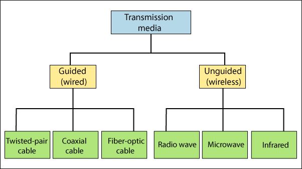
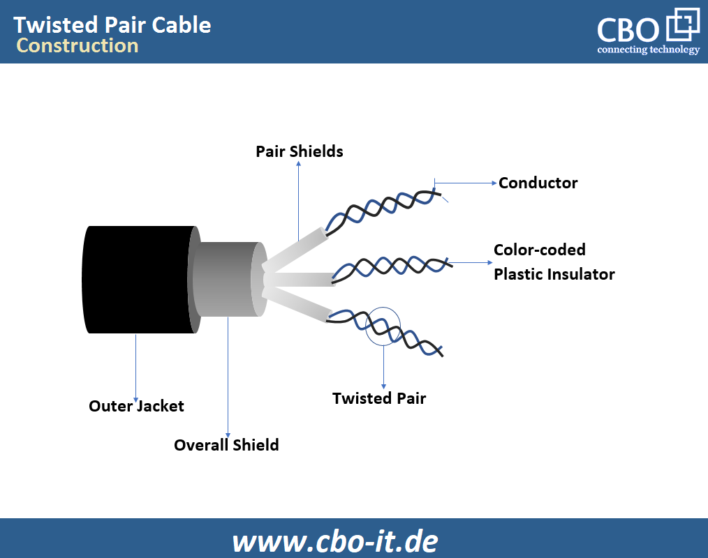
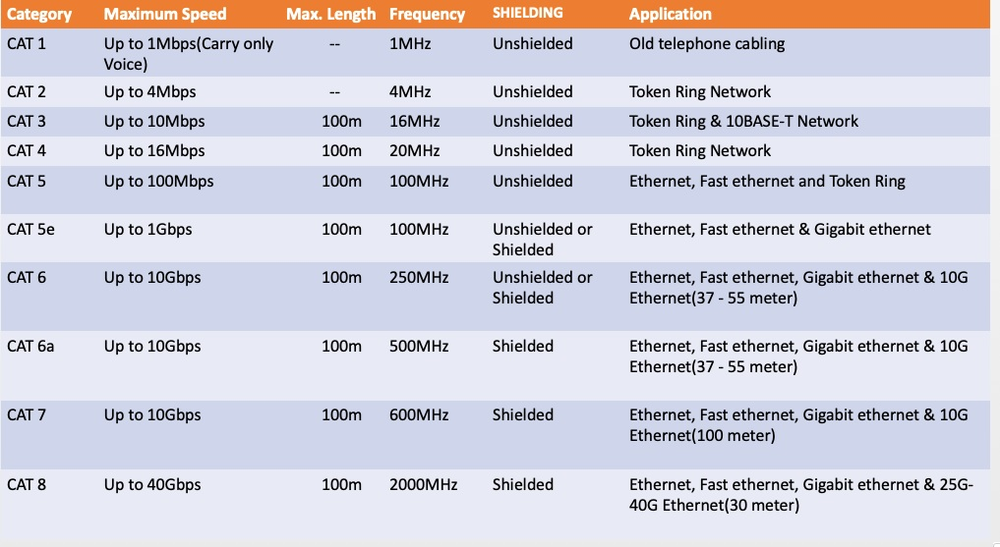
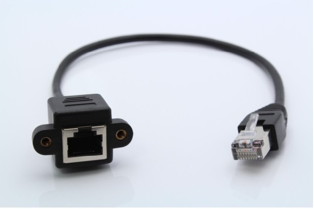
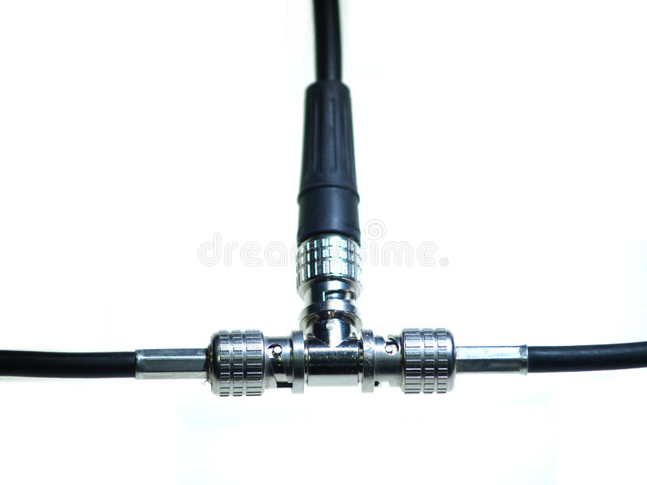
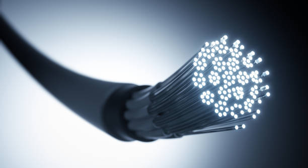
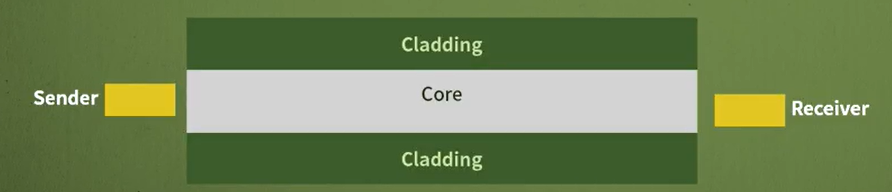
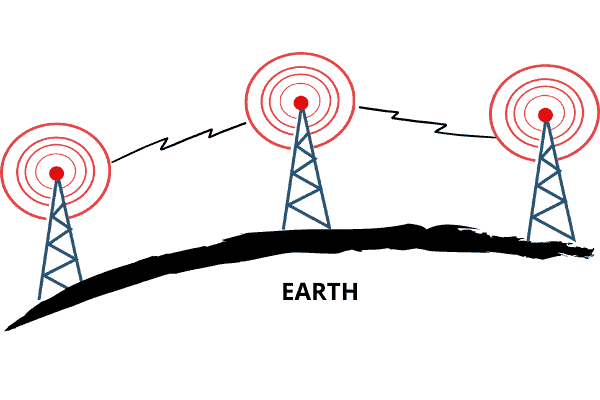
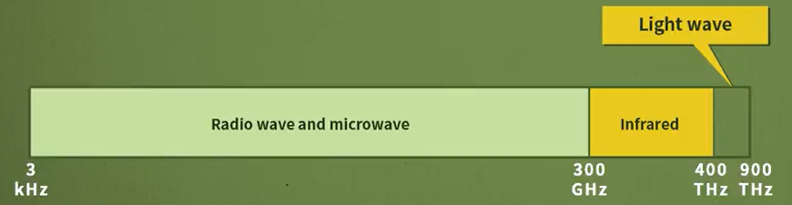

# 네트워크 - LAN에서 사용하는 매체

*K-MOOC - 네트워크 기초*

## 전송매체 / 매체 란?

> #### 전송하는 송신자와 데이터를 받는 수신자 사이에서 신호를 통해 데이터를 전달해 주는 것을 매체라고 한다

#### 매체는 크게 유선과 무선 또는 유도체와 비유도체로 두 가지로 나누어 진다

- 여기서 `유도체`는 Guided Media라고 부르고, 선이 있는 것이다
  - 예) 주로 컴퓨터와 프린터를 연결 할 때, 선을 이용한다
- `비유도체`는 Unguided Media로 선이 없는 것으로, 꼭 신호가 특정한 곳으로 가도록 유도하지 않는 것이다.
  - 예) 사람과 사람이 대화를 할 때에, 대화 내용, 즉 소리는 공기를 통해 상대방에게 전달된다. 그리고 소리는, 내가 대화하지 않고 있는 사람들에게도 들릴 수도 있다.

## 유도 매체

> 크게 3가지로 나뉘어 진다
>
> - 트위스티드 페어 케이블 (Twisted-pair cable)
> - 동축 케이블 (Coaxial cable)
> - 광 케이블 (Fiber-optic cable)

### 트위스티드 페어 케이블 (Twisted-pair cable)

#### 트위스티드 페어 케이블, TP 케이블은, 두 개의 케이블이 꼬여져서 한 쌍을 만든 것을 의미한다.

#### 트위스티드 페어는 두 가지로 구분이 되어있다. 각 쌍에게 쉴드가 되어 있는지 없는지를 구분한다

- **UTP (Unshieded Twisted-Pair)**
  - 위에 그림을 보면 `Pair Shields`라는 단어가 있다. 이게 없으면 UTP다.
  - 가장 흔하게 사용이 된다

- **STP (Shielded Twisted-Pair)**
  - 위에 그림처럼 `Pair Shields`가 있는 것이다.
  - 이 쉴드는 각 페어 단위로, 외부로부터의 신호를 간섭 받지 않도록 보호해 주는 것이다.
  - 각 페어 단위로 보호막을 씌우기 때문에 UTP보다 가격이 비싸다

#### 품질에 따라 등급, 카테고리를 지정해놓았다

- 주로 LAN에서는 CAT3와 CAT5를 많이 쓰고, CAT에서 숫자가 커질수록, 데이터 전달 속도가 더 빨라진다

#### UTP와 STP 케이블들도 연결하는 커넥터가 있다

- **Registered Jack, RJ** 로 부른다
- LAN에서 많이 쓰이는 커넥터는 RJ-45라고 불린다

### 동축 케이블 (Coaxial Cable)

#### 굵은 구리선을 플라스틱 물질로 덮고, 그 위에 그물처럼 구리선을 싸서 원통형으로 둘려져 있다

#### TP 케이블보다 높은 주파수를 이용해서, 고속으로 신호를 전달이 가능하다

#### 단, 거리가 멀어질수록 감쇄가 심해지는 단점이 있어, 많이 사용이 안 되고 있다

#### 커넥터는 BNC-T라고 불린다

### 광 케이블 (Fibre-optic Cable)

#### 굉장히 많이 쓰이는 케이블이다

#### UTP, STP, 동축케이블에 비해 전기적 신호를 사용하지 않는다

#### 광 케이블은 빛이라는 신호를 사용한다

- 잡음에도 덜 민감하고, 속도도 빠르다는 장점이 있다
  - 현재 존재하는 매체 중 가장 고속의 광대역 전송이 가능한 매체이다
- 하지만 연결하는 것이 어렵고, 가격도 비싼 편에 속한다

#### 빛을 쏘게 되면, 코어에서 빛이 클래딩에 부딪히면서 반사되어, 목적지까지 가게 된다.

#### 3 종류의 커넥터가 존재한다

- SC (Subscriber Channel) 커넥터
- ST (Straight-Tip) 커넥터
- MT-RJ 커넥터

## 비유도매체

> #### 선이 아닌, 공기라는 매체에 주파수를 쏴서 통신을 하는 것이다

#### 주파수를 쏘게 되면, 라디오파, 마이크로파 같은 파들이 존재하게 된다

- 라디오 파 주파수  <  마이크로파 주파수

#### 주파수가 높아지면 직진성이 강해진다

- 이 뜻은, 주파수는 한 방향으로만 가는 것이 아니다. 하지만 주파수, Hz가 높으면 높아질 수록 여러 방향으로 전달되는 신호가, 방향의 범위가 더 좁아지는 것이다

