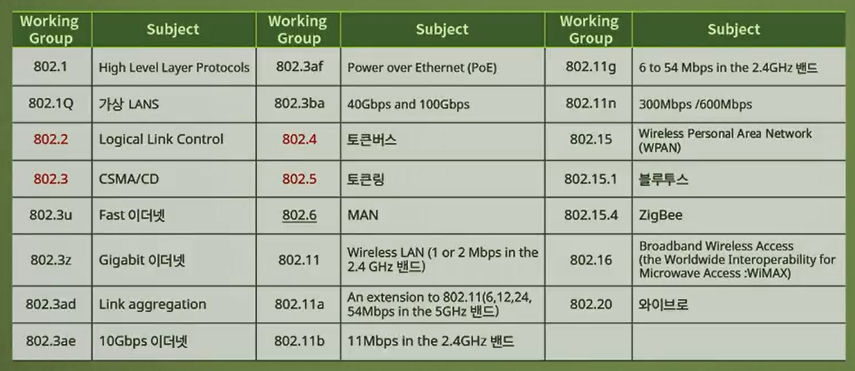
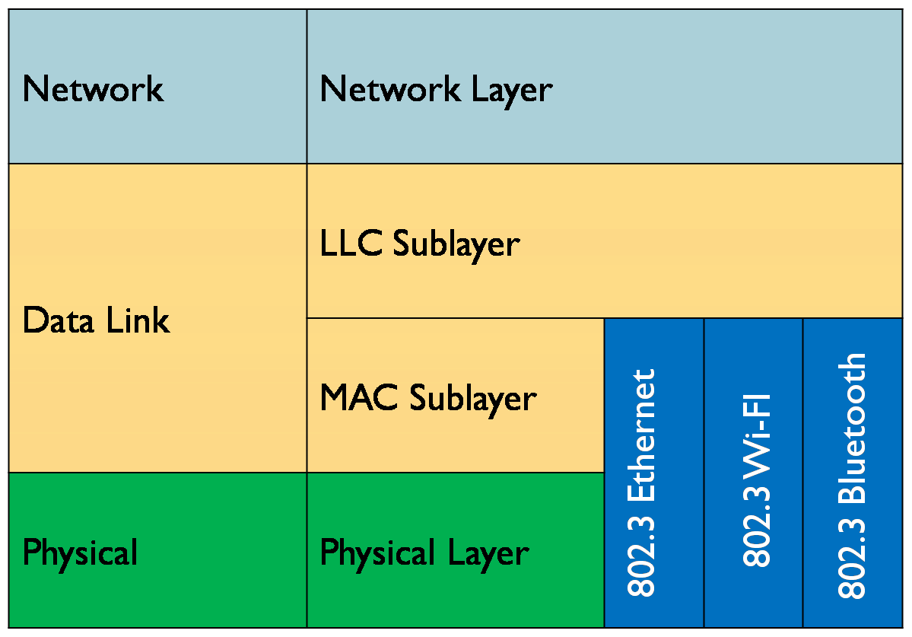
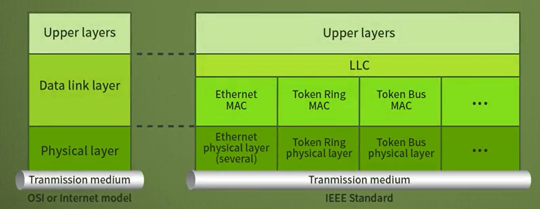
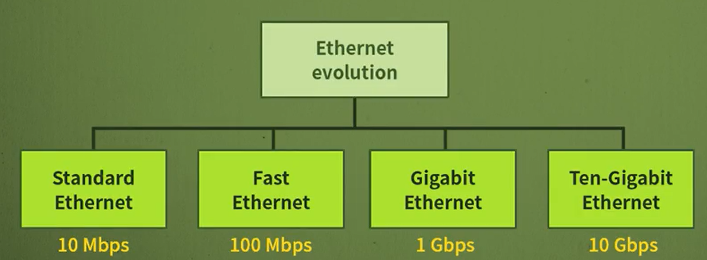
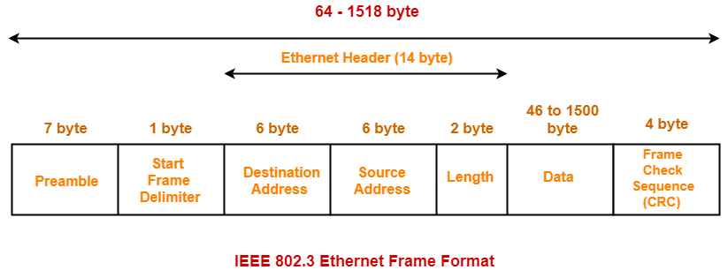
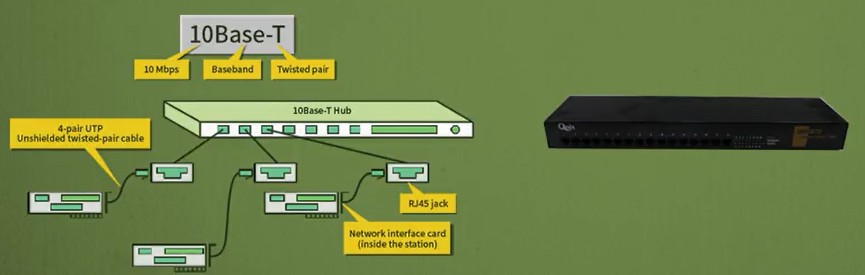
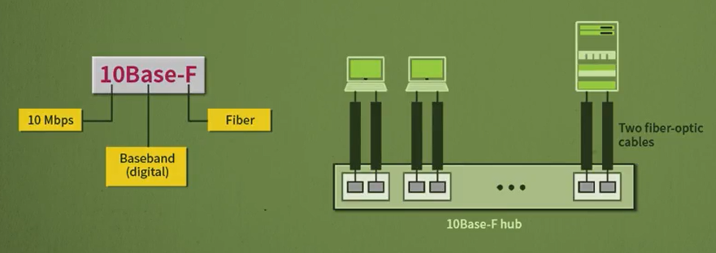

# 네트워크 - 유선 LAN : Ethernet

*K-MOOC - 네트워크 기초*

## IEEE 표준 프로토콜

- Ethernet은 Rober Melancton Metcalfe 라는 사람이 Xerox (프린트 회사)에서 1976년에 발명했다
  - 당시 근거리 데이터를 전송하는데 속도가 10Mb였다
- 이렇게 좋은 것을 더 많으 회사가 사용하기 위해 Digital Equipment, Intel 그리고 Xerox 회사들이 연구를 하여 표준을 만들게 된다.
  - 이 표준을 **DIX** 스타일 이라고 한다
- 그리고 미국 전국에서 사용하기 위해 IEEE 라고 불리는 기관에서 이더넷을 표준으로 만들고, 이것이 ISO, 국제 기구에서 표준화가 된다

### IEEE Working Groups

- IEEE에서 만든 위원회의 목록들이다
- 소수 2개부터는 무선을 연구하기 시작하는 것이다

## Data Link Layer

#### 데이터 링크 계층은 크게 MAC 부계층과 LLC 부계층이 있다

- 데이터 링크 계층은 기본적으로 에러제어, 흐름제어 등을 하는 계층이다

- LAN 프로토콜을 얘기할 때에는 꼭 MAC와 LLC가 나온다

  

### Media Access Control (MAC)

- Ethernet, 토큰 링, 토큰 버스 같은 프로토콜이 있다
- 이렇게 있는 이유는, 매체에 접근하는 방식이 여러가지 있을 수 있기 때문이다

### Logical Link Control (LLC)

- MAC 프로토콜 종류 상관 없이, 가져야할 공통적인 기능을 모아두었다
  - 흐름제어, 에러제어 등 
- LAN 표준을 얘기할 때에, LLC는 공통적으로 있고, 그 밑에 Ethernet, 토큰 링, 토큰 버스로 나눌 수 있는 MAC 계층이 있는 것이다

## Ethernet

> Ethernet은 10배씩 빨라졌다

### Ethernet Frame / MAC Frame

**Preamble / Start Frame Delimiter (SFD)**

- 하드웨어에서 비트의 손실이 발생하는 것을 방지하기 위해 쓰이는 임의 필드
- Ethernet 형태의 프레임은 아니다
- 프레임 도착 여부를 확인 / 프레임의 시작을 알림

**Destination Address** / **Source Address**

- 목적지 주소

- 도착지 주소, 즉 누가 데이터를 받는지 구분한다
- 이 주소는 MAC 주소, 물리 주소, Ethernet 주소, 하드웨어 주소라고도 한다
  - 이 주소는 IP주소와 다르게 사용자가 설정할 수 없고, LAN 카드를 공장에서 생성할 때에 주소가 찍혀 나온다
  - 즉 Ethernet 주소는 고유한 주소이다
  - 간혹 FF:FF:FF:FF:FF:FF로 박혀 있는 목적지 주소가 있는데, 이것을 **브로드 캐스트** 라고 한다
    - LAN에 붙어있는 모든 컴퓨터가 데이터를 다 받을 수 있도록 설정하는 것이다
    - 받는 사람의 주소가 정해져있지 않다
  - 반대로 목적지 주소가 정해져 있으면, **유니캐스트**라고 한다

**Length or type**

- 프레임의 길이, 네트워크 계층 프로토콜의 종류

**Data and padding**

- 데이터, 최소 46바이트에서 최대 1500바이트까지 가능하다

**CRC (Cyclical Redundancy Check)** 

- 사용자가 보내는 데이터 부분에 에러 여부를 확인한다

### Ethernet은 CSMA/CD 를 사용한다

- Ethernet은 **1-Persistent** 방법을 사용한다
- 다른 기계의 데이터 송신여부를 확인하고, 아무도 송신을 안 하면 데이터를 바로 보낸다
  - 여기서 바로 데이터를 보내는 부분이 1-Persistent 방법이다
- 만약 다른 컴퓨터도 같은 동작을 하면 충돌이 일어난다

### Ethernet의 형태

앞에 숫자 : 속도

Base : Baseband 신호 방식 / 디지털 신호 그대로 보내는 것

뒤에 숫자 또는 단어 : 케이블의 길이 (500m, 200m) 또는 종류 (F = Fibre, T = Twisted-Pair)

> #### Standard Ethernet

**10Base5 (Thick Ethernet)**

- 케이블이 매우 두껍고 동축케이블로 사용한다
- 구멍을 뚫어서 네트워크에 관련된 여러 장치를 설치하고 케이블에 연결하고 LAN카드를 꽂아서 데이터를 전송한다
  - 구멍을 뚫다보니 데이터를 보낼 때에 충돌이 발행할 수 있다
- 한 선을 공유하는 형태로 버스형 토폴로지다
- 최대 길이가 500m / 리피터라는 것을 설치하면 최대 2500m까지 연장할 수 있다

**10Base2** **(Thin Ethernet)**

- 케이블이 얇고 동축케이블로 사용한다
- 주로 BNC-T 커넥터를 사용한다
- 케이블 길이는 대략 200m이지, 실제로 185m 정도로 사용된다
- 동축 케이블이라서 많이 사용되지 않는다

**10Base-T**

- 속도가 10Mbps로 , Baseband 선호방식으로, Twisted-pair 케이블을 사용한다

- 대부분 UTP (Unshielded Twisted-Pair) 형태로 사용된다

**10Base-F**

- 광케이블 (Fibre-optic cable)을 사용한다

> #### Fast Ethernet

기존보다 10배 빨라진 100Mbps 속도로 발전되었다

기존 Ethernet과 자동협상 기능을 통해 호환이 가능하다

**100Base-TX (Two-wires category 5 UTP)**

- TX 는 송수신이 동시에 가능 한 것이다

**100Base-FX (Two-wire fiber)**

- 광케이블을 사용한다

**100Base-T4 (Four-wires category 3 UTP)**

- T4는 송수신이 동시에 불가능 하다. 즉 송신을 하고 수신을 받을 때 까지, 기다려야 한다

> #### GIgabit Ethernet

10배가 더 빨라진 1000Mbps 속도로 발전되었다

이것도 기존 Standard Ethernet과 Fast Ethernet과 호환이 가능하다

대부분 광 케이블을 사용하게 되었다

**1000Base-SX (Two-wire short-wave fiber)**

**1000Base-LX (Two-wire long-wave fiber)**

**1000Base-CX (Two-wire copper(STP))**

**1000Base-T (Four-wire UTP)**

> #### Ten-Gigabit Ethernet

그 전 모든 Ethernet을 호환 할 수 있다

Gigabit ethernet보다 10배 더 빠르다
