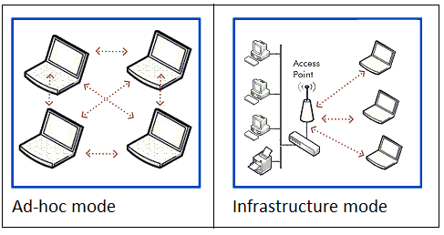
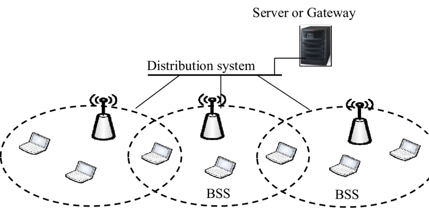
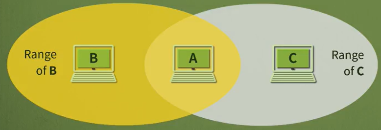
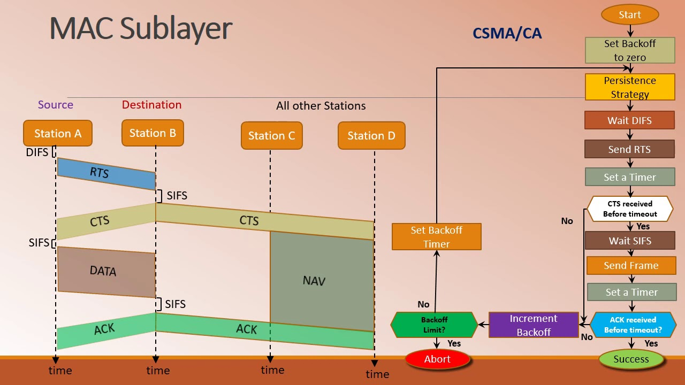

# 네트워크 - 유선 LAN : Ethernet

*K-MOOC - 네트워크 기초*

## 무선 LAN 구조

#### 무선 LAN은 BSS와 ESS라는 두 종류의 서비스를 지원한다

#### BSS (Basic Service Set)

> ##### BSS도 2가지 모드가 있다

- **Infrastructure 모드**
  - **AP (Access Point)**를 통해서 무선 LAN을 사용하는 모드이다
  - 즉 특정한 기기를 통해 인터넷 또는 데이터를 주고 받을 때에 Infrastructure 모드를 사용한다
  - 예) IP 공유기, 즉 AP를 이용해서 인터넷을 사용하는 것이 Infrastructure 모드
- **Ad hoc 모드**
  - AP 가 없이 무선으로 데이터를 주고 받는 것이다
  - 예) 블루투스

#### ESS (Extended Service Set)

- 회사 내에 각 부서들끼리 인터넷을 같이 사용하거나, 데이터를 주고 받을 때에 사용될 수 있다
- Distribution System이 각 AP들을 연결함으로서, 각 부서들이 하나의 서버를 통해 인터넷을 사용할 수 있다

## MAC 부계층

> 유선 LAN 같은 경우 메체의 종류에 따라서 MAC (Media Access Control)의 형태가 달라졌다
>
> 하지만 무선 LAN 같은 경우는, MAC 안에서도 부계층이 존재한다

#### PCF (Point Coordination Function)

- 선택형이다. 꼭 안 써도 되는 것이다
- 충돌이 발생하지 않도록 중간에서 통제를 하는 것이다 (폴링)
- 즉 AP가 있어야 하고, Ad-hoc 모드에서는 사용이 불가능하다
  - Ad-hoc모드는 중간에 데이터를 통제하는 기기가 없고, 기기와 기기끼리 연결해서 데이터를 주고 받는 것이다

#### DCF (Distributed Coordination Function)

- PCF가 선택형이면 DCF는 꼭 써야 한다
- **CSMA/CA**
  - Carrier Sense Multiple Access / Collision Avoidance
  - 즉 충돌을 피하는 것이다
    - 누군가가 데이터를 송신하고 있으면, 기다린다
    - 그리고 아무도 송신을 안 하고 있으면, 바로 보내는 것보다, 몇 타임 쉬었다가 데이터를 보내게 된다
  - 하지만 이 방법은, 만약에 충돌이 발생했을 경우 신호가 약해져서 충돌 여부를 다른 컴퓨터에서 감지를 못할 수도 있다
- **hidden terminal **(예시 설명)
  - 밑의 그림은 B와 C의 신호 범위다
  - B가 데이터를 송신했어도, C는 B가 데이터를 송신했다는 신호를 받지 못한다
  - 그렇게 되면, B가 데이터를 송신 했을 때, C도 아무때나 데이터를 송신할 수 있다
  - A가 두 개의 데이터를 동시에 받게 되어, 데이터들은 충돌한다
  - 즉 B의 입장에서 C의 데이터 송신 여부를 모르고, C의 입장에서 B의 송신 여부를 신호의 범위 때문에 모르는 것이다

#### hidden terminal의 문제 해결

> **RTS (Request To Send)** 와 **CTS (Clear To Send)**

1. `Station A` 에서 데이터를 보낼 것이 있어 **RTS**를 보낸다
   - `Station A`는 타이머를 설정해서, **CTS**를 시간 내에 받을 수 있는지 기다린다
2. 그러면 `Station B`에서 `Station C`와 `Station A` 에게 **CTS**를 보낸다
   - 여기서 `Station D`도 `Station C`를 통해서 **CTS**를 받는다
3. `Station A`에서 `Station B`에게 데이터를 보낼 것이라는 정보를 모든 `station`에서 알게 되었으니 `Station A`에서 `Station B`에게 데이터를 전송한다

**즉, 데이터를 보내게 전에 RTS를 보내고, 모든 기기들이 CTS를 받게 될 때, 데이터를 송신하게 된다**

## Bluetooth

> 기기들끼리 연결하기 위한 무선 LAN 기술이다

#### 블루투스 같은 경우 WPAN (Wireless Personal-area Network) 이다

- 이 뜻은, 블루투스 같은 경우 근거리 내에서만 연결이 가능하다
- 즉 LAN의 최대 범위까지 도달하지 못 한다

#### 블루투스는 ad hoc 모드를 사용한다

- 중앙의 통제가 있으면 여러 개의 기기들이 하나의 무선 네트워크를 형성할 수 있다
- 이것을 **Piconets**이라고 한다

#### SCO 링크와 ACL 링크

- **SCO 링크**
  - 데이터가 손실이 되어도 빠르게 전송하기 위해, 데이터를 빠르게 주고 받는 것이다
- **ACL 링크**
  - 데이터에 손실이 없도록, 정확하게 데이터를 전송하는 것이다

