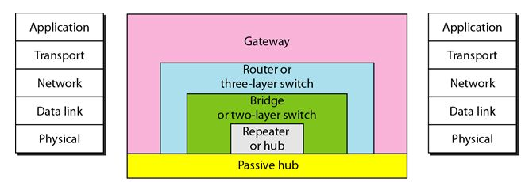
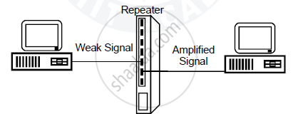
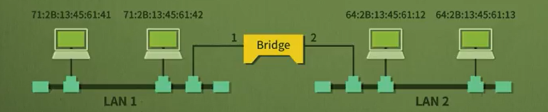
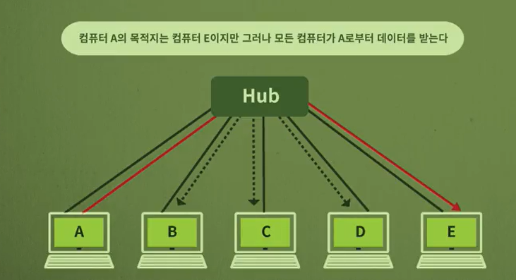
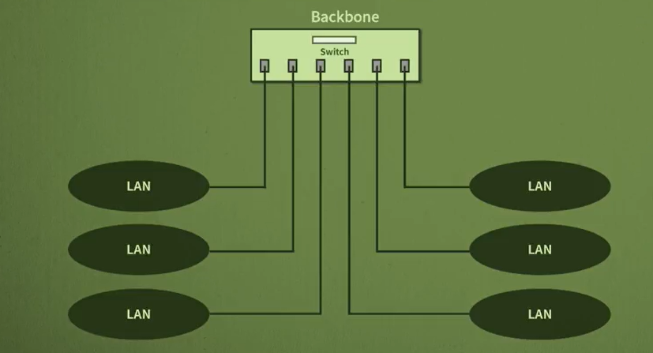
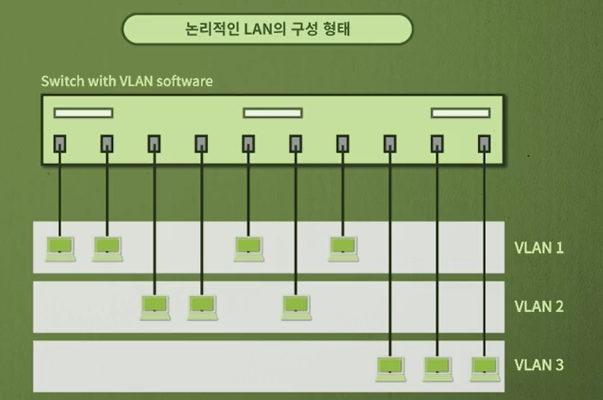

# 네트워크 - 네트워크 연결장치

*K-MOOC - 네트워크 기초*

## 네트워킹 장비

> #### 네트워크 연결장치는 어떤 계층에서 연결하는 가에 따라서 4가지 종류가 존재한다

- Transport layer, 수송 계층에도 L4 스위치가 존재하기는 하지만 보통 **Gateway**까지 설명을 한다

### Repeaters / Hub

> #### 디지털 신호 증폭 장치

- 물리 계층 (physical layer)에 있고, 일반 허브 (Hub)라고도 불린다
- **디지털 신호는 0과 1 밖에 없는데, 미약해진 0과 1의 신호를 재생산 하는 것이다**
  - 즉 신호 증폭 장치라고 할 수 있다
- 디지털 신호를 증폭 시켜주는 역할로, **물리적으로 선을 더 길게 가져갈 수 있게 한다**
  - 선의 길이를 더 길게 만들어 주는 것
- 하지만 미약해진 0과 1 신호를, 구분하지 않아서 원래 디지털 신호를 바꿔서 전달할 수 있다
  - 물리 계층 특성 상, 에러 제어를 하지 않는다. 즉 repeater도 에러를 따로 검출하지 않는다

### Bridge / L2 스위치

> #### 에러 제어와 트래픽 관리

- repeater는 디지털 신호를 증폭해주는 역할을 하지만, 에러를 검출하는 역할을 하지 않는다
- 즉 **Bridge 또는 L2 스위치는 에러를 검출하는 기능이 들어가 있다**
  - Bridge보다 L2 스위치를 더 많이 사용한다
- 다시 말해서 repeater가 신호를 증폭해주면, Bridge 또는 L2가 신호에 대한 에러를 검출하는 것이다
- **또 트래픽 필터링도 가능하다**
  - MAC (Media Access Control)  주소가 있어서 어느 포트에 어떤 기기들이 있는지 알 수 있다
  - 즉 같은 포트 안에 있는 기기들끼리 데이터를 주고 받을 수 있게 된다
- Bridge의 사용 효과
  - 속도가 올라갈 수 있다
    - 한 케이블만 이용을 하게 되면, 한번에 두 개의 컴퓨터만 데이터를 송수신 할 수 있다
    - 하지만 Bridge를 통해, 한 포트에 있는 컴퓨터끼리 데이터를 송수신 할 수 있게 되었다
    - 즉 colision domain, 충돌이 일어나는 영역이 더 작아졌다
      - 한 케이블을 통해 10대의 컴퓨터가 연결이 되었다면, Bridge 통해 한 포트 당 2대의 컴퓨터로 나눈다
      - 이렇게 되면 10대의 컴퓨터끼리 충돌할 가능성에서, 2대로 줄어든 것이다

### L3 Switch / Router

> #### 최적의 경로 찾기

- Repeater의 기능, Bridge / L2 Switch의 기능 모두 가지면서, 최적의 경로를 찾아 주는 기능이 있다

  #### Switching Hub

- 일반 허브는 수신한 메세지를 모든 포트로 전송한다
- **하지만 스위칭 허브는, 어느 포트에 어떤 컴퓨터들이 있는지 알고 있다**
  - 즉 A에서 E로 데이터를 보내게 된다
  - Switching hub는 MAC 주소의 목적지 주소를 보고 E가 있는 포트로 데이터를 전송한다
  - 이 때, 일반 허브처럼 모든 포트에 데이터를 전송하는 것이 아니라서, 이제는 스위칭 허브를 통해 B도 C에게 데이터를 전송할 수 있다

### Gateway

- 두 개 이상의 다른 시스템이나 네트워크를 연결하는데 사용
- 계층 구조에 따라 해석된 메세지를 다른 계층 구조로 전달
- 서로 다른 프로토콜 구조를 변환하는데 사용하는 것
  - 인터넷의 5계층이나 OSI 모델의 7 계층에서 동작한다

## Backbone Network

> #### 네트워크와 네트워크를 연결해준다
>
> 예) 1층의 영업 부서는 허브를 쓰고, 2층의 연구 부서는 무선 랜을 사용하고, 3층의 기술 부서는 다른 허브를 사용한다
>
> ​		이런 부서들을의 네트워크를 연결해주는 것이 Backbone Network 이다

- 굉장히 상대적이다.
  - 건물과 건물을 이어주는 backbone 네트워크가 있을 수도 있다

## Virtual LAN

- 일반 허브를 사용하게 되면, 선으로 연결하는 것이기 때문에 연결할 수 있는 인원에 제한이 있을 수도 있다
- 이것을 해결하기 위해, 허브 하나에 많은 포트를 넣어주고, LAN을 분리 시켜 주는 것이다
- 논리적으로 LAN을 구성하는 것
- 딱 인원수에 맞게 허브를 구매해서 정해진 틀 안에 구조를 안 만들어도 된다

