# 네트워크 - 이동 전화와 위성 네트워크

*K-MOOC - 네트워크 기초*

## 이동 전화

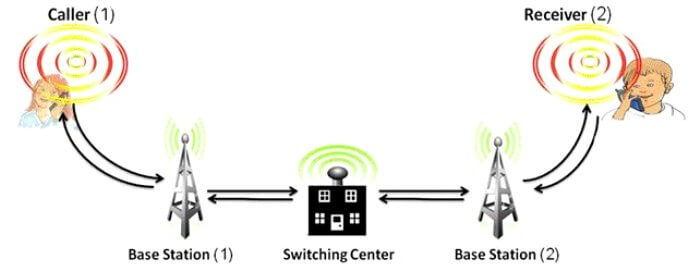

#### 기지국과 Mobile Switching Center

- **기지국 (Base Staion)**을 중심으로 수 많은 기기들과 전파를 주고 받는다
  - 이 전파를 주고 받는 가상적인 공간을 **Cell** 이라고 부른다
  - 휴대폰과 기지국은 주기적으로 정보를 공유한다
- 여러 개의 기지국들을 관리하는 곳이 **Mobile Switching Center (MSC)**이다.
- 휴대전화는 기지국과 무선으로 연결 ▶️ 기지국 또는 MSC 들은 유선으로 연결이 되어 있다

#### Handoff

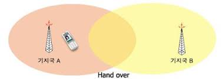

- 휴대전화를 사용하다 보면, 원래 연결했던 기지국과의 신호가 안 좋아 질 수 있다
- 그럴 때에, 적절한 기지국을 찾아서 그 기지국과 연결을 한다
- 즉 Cell, 새로운 Cell 안으로 들어가는 것이다 (Cell은 기지국과 핸드폰이 신호를 주고 받을 수 있는 가상의 공간)
  - 이때, 다른 기지국으로 연결할 때 **Handoff** 라고 한다
  - 마치 마라톤 바통터치 하는 것과 같다
- **Hard Handoff**
  - Cell을 바꾸게 될 때에, 전에 썼던 기지국과의 연결을 바로 끊어버리고, 새로운 기지국과 연결을 한다
  - 예전에 썼던 방식이다
- **Soft Handoff**
  - 이전 기지국과 통신을 끊기 전에, 새로운 기지국과 연결을 동시에 하는 것이다
  - 신호가 끊길 일이 별로 없다

#### 1G ~ 5G

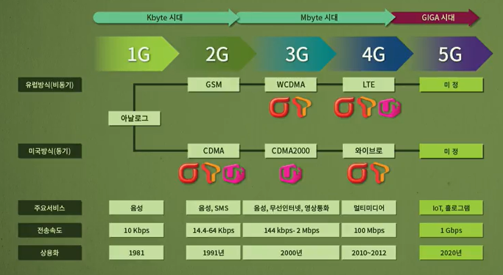

- 아날로그부터 시작해서, 디지털 데이터를 공유하는 속도가 계속 빨라지게 되었다
- 데이터 공유 속도가 빨라 지면서, 새로운 서비스들을 이용할 수 있게 되었다
  - 인터넷 연결부터, 영화 다운로드 등

## 1G (First Generation)

> #### 처음으로 이동하면서 전화를 할 수 있게 되었다

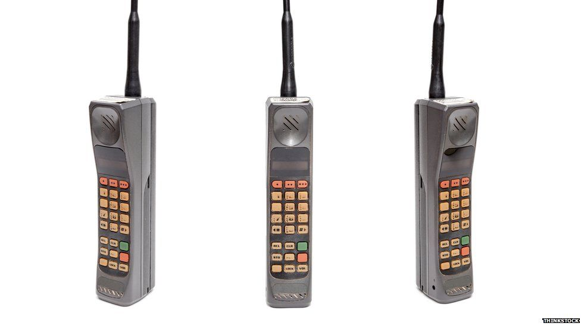

- 송신하는 주파수와 수신하는 주파수가 정해져 있었다
  - 송신하는 주파수 = 포워드 채널 (Forward Channel)
  - 수신하는 주파수 = 리버스 채널 (Reverse Channel)
- **AMPS (Advanced Moblie Phone System)**
  - FDMA (Frequency Division Multiple Access)을 사용하여 채널당 주파수를 단말에 할당했다
  - 순방향 (Base Station to mobile station), 역방향 (Mobile station to base station) 채널

## 2G (Second Generation)

> #### 아날로그로 사용했던 것을 디지털로 바꿔서 사용하게 된다

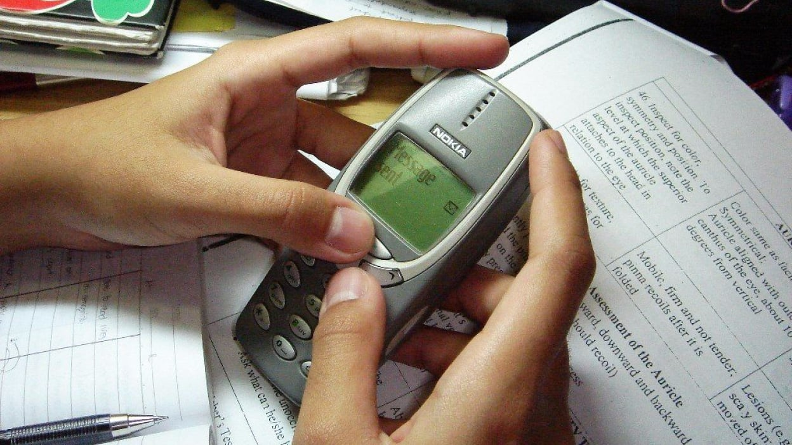

- 디지털을 0과 1로 구성이 되어 있다
  - 즉 0과 1로만 구성이 되어 원래 신호로 복원하는데 아주 유용하다
- 그리고 채널 용량이 커지면서, 한 기지국에서 수용할 수 있는 휴대전화 대수가 늘어났다
- GSM (Global System for Moblile Communication)과 CDMA (Cod Division Multiple Access)가 생기는데, 우리나라는 CDMA 방식을 도입 했다
  - CDMA를 사용하면서 GPS (Global Positioning System), SMS (Short Message Service)를 사용할 수 있게 된다
  - 그리고 조금씩 인터넷을 사용할 수 있게 된다

## 3G (Third Generation)

> #### 음성도 디지털로 표현을 하여, 모든 것이 디지털 데이터로 전환이 되었다

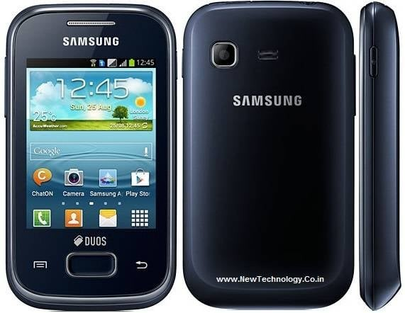

- CDMA도 발전을 하여 Whideband CDMA (WCDMA)와 CDMA2000으로 나눠 발전되었다
- 데이터 전송 속도가 빨라졌다
  - 데이터 전송이 빨라졌다는 것은, 인터넷도 휴대폰으로 더 빠르게 이용할 수 있게 되었다

## 4G (Fourth Generation)

> #### All IP로 디지털 데이터와 음성 통신을 통합시켰다

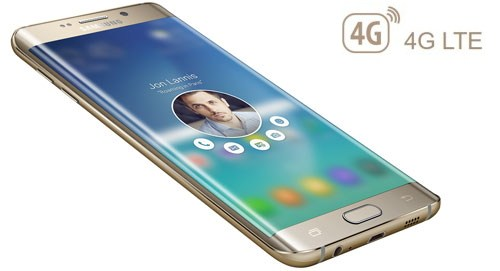

- 데이터 전송 속도가 100Mbps까지 빨라졌다
- 스마트폰이라는 개념이 자리를 잡았다
  - 핸드폰 기능 뿐만 아닌, 컴퓨터 기능까지 가능하게 되었다
  - 즉 인터넷 접속, 멀티미디어 통신이 원활해졌다
  - 예) 게임, 채팅, 메일 등
- WCDMA에서 확장된 LTE와 CDMA2000에서 확장된 Wibro로 나뉜다

## 5G (Fifth Generation)

> #### 데이터 전송, 공유 속도가 훨씬 빨라졌다

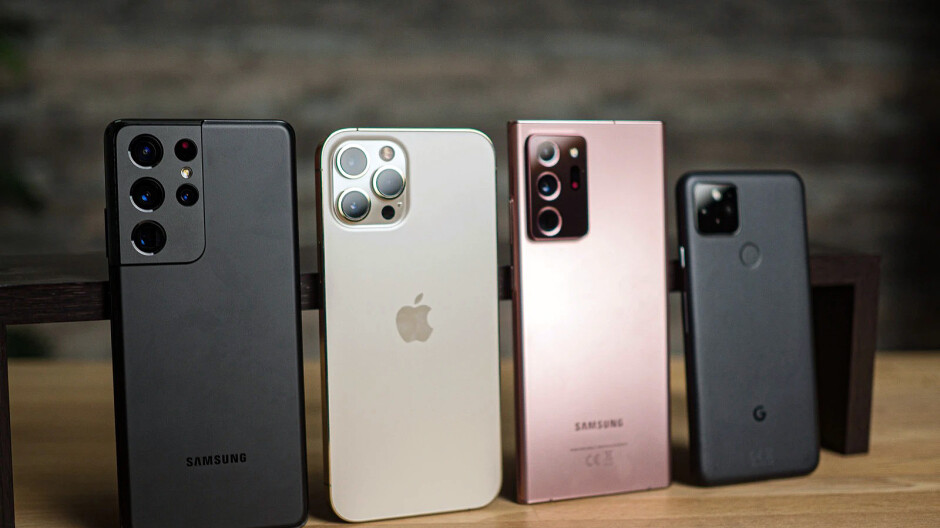

## 위성 네트워크

> #### 일상으로는 스마트폰을 통해 나의 위치 또는 네비게이션을 이용한다

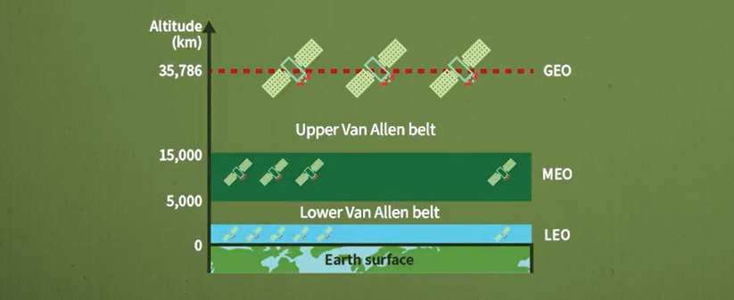

#### 위성을 띄우는 3개의 고도가 있다

#### 그 이유는 2개의 Van Allen 벨트가 있기 때문이다

- Van Allen 벨트에는 하전 입자를 가지고 있는데, 이 하전 입자 때문에 인공위성이 파괴될 수 있다
- 즉 이 두 개의 층을 피하기 위해 위성을 3개의 고도에 띄운다

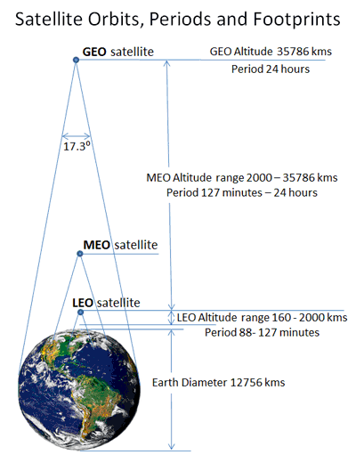

### GEO (Geosynchronous Earth Orbit)

- 이곳에 띄어진 위성들은 지구의 자전 속도와 동일하게 돌아간다
  - 그래서 우리가 볼 때는, 그냥 고정되어 있다고 생각할 수 있다
- 지구 전체를 커버하기 위해서는 위성이 3개가 있으면 된다
  - 1개당 120도 차이로 존재하기 때문이다

### MEO (Medium Earth Orbit)

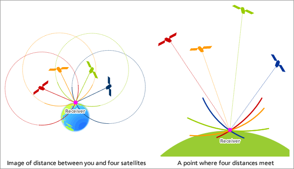

- Low Van Allen Belt와 Upper Van Allen Belt 사이에서 지구를 돌고 있는 위성들이다
- 주로 용도는 GPS이다
  - 수많은 위성이 있는데, 그 중 4개의 위성으로 부터 정보를 받아서 위치를 계산한다
  - 3개로부터 위치 추적을 할 수 있고, 4개는 공간 즉 예를 들면 몇 층에 있는지 알 수 있다
- 6시간에서 8시간에 한번씩 지구를 돌고 있다

### LEO (Low Earth Orbit)

- 신호가 전파하는데 걸리는 시간이 가장 짧다
- 주로 음성 통신을 할 때에 사용을 한다
