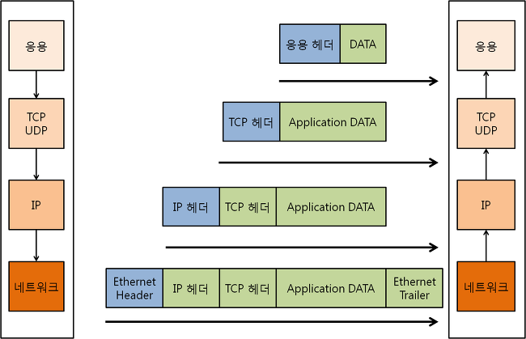

# TCP/IP

*CS 노트*

#### 

## TCP/IP 란?

> #### Transmission Control Protocol / Internet Protocol
>
> #### 데이터를 주고 받을 때에 사용되는 프로토콜이다
>
> #### 데이터를 송수신할 때에, 각 계층마다 역할을 부여하며, 데이터가 전달 된다
>
> - 주소를 담당하는 역할
> - 목적지까지 에러 없이 보내는 역할 등

### OSI 7 계층과 다른 점은, OSI 7 계층은 각 계층을 더 세분화 했다

- TCP / IP 계층의 응용 계층은, OSI 7 계층에서 Application, Presentation, Session 계층으로 나누어졌다
- TCP / IP 계층의 전송 계층과, 네트워크 계층은 OSI 7 계층과 동일하다
- TCP / IP 계층의 네트워크 계층은, OSI 7 계층에서는 Data Link와 Physical 계층으로 나누어졌다

### Application 계층

> #### HTTP, FTP, SSH, SMTP, DNS

- 실제 유저들에게 제공하는 층이다
- 이 계층을 통해 유저들이 실제 서비스, 즉 SMTP를 이용해서 이메일을 보내거다, DNS를 통해 웹 서비스를 찾아 들어갈 수 있

### Transport 계층

> #### Application 계층에서 받은 요청 / 메세지를 기반으로 데이터를 쪼개서 송신을 한다
>
> #### 쪼갠 데이터를 Segment 또는 Datagram이라고 한다
>
> #### 데이터를 쪼개서 보내게 되면, 데이터 순서가 이상해 질 수 있지만, Transport 계층에서 오류 없이 순서대로 전달하도록 도와준다
>
> - 즉 Network 계층에서 데이터그램 또는 세그먼트를 패킷화 하는데, 패킷들을 순서대로 연결해주는 역할을 한

#### 오류를 확인해준다

### 인터넷 계층

> #### 데이터그램 또는 세그먼트를 패킷화 한다

#### 주소 역할을 한다

#### 최적의 경로를 설정해준

### Network Access / Link 계층

> #### 물리적으로, 무선 또는 유선으로 데이터를 전달하는 것이다

## 캡슐화와 비캡슐화

#### 응용, 전송, 네트워크, 데이터 링크 계층은 캡슐화다

- 송신자가 데이터를 보낼 때, 응용 계층으로 시작하여, 데이터가 쪼개지면서 수신자에게 보내진다

#### 반대로 데이터 링크 계층부터 응용으로 올라가는 것이 비캡슐화

- 수신자가 데이터를 받게 되면, 쪼개진 데이터를 다시 모아서, 응용 계층으로부터 받게 된다

## PDU (Protocol Data Unit)

> #### 각 계층마다 데이터 단위가 다르게 표현 된다

#### 어플리케이션 계층 : 메세지

#### 전송 계층 : 데이터그램 (UDP) 또는 세그먼트 (TCP)

#### 인터넷 계층 : 패킷

#### 링크 계층 : 프래임 (데이터 링크 계층), 비트 (물리 계층)

