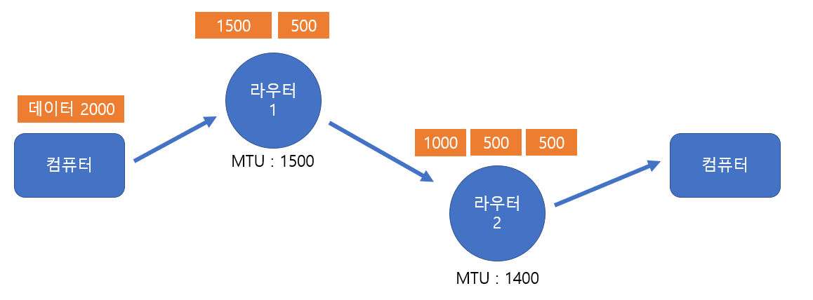
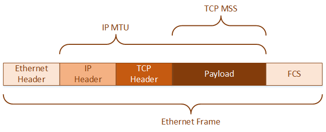

# TCP/IP [MTU, MSS, PMTUD]

*CS 노트*

## MTU

> #### Maximum Transmission Unit

데이터를 송수신 할 때에, 패킷으로 쪼개진다

그리고 쪼개질 때에는 **MTU** 기반으로 쪼개진다

MTU 기반으로 쪼개진다는 것은, 패킷이 쪼개질 때에, 쪼개질 수 있는 최대의 크기를 뜻한다

- 즉 패킷이 MTU 보다 더 크면, 중간에 패킷이 더 쪼개지거나, 에러가 발생할 수 있

- 위와 같이 라우터 1에서 한번 더 쪼개서 라우터 2를 통해서 송신을 할 수 있다
- 또는 아예 송신할 때에 1000, 500, 500으로 나누어서 송신할 수 있

## MSS

> #### Maximum Segment Size

#### MTU 는 IP헤더와 TCP헤더 크기까지 다 합쳐서 1500바이트까지 제한을 둔

#### 반대로 MSS 같은 경운 IP헤더와 TCP 헤더를 빼서 최대 1460바이트까지 제한을 둔다

- FCS는 에러검출을 돕기 위해 삽입되는 필드이다 (4바이트)

## PMTUD 

> #### Path MTU Discovery
>
> #### 패키지 분활이 안 될 경우, 패킷의 크기를 낮추면서 MTU에 맞게끔 반복해서 보내는 것이다

