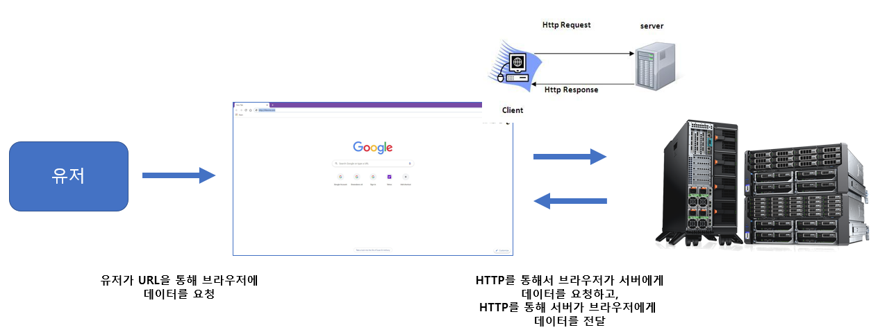
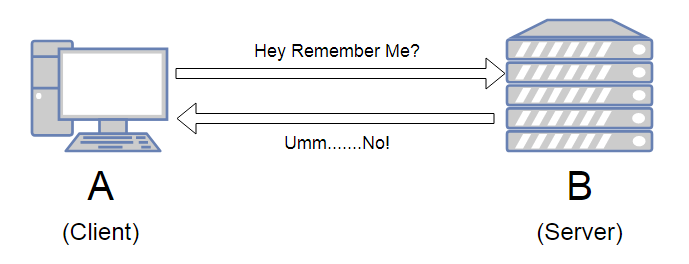
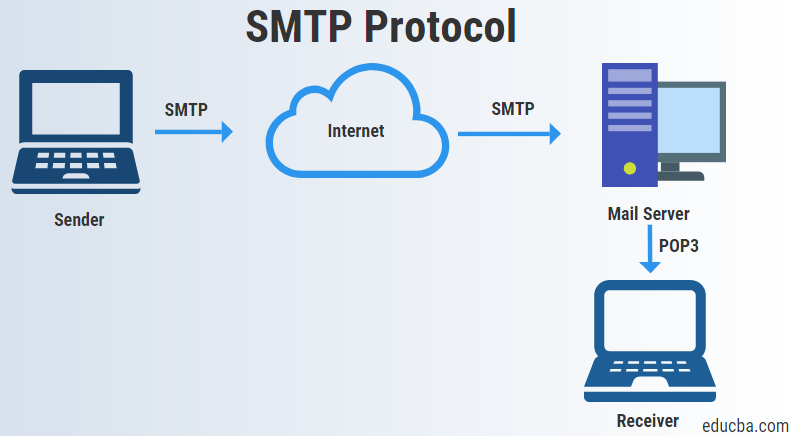

# TCP/IP [응용, 전송, 인터넷 계층 in detail]

*CS 노트*

## 응용 계층 (Application)

> #### 데이터를 송수신 할 때에 메세지 역할을 한다
>
> #### 즉 실제 유저들이 서비스를 사용할 수 있게 해주는 층이

### FTP (File Transfer Protocol)

>  #### 노드와 노드간에 파일을 전송할 때에 사용되는 프로토콜이다
>
> - 최근에는 파일을 암호화하여 전송을 한다

### HTTP (HyperText Transfer Protocol)

- 서버와 브라우저 간의 또는 서버와 서버 간에 데이터를 주고 받을 때 사용되는 프로토콜이다
- header 확장이 가능하고, stateless하다
  - HTTP Header : 클라이언트와 서버가 요청 또는 응답으로 부가적인 정보를 전송할 수 있도록 해주는 기능
    - 메세지 바디 내용, 메세지 바디 크기, 압축 정보, 인증 정보, 클라이언트 브라우저 정보, 서버 에플리케이션 정보, 캐시 정보 등
  - stateless : 서버가 클라이언트의 이전 상태를 보존하지 않는다

#### stateless

### SSH (Secure SHhell Protocol)

#### SSH 프로토콜은 보안되지 않 네트워크에, 암호화 네트워크 프로토콜을 통해 네트워크를 보호해주는 프로토콜이다

- 가장 대표적인 어플리케이션은 로그인 그리고 명령 행(command line)이다
- 주로 private key를 받아서 사용을 할 수 있다
- API key를 받아서 서버를 사용하는 것

### SMTP

> #### 이메일을 보낼 때에 SMTP를 이용하여 메일을 보내게 된다

[Python SMTP 구현](https://jejoonlee.tistory.com/100)

