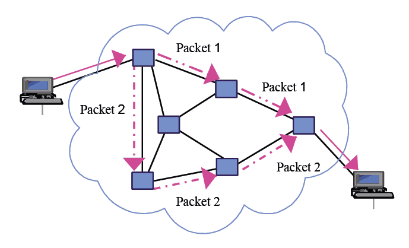

# 13. TCP/IP [전송 계층 in detail]

*CS 노트*

## 전송 계층 (Transport)

> #### 응용 계층에서 받은 메세지를 세그먼트 또는 데이터그램을 통해서 데이터를 송신하는 것이다
>
> - 세그먼트 : TCP
> - 데이터그램 : UDP
>
> #### 데이터가 송신 될 때에는, 목적지에 도착한다는 보장이 없다 (중간에 오류가 발생할 수도 있다)
>
> #### 전송 계층에는 TCP와 UDP가 있다

## TCP (Transmission Control Protocol)

> 가상회선 패킷 교환 방식

#### 말 그대로 가상으로 회선을 만든 후, 그 경로대로 패킷을 순서대로 보낸다

#### TCP는 체크섬을 통해 오류를 검사하고, 데이터가 처음부터 끝까지 제대로 송신이 되었는지 확인을 한다

#### TCP를 통해 데이터를 전송 중, 측정 시간 동안 데이터가 수신자에게 도달을 안 할 경우, 다시 재전송을 한다

- 송수신 데이터는 같아야 한다

### 세그먼트 형태

> 중요!!! 
>
> **세그먼트의 헤더는 20 ~ 60 바이트로 가변적이다**

####  

#### **Source Port Address (송신자 포트 번호)**

####  

#### **Destination Port Address (수신자 포트 번호)**

####  

#### **Sequence Number**

####  

#### **Acknowledgment number (ACK)**

- 수신자 쪽에서 바이트 몇 번까지 잘 받았는지 송신자에게 전해주는

####  

#### **HLEN (Header Length)**

- 헤더는 20바이트지만, 옵션까지 최대 60바이트까지 존재할 수 있다
- 그래서 헤더의 길이를 표시하는 필드가 필요하

####  

#### **Control Field (제어 필드) - 어떤 세그먼트인 것을 나타내는 필드**

*이미지 빨간 부분*

- ##### URG (urgent) - 1비트

  - 해당 TCP 세그먼트를 우선적으로 보내야 한다는 필드
  - 해당 필드가 있으면, 빨리 보내야 한다는 것을 알 수 있음

- ##### ACK (Acknowledge) - 1비트

  - 이 필드가 세트가 되면, **Acknowledege number** 필드가 의미를 갖게 된다

- ##### PSH (Push) - 1비트

  - TCP에서는 버퍼링을 하는데, 버퍼링 없이 데이터를 보내라는 신호
  - 바로바로 데이터를 보내야 할 상황에서 사용된다

- ##### RST (Reset) - 1비트

  - 연결을 재설정 해야 하는 것
  - 오랫동안 통신을 안 했을 경우 재설정을 해야 한다

- ##### SYN - 1비트

  - 연결을 설정하는 필드

- ##### FIN (Finish) - 1비트

  - 연결을 종료를 알리는 필

#### **Window Size**

- 버퍼의 크기다
- 흐름 제어를 하기 위해, 수신자 쪽에서, 지금 비어있는 용량이 어느 정도인지 송신자에게 보낸다
- 이를 통해 송신자가, 얼마만큼 바이트를 보낼 수 있을지 알 수 있다

#### **Checksum**

- TCP는 무조건 검사가 필요하다
- 가상 헤더를 포함하여 계산을 한다
- 에러를 확인해야, 나중에 데이터를 재전송할 수 있다

#### **Urgent Pointer**

- URG 가 셋팅되면, 바이트 어디까지가 빠르게 보내져야하는 알려주는 필드
- 예시) urgent pointer가 100이면, 100바이트까지 긴급데이터라는 것을 의미한다

## TCP 연결 설정 / 해제

> #### TCP 연결 설정은 Three-way handshake을 통해서 연결을 한다
>
> #### TCP 연결 해제는 Three-way handshake 또는 Four-way handshake를 사용할 수 있다

####  

#### **연결 설정 : Three-way handshake**

1. 클라이언트에서 연결을 하기 위해 SYN 세그먼트를 전송
2. 서버에서 `1번`을 잘 받았다는 것과, 클라이언트와의 연결을 위해 SYN와 ACK를 포함한 세그먼트를 전송
3. 클라이언트는 `2번`을 잘 받았다는 것을 ACK 세그먼트를 통해 서버에게 전달

> 이렇게 총 3번 왔다갔다 해서 Three-way handshake이라고 한다

####  

#### **연결 해제 : Three-way handshake**

> FIN을 의미하는 신호를 보낸다
>
> FIN을 보낼 때에 바로바로 연결을 끊는

1. 클라이언트에서 FIN 세그먼트를 서버에게 전송한다
2. 서버는 `1번`을 잘 받았고, 연결을 끊기 위해서 ACK와 FIN이 포함되어 있는 세그먼트를 클라이언트에 전송한다
3. 클라이언트는 `2번`을 잘 받았다는 ACK 세그먼트를 서버에 보낸다

####  

#### **연결 해제 : Four-way handshake**

> 서버에서 ACK와 FIN을 한번에 다 보내는 것이 아니다
>
> ACK를 보내고, FIN을 보내기 전에 보낼 데이터들을 다 보낸다

1. 클라이언트에서 연결 해제를 위해 FIN을 보낸다
2. 서버는 `1번`을 잘 받았다는 의미로, ACK 세그먼트를 보낸다
3. 서버에서 클라이언트 쪽에, 보낼 데이터들을 다 보내면, 클라이언트 쪽에 FIN을 보내 연결을 해제한다
4. 클라이언트는 `3번`을 잘 받았다는 의미로 ACK 세그먼트를 서버에 보낸

## UDP (User Datagram Protocol)

> 데이터그램 패킷 교환 방식은 데이터의 패킷들이 독립적으로 최적의 경로를 통해 이동을 하는 것이다
>
> 즉 TCP와 달리, 순서대로 움직이지 않아, 순서가 다를 수 있다

#### UDP는 8바이트의 고정된 헤더를 가지고 있다

#### 단순한 체크섬만 지원하여 오류검사를 한다

## TCP vs UDP

### 패킷 교환 방식

- TCP : 가상 회선 패킷 교환 방식
- UDP : 데이터그램 패킷 교환 방식

### 신뢰성

- **TCP : 보장 됨**
  - 3-웨이 핸드쉐이크를 통해 노드간의 연결 상태를 확인하고, 4웨이 핸드쉐이크를 통해 연결을 해제한다
  - 즉 연결 상태를 확인함으로써, 데이터를 송수신 할 수 있는 가능성이 높아진다

- **UDP : 연결을 보장하지 않는다**
  - 수신자와의 연결 상태 상관 없이, 그냥 데이터를 송신한다

### 오류검사

- **TCP : 오류검사, 재전송**
  - 체크섬을 통해 오류검사를 하고, 오류가 발생했을 시에는 데이터를 다시 수신자에게 보낸다
- **UDP : 오류검사**
  - 체크섬을 통해 오류검사를 하지만, 선택 사항이다

### 패킷의 순서보장

- **TCP : 순서 보장**
  - 가상의 회로를 설정하고, 그 경로대로 패킷을 순서대로 보낸다
- **UDP : 순서를 보장하지 못 한다**
  - 패킷들을 독립적으로 송신을 한다
  - 즉 순서 상관없이, 패킷들이 알아서 최적의 경로를 찾아 수신자로 전달된다

### 헤더 길이

- **TCP : 20~60 바이트로 변화가 가능하다**
- **UDP : 8바이트로 고정된 헤더 길이를 가지고 있**

### 브로드캐스트 지원

- **TCP : 지원 하지 않는**
- **UDP : 지원 한다**

### 속도

- **TCP : 연결 상태를 확인해야 해서, 속도가 느리다**
- **UDP : 연결 상태 확인 없이 그냥 패킷을 전송하는 것이라서 빠르다**

