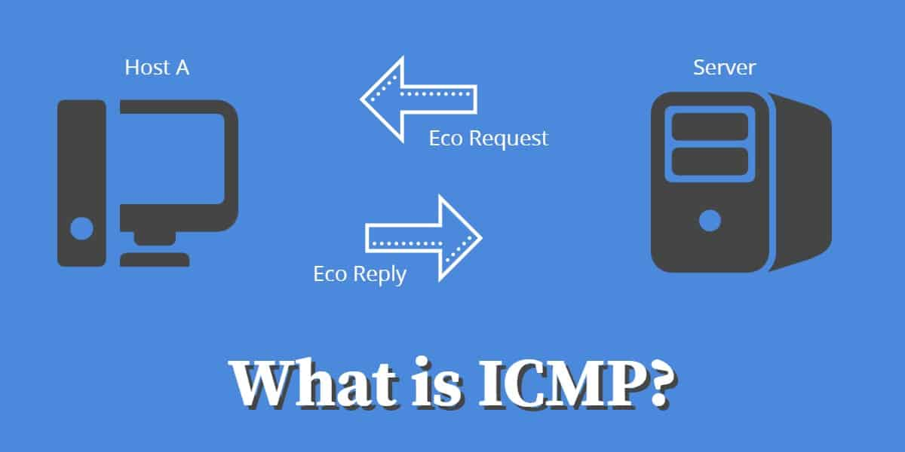
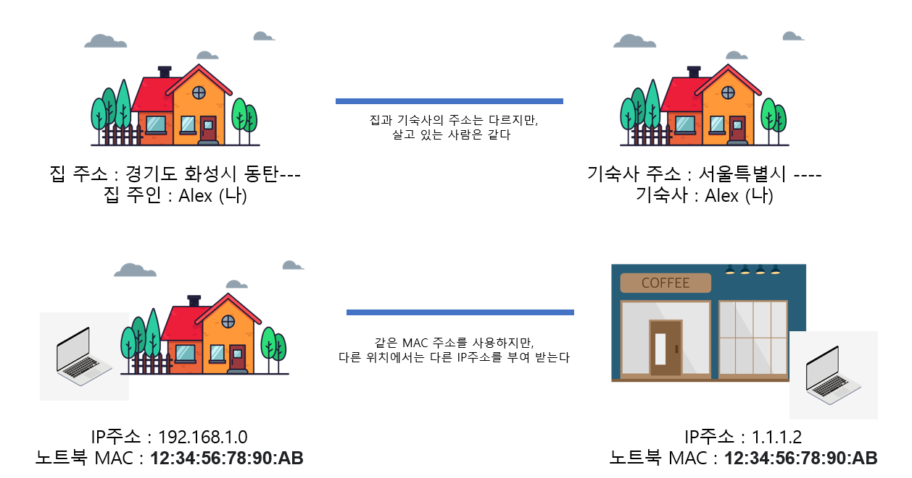

# 14. TCP/IP 인터넷 계층

*CS 노트*

## 인터넷 계층

> #### IP, ICMP, ARP가 대표적
>
> #### 한 노드에서 다른 노드로 전송 계층에서 받은 세그먼트 또는 데이터그램을 패킷화 하여 전송하는 것

### ICMP (Internet Control Message Protocol)

- 노드와 노드 사이에서 통신이 잘 되는지 확인하기 위해 사용되는 프로토콜

- 데이터를 주고 받는 것이 아니 에코를 주고 받으면서, 통신이 잘 된다는 것을 확인할 수 있다

## IP 주소

> #### 인터넷 상에 있는 컴퓨터의 논리적인 주소 (변할 수 있는 주소)
>
> - 집에서 인터넷에 연결해서 부여 받는 IP주소와, 카페의 인터넷에 연결해서 부여 받는 IP주소는 다르다
>
> #### IP 주소를 통해 데이터를 주고 받을 수 있다 (택배를 받기 위해 집 주소를 기재하는 것과 같다)

#### IP 주소를 기반으로 네트워크 간에 통신을 하지만, IP 주소는 MAC 주소를 기반으로 만들어진다

## MAC 주소

> #### 인터넷을 사용할 수 있는 기기에 할당되는 고유한 ID

.png)

#### OUI (Organizationally Unique Identifier)

- IEEE에서 할당한 제조사 코드다
- OUI를 검색을 하면, 실제 제조사를 확인할 수 있다

#### UAA or Network Interface Controller (NIC)

- 제조사에서 해당 기기에 부여해준 코드다
- UAA는 같은 네트워크를 사용하지만 않으면 중복이 될 수 있다
- UAA를 바꿀 수는 있지만, 안 하는 것을 권장한다

## ARP, RARP

> #### ARP : IP주소가 MAC주소를 찾는 과정
>
> #### RARP : MAC주소에서 IP주소로 변환되는 과정

### ARP (Address Resolution Protocol) 의 과정

.png)

- Host A 가 브로드캐스트를 통해 MAC 주소를 요청한다

### RARP의 과정

- 192.168.30.6은 Host A의 브로드캐스트를 통해, 정보를 요청 받는다
- 그리고 자신의 MAC 주소를 유니캐스트를 통해 Host A에게 응답해준다

