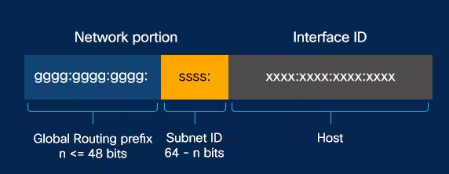
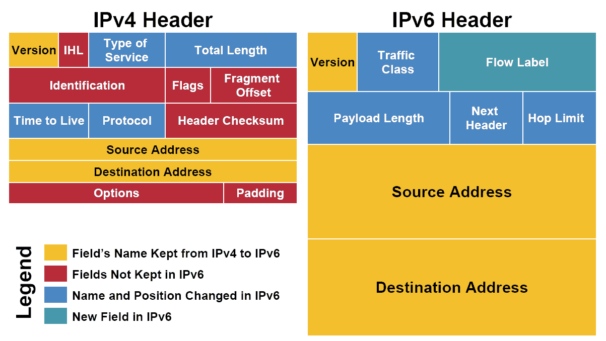

# 15. IP주소 체계

*CS 노트*

## IPv4와  IPv6

> #### IP주소의 버전들이다
>
> - IPv4가 먼저 시작을 했고, 아직도 많이 사용하고 있다

### IPv4

> #### 32비트로, 8비트씩 나누어 구분한다
>
> - 여기서 8비트의 묶음을 옥텟 (Octet)이라고 한다
> - 즉, 4개의 옥텟으로 만들어져 있다
>
> #### IPv4를 가지고 2^32 (41억 9천만) 주소를 표현할 수 있다

#### 위의 123.89.46.72 는 사람들이 보기 편하게, 쓰이는 것이다

- 원래는 이진수로 표현한다

#### 41억 9천만 주소를 표현할 수 있지만, 인구 수 그리고 인당 사용 네트워크 기기를 따진다면, 부족한 수다

- 그래서 NAT, Subnet 같은 추가적인 기술이 필요하다

### IPv6

> #### 128 비트로, 16비트씩 8개의 묶음으로 구성되어 있다
>
> #### 128 비트는, 2진수에서 16진수로 변환되어 구현이 된다
>
> #### 128 비트로 이루어져 있어, IPv4보다 훨씬 더 많은 주소를 구현할 수 있다

| **10진수** |  0   | 1    |  2   |  3   |  4   |  5   |  6   |  7   |  8   |  9   |  10  |  11  |  12  |  13  |  14  |  15  |
| ---------- | :--: | ---- | :--: | :--: | :--: | :--: | :--: | :--: | :--: | :--: | :--: | :--: | :--: | :--: | :--: | :--: |
| **2진수**  |  0   | 1    |  10  |  11  | 100  | 101  | 110  | 111  | 1000 | 1001 | 1010 | 1011 | 1100 | 1101 | 1110 | 1111 |
| **8진수**  |  0   | 1    |  2   |  3   |  4   |  5   |  6   |  7   |  10  |  11  |  12  |  13  |  14  |  15  |  16  |  17  |
| **16진수** |  0   | 1    |  2   |  3   |  4   |  5   |  6   |  7   |  8   |  9   |  A   |  B   |  C   |  D   |  E   |  F   |

 #### 연속으로 0으로 표현이 된다면, (::)을 통해 생략을 할 수 있다

- 위의 설명을 보면 `:0000:0000:0000:0000` 는 `::`로 생략이 되었다

#### 앞에 64비트는 네트워크 주소 그리고 뒤의 64비트는 인터페이스 주소로 나누어져 있

#### IPSec가 들어가 있어, 데이터 패킷을 암호화 해준다

- IPSec은 데이터 패킷을 암호화 해주는 프로토콜이다

#### IPv4와 다르게 헤더가 단순하다

- IPv4에서 불필요한 필드를 제거함으로써 더 빠르게 처리를 할 수 있다

### IPv4 vs IPv6

#### **체크섬**

- **IPv4 : 체크섬이 들어가 있다**
  - TCP : 무조건 체크섬이 있기 때문에, 체크섬을 2번 하는 것
  - UDP : 체크섬이 선택이다. 1번만 하거나 2번을 할 수 있다
- **IPv6 : 체크섬이 없다**
  - TCP : TCP에서 무조건 체크섬을 해서, 굳이 IPv6가 체크섬을 할 필요가 없다
  - UDP : IPv6가 체크섬이 없어, UDP는 무조건 체크섬을 선택을 해야 한다

> #### 전송계층에서 체크섬을 할 수 있어서, 굳이 인터넷 계층에서 할 필요가 없다
>
> - 즉 IPv6는 체크섬을 없애서, 에러를 두번 확인하는 것을, 한번으로 줄여서, 데이터 전송을 더 빠르게 만들었다

#### 헤더길이

- IPv4 : 헤더 길이가 패킷에 따라 달라질 수 있다
  - 길이가 다르다 보니, 헤더의 길이를 나타내는 필드까지 필요하게 된다
- IPv6 : 헤더 길이가 고정이면서, IPv4보다 적다 (40바이트)

#### TTL을 Hop Limit 으로

- TTL은 패킷이 라우터를 지나칠때마다 하나씩 줄어드는 값이다
  - TTL이 있어야, 패킷이 네트워크 안에서 무한순회를 방지할 수 있다
  - TTL이 없어지면, 패킷도 폐기된다
- 그런 TTL은 IPv6에서 Hop Limit으로 바뀌었다

#### 속도

- IPv4의 헤더 필드에서, 불필요한 것들을 빼면서 IPv6가 좀 더 빠르게 데이터를 처리할 수 있다. 하지만 그래도, 더 큰 패킷 크기로 인해서 IPv6가 조금 느릴 수도 있다.

