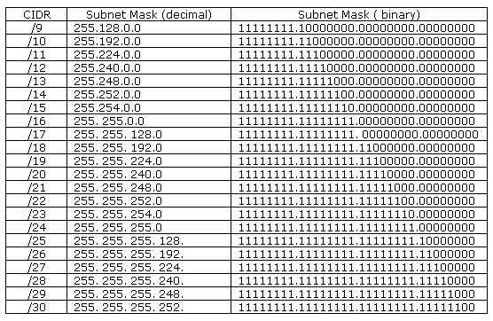

# 16. IP주소 체계 [클래스풀, 클래스리스]

*CS 노트*

## 클래스풀 IP 주소

> #### 모든 단체들이 똑같은 네트워크 주소를 가지게 된다면, 보안상 문제가 일어날 수 있다
>
> #### 그래서 네트워크 ID를 가지되, Host ID를 따로 배포해주는 것이다
>
> - Host ID는 기기들에게 주어지는 IP 주소의 ID이다
>
> #### Class A부터 Class C까지가 제일 중요하다
>
> #### Class D는 멀티캐스트용 그리고 E는 주소가 부족할 때에 사용하는 클래스다

### Class A

- 첫 번째 옥텟을 네트워크 ID고, 나머지 3개의 옥텟을 Host ID로 주어진다
- 즉 하나의 네트워크 당, 2 ^ 24 - 2 개의 호스트에게 IP주소를 나눠줄 수 있다
- **1 ~ 126 인 범위만 Network ID로 사용할 수 있다**
- 127.X.X.X 는 루프백 주소 그리고 0.0.0.0도 특수 주소다
  - 루프백 주소 : 로컬 네트워크 / 본인 IP를 지칭하는 IP주소

### Class B

- 앞에 2개의 옥텟을 네트워크 ID로 가지고, 뒤의 2개의 옥텟을 Host ID로 가진다

- 하나의 네트워크 당, 2^16 - 2개의 호스트를 IP주소로 나눌 수 있다
- **Network ID  :  128 ~ 191**

### Class C

- 앞에 3개의 옥텟을 네트워크 ID로 가지고, 뒤의 1개의 옥텟을 Host ID로 가진다
  - 즉 더 많은 네트워크를 만들 수 있지만, Host ID가 줄어든다
- 2^8 - 2 만큼 Host ID를 부여할 수 있다

- **Network ID : 192 ~ 223**

#### 호스트 ID를 부여할 때에 2개를 뺀다

- 0 은 네트워크의 주소다
  - 192.0.0.0 인 IP주소는, 해당 네트워크의 주소다
    - 외부에서 네트워크를 찾을 때에, 네트워크 주소를 사용한다
    - 즉 192.0.0.0의 네트워크를 먼저 찾고, 그 네트워크 안에 있는 IP 주소 192.0.0.1을 찾는
  - 192.0.0.1, 192.0.0.5 이 기기에게 부여하는 주소가 된다
- 255는 브로드캐스팅 주소다

#### 클래스풀 IP 주소 같은 경우, 하나의 네트워크 ID 당, 고정적으로 Host ID를 부여할 수 있다

- 예시)
  - 기기 1000대를 네트워크에 연결하려고 한다
    - Class A는 하나의 네트워크 당 최대 253개의 호스트를 호스팅할 수 있어 Class B를 사용해야 한다
    - Class B를 사용하면 65534개의 호스트 ID를 부여할 수 있는데, 1000대만 사용하면 되서 나며지 64534개의 호스트가 낭비가 된다

## 클래스리스 IP 주소 (Classless)

> #### Classful IP주소의 단점을 보완한 것
>
> #### 서브넷 마스크 (Subnet mask)를 사용하여, 네트워크 주소와 호스트주소를 구분한다
>
> - 서브네팅 : 네트워크를 나누는 것
> - 서브넷 : 쪼개진 네트워크
> - 서브넷 마스크 : 서브네트워크 (서브넷)을 위한 비트 마스크

- 서브넷 마스트는 이진 수에서, 앞에 연결되어 있는 1 중, 제일 마지막 1까지가 네트워크 ID가 되고, 그 뒤는 Host ID가 된다
  - 11111111.11111111.11111111.11110000
  - 위에 마지막 0000부터 호스트 ID로 사용할 수 있는 것이고, 앞에 1들이 모두 네트워크 ID가 되는 것이다
- 이렇게 하면, 하나의 네트워크 당, 호스트 ID를 더 쪼개서 분배할 수 있다

## 공인 IP 와 사설 IP와 NAT

> public IP & private IP
>
> NAT : Network Address Translation

#### 단체 내부에서 데이터를 송수신을 할 때에는 Private IP를 사용한다

#### 다른 네트워크, 즉 외부 네트워크와 데이터를 송수신 할 때에는 Public IP를 사용한다

#### 그 Private IP에서 Public IP로, 또는 Public IP에서 Private IP로 전환해주는 것이 NAT다

