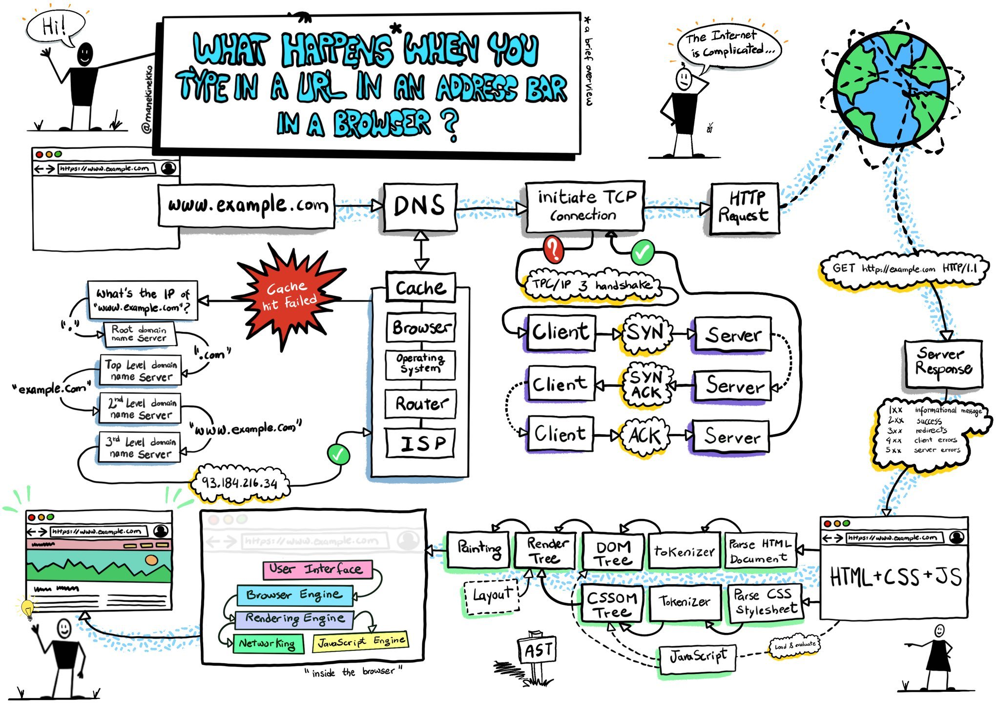
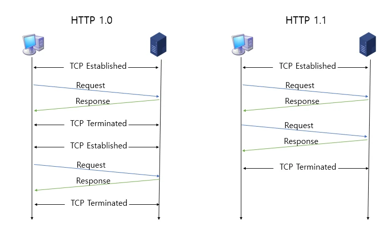
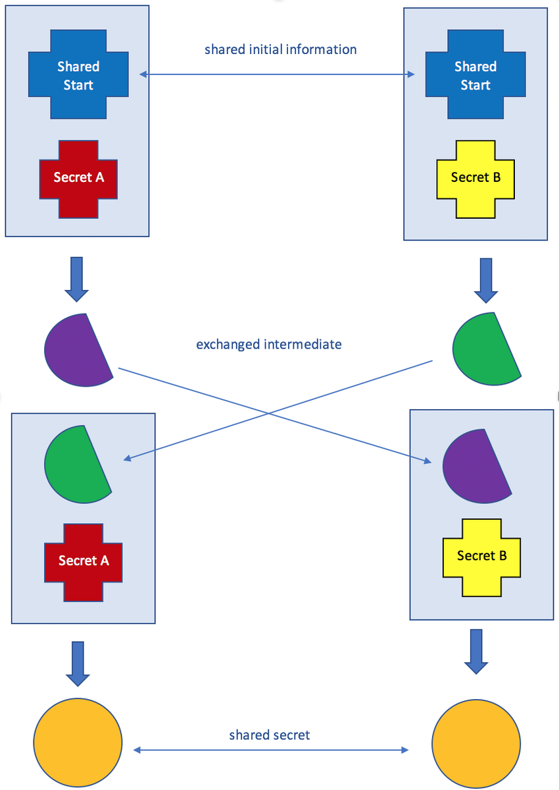
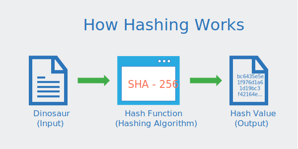
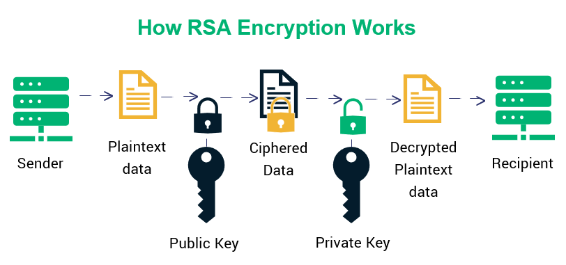

# 18. HTTP, HTTPS & TLS

*CS 노트*

## URL을 입력하고, 화면을 볼 때까지의 과정

### 대기열

- URL을 통해 요청을 하면, 브라우저는 URL을 대기열에다 넣는다

### 캐싱

- 캐싱을 통해 원래 서버에 직접 접근을 하지 않고, 캐시 안에 대기열에 요청한 값을 저장을 한다
  - 추후에 같은 값을 요청하면, 이미 저장이 되어 있어, 더 빠르게 반응을 한다
- 또한 직접 서버에 접근을 하는 것이 아니라서, 보안성도 보장이 될 수 있다 (프록시 캐시)

### DNS

> 서버 주소 즉 수신 주소를 찾는 것이다

- 유저가 브라우저 창에 요청한 주소는 컴퓨터가 읽을 수 없다
- 즉 DNS를 통해 브라우저 창에 요청한 주소의 IP주소로 변환해준다
- ARP를 통해서 IP주소의 MAC주소를 찾아준다

### TCP, 3웨이 핸드쉐이크

- 유저 기기와 서버 기기의 통신을 연결하기 위해서 TCP를 사용한다
- **연결된 것이 확인이 된다면, 서버에서 다시 HTML 등을 유저에게 응답을 해준다**

## HTTP/1.x HTTP2, HTTP3의 차이

> #### HTTP는 HyperText Transfer Protocol로 웹에서 정보를 주고 받을 수 있는 프로토콜이다

### HTTP/1.0

- 한 번의 연결당 하나의 요청을 처리한다
  - 즉 한번의 요청을 처리하면, 똑같은 요청이라도, 다시 연결을 하고 요청을 처리한다
  - 3웨이 핸드쉐이크를 요청을 할 때마다 해서, RTT (Round Trip Time)가 증가 한다

- RTT의 증가를 해결하기 위해 몇 가지 방법을 가지고 왔다
  - **이미지스플리팅**
    - 여러 이미지가 있으면, 이미지를 하나의 파일로 모은다
    - 그리고 그 하나의 이미지를 기반으로, 포지션을 다르게 해서, 시각화 한다
    - 여러 개의 이미지가 아닌, 하나의 이미지를 사용하는 것이라서, 이미지 관련 메모리가 줄어든다
  - **코드압축**
    - 코드의 빈칸들을 없애준다
    - 코드 관련해서 메모리를 줄여준다
  - **Base64인코딩**
    - 64진법 문자열로 이미지를 인코딩하는 것이다
    - 이미지에 대한 HTTP 요청을 할 필요가 없지만, 크기가 커진다

### HTTP/1.1

- **Keep-alive 옵션**
  - HTTP/1.0의 단점이었던, 하나의 요청 당 한 번의 연결 과정을 해결해준다
  - 한번만 연결을 하고 Keep-alive 옵션을 두면, 한번의 연결로 여려개의 파일을 송수신할 수 있다
- **HOL blocking (Head Of Line blocking)**
  - 요청하는 파일들의 크기가 작으면 별로 문제가 없다
  - 하지만 요청하는 파일들의 크기가 크다면, 첫 번째 패킷이 지연되면, 뒤의 패킷들에게도 영향을 주게 된다

### HTTP/2

- **멀티플랙싱**

  - HOL blocking을 해결해준다
  - 여러 스트림을 사용하여, 앞의 패킷 크기에 상관 없이, 데이터를 송수신 할 수 있도록 한다

  

- **해더압축**
  - 허프만 코딩을 이용하여 해더를 압축해준다
    - 문자의 빈도 또는 확률정보를 이용해 통계적 압축하는 방법
    - 텍스트에서 문자가 출현하는 빈도수에 따라 다른 길이의 부호를 부여한다
- **서버 푸쉬**
  - 클라이언트 요청없이 서버에서 푸쉬하는 것 (HTML 파일을 요청할 때에 알아서 HTML, CSS, JS까지 모두 응답해주는 것)
    - 이렇게 하면 HTML을 요청하고 따로 CSS, JS를 요청할 필요가 없다

### HTTP/3

- TCP 기반이 아닌, UDP 기반으로 돌아간다 (QUIC을 이용)
  - 즉 초기 연결 설정을 할 때에, 지연시간을 감소한다
- HTTP/2에서의 장점을 모두 가지고 있다
- QUIC - 에러를 검출하면 수신측에서 에러를 수정할 수 있다

## HTTPS와 TLS

> #### HTTPS : HyperText Transfer Protocol Secure
>
> #### TLS : Transport Layer Security
>
> #### SSL : Secure Socket Layer
>
> - TLS와 SSL, 모두 같다 / SSL이 업데이트 되면서, TLS로 명칭이 바뀌었다

.png)

#### HTTPS는 통신을 주고 받을 때에 데이터를 암호화 한다

- 암호화를 하면, 웹 서비스를 공격하려고 하는 사람이 데이터를 중간에 가로채도 데이터가 암호화가 되어 있어, 쓸모가 없어지게 된다
- 예) 군대에서 통신을 할 때에, 기밀 정보를 대놓고 얘기하는 것 보단, 서로 주어진 규칙을 통해 통신을 하며 데이터를 주고 받는다
  - 이는 적이 통신 내용을 이해 못 하도록 하는 것이다

#### 암호화란? (Encryption)

- 허가된 키를 가진 사람만 열거나 해독할 수 있도록 데이터를 스크램블 하는 것이다
- 암호화된 키를 사용하여 메세지를 열면 데이터가 원래 메세지로 돌아간다
  - 즉 키 없이 전송되고 열린 모든 메세지는 해독할 수 없고, 정보를 읽을 수 없을 것이

#### 대칭 암호화

- 암호화, 복호화에 사용되는 키가 동일하다

.png)

- 예시)
  - plain text + key = cipher text    :    hi + **7ad1056ef6** = X8fasd89FD
  - cipher text + key = plain text    :    X8fasd89FD + **7ad1056ef6** = hi

#### 비대칭 암호화

- 암호화, 복호화에 사용되는 키가 다르다

- 공개 키와 개인 키가 있다

  - 공개 키로 암호화 된 데이터는 개인 키로만 복호화 될 수 있다

  .png)

- **공개키 암호화 ▶️ 개인키 암호화** : 데이터를 안전하게 전송할 수 있는 보안 관점
- **개인키 암호화 ▶️ 공개키 암호화** : 신뢰할 수 있는 단체라는 것을 인증

### TLS 핸드쉐이크

> #### TLS가 하는 것
>
> - 암호화 : 제 3자로 부터 전송되는 데이터를 숨길 수 있다
> - 인증 :  정보를 교환하는 클라이언트가 같은 클라이언트라는 것을 보장한다
> - 무결성 : 데이터가 위조되거나 변조되니 않았는지 확인한

### 1 RTT

- Client Hello 를 보내고 Sever Hello를 받으면 통신이 연결되었다고 인증이 된다
  - 여기서 **비대칭 암호화**를 사용한다
- 한번 연결이 된 후, 데이터를 계속 송수신 할 수 있다
  - 이때는 **대칭 암호화**를 사용한다

> 비대칭 암호화만 사용하는 경우, 연산 작업이 많이 들어가서, 비용이 많이 든다
>
> - 즉 처음 연결을 인증할 때에는 엄격하게 하되, 그 이후에는 대칭 암호화를 사용한다

### Client Hello

- **사이퍼슈트와 클라이언트 랜덤값 (무작위 문자열), 임시 DH 매개변수**를 서버로 보낸다
- **DH 매개변수 (Diffie-Hellman)**
  - 상대방의 공개키와, 나의 개인키를 이용고 계산을 통해 비밀키가 나오는 것이다
  - 이렇게 비밀키가 나오고 난 후, 상대방과 통신을 할 때에 비밀키를 통해 데이터를 암호화 하면 된다
  - DH에 타원곡선 암호화 방법을 통해, 보안을 더 강화키셨

- **사이퍼 슈트, Cipher Suite**

  .png)

  - TLS_AES_128_GCM_SHA256
  - TLS_AES_256_GCM_SHA256
  - TLS_CHACHA20_POLY1305_SHA256
  - TLS_AES_128_CCM_SHA256
  - TLS_AES_128_CCM_8_SHA256
    - **TLS** : 프로토콜 (TLS 또는 SSL)
    - **AES_128_GCM** : AEAD 사이퍼 모드
      - AEAD는 데이터 암호화 알고리즘이고, AES_128_GCM이 AEAD 알고리즘 중 하나
    - **SHA256** : 해시 알고리즘, **인증서**를 확인 할 때에 사용되는 알고리즘이다

### Server Hello, Encrypted Extension, Certificate ,Certificate Verify

- Client Hello에 대한 서버의 응답이다
- 서버와 클라이언트가 지원하는 가장 높은 TLS 버전을 결정하고, 사이퍼 슈트 지원 여부를 확인한다
- 클라이언트에 공개키가 포함된 **인증서, 서버 랜덤값, 임시 DH 매개변수**를 보낸다

- **인증서** : 주체 (**CA**, 도메인, 웹사이트 소유자, 인증서 소유자)와 공개키로 구성되어 있다
  - 주체는 클라이언트가 올바른 웹 사이트에 접속이 되어 있는지 확인한다
  - 공개키는 처음 인증작업을 수행할 때에 사용된
- **CA (Certificate Authority)**
  - 제대로 된 웹 사이트라는 것을 보장해준다
  - 검증된 기관에서 CA를 보장해준다

### Finished

- **서로 주고 받은 임시 DH 매개변수를 사용하여 임시 암호 키(세션 키)를 생성한다**
  - 생성한 세션 키를 이용하여 대칭 암호화를 사용하여 통신이 시작된다

### 0 RTT

- 한번 세션키가 만들어지면, 클라이언트와 서버간에 인증을 추가적으로 할 필요가 없다

### RSA

> #### 공개키 암호시스템의 하나다
>
> #### 비대칭키 알고리즘의 대표적인 알고리즘이다
>
> #### 하지만 DH 매개변수를 더 많이 사용한다
>
> - RSA 클라이언트에서 생성한 암호값이 탈취되면, 해킹의 위험성이 있다

