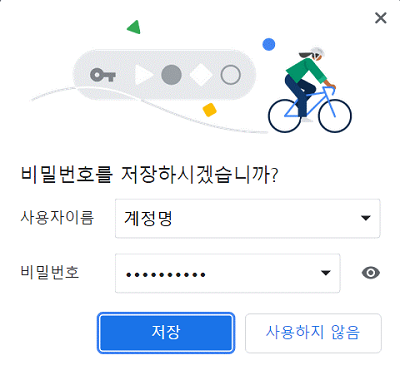

# 19. 웹브라우저의 캐시 [로컬스토리지]

*CS 노트*


## 웹 브라우저의 로컬 스토리지

> #### 하나의 웹 브라우저에 저장되는 key : value
>
> - 즉 Chrome에서 하나의 데이터를 저장한다고 해도, Edge브라우저에 저장이 안 된다
> - Chrome 이라는 하나의 웹브라우저의 로컬스토리지에 데이터를 저장하는 것이다
>   - 같은 컴퓨터지만 다른 브라우저




#### key에는 하나의 value만 넣을 수 있다

- value는 리스트로 만들어질 수 있다


#### 최대 5MB까지 저장을 할 수 있고, 사용자가 직접 데이터를 삭제하지 않는 한, 평생 로컬스토리지에 저장되어 있다


#### 자동 로그인, 검색할 때에 나오는 전에 검색한 기록 등

- 사용자 행위를 기억할 때에 사용된다


```javascript
// 추가
localStorage.setItem(key,value);
// 탐색
localStorage.getItem(key);
// 제거
localStorage.removeItem(key);
// 전체제거
localStorage.clear()
```


## 로컬 스토리지와 오리진

.png)

#### origin이 같으면, 로컬 스토리지에 저장되어 있는 데이터들이 서로 공유가 된다


#### 하지만 origin이 다르면, 로컬 스토리지에 저장되어 있는 데이터들이 공유가 안 되어 다르게 나타난다


1. `https://sports.news.naver.com/index` 의 오리진은 `https://sports.news.naver.com/`

- 로컬 스토리지 : {뉴스 : 스포츠}

2. `https://www.naver.com/`의 오리진은 `https://www.naver.com/`


> 같은 네이버지만, 다른 오리진을 가지고 있다. 즉 {뉴스 : 스포츠}는 1번 오리진의 로컬 스토리지에 저장되어 있다
>
> 반대로 2번 오리진의 로컬 스토리지에는 {뉴스 : 스포츠}가 없다


## 로컬 스토리지 활용


### UX (User Experience) 개선

- 자동 완성 또는 로그인 유지 할 때, 등 사용될 수 있다
- 로그인 유지 (토큰) : 토큰 로컬 스토리지에 저장하여, header_authorization을 통해 로그인을 유지한


- 로그인 유지, 자동 완성 (캐싱)
  - 브라우저에 입력을 하게 되면, 로컬 스토리지에 자동으로 값들이 저장이 된다
  - 추후에 다시 입력을 할 수 있어서, 자동으로 저장된 값들을 보여주게 되면 UX가 향상이 될 수 있다


## 세션 스토리지

> #### 로컬 스토리지와 똑같다
>
> - 단 세션 스토리지 같은 경우, 탭을 닫으면 데이터가 사라진다
>
> #### 많이 사용이 안 된다

```javascript
// 추가
sessionStorage.setItem(key,value);
// 탐색
sessionStorage.getItem(key);
// 삭제
sessionStorage.removeItem(key);
// 모두 삭제
sessionStorage.clear()
```

