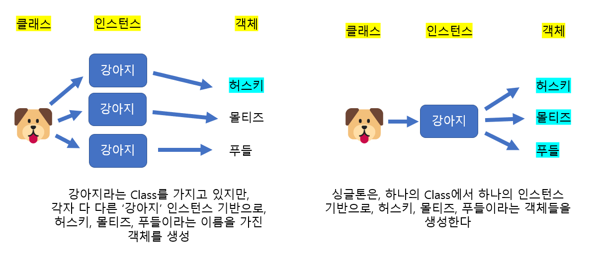
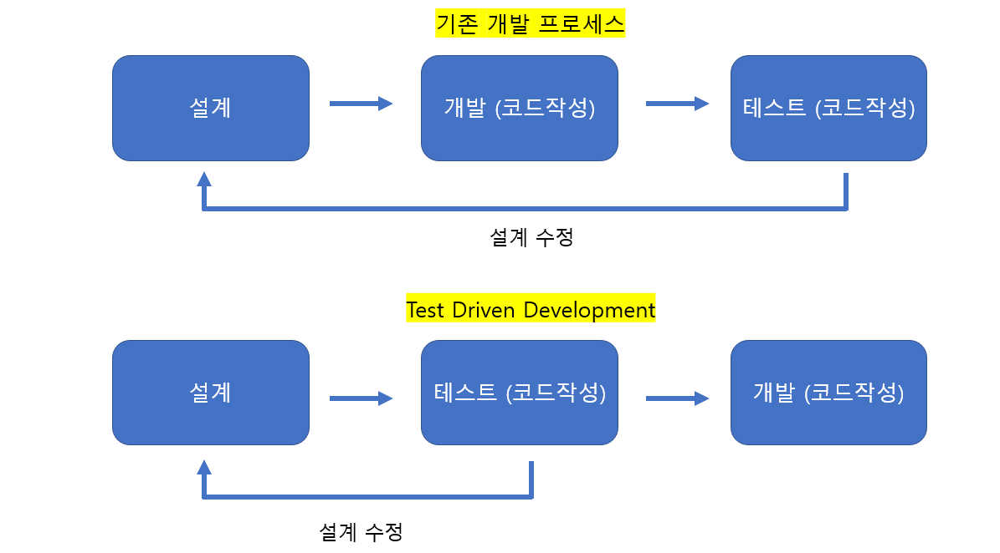
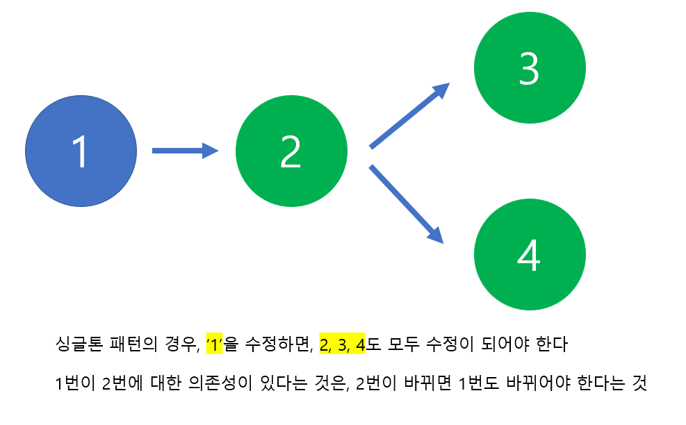
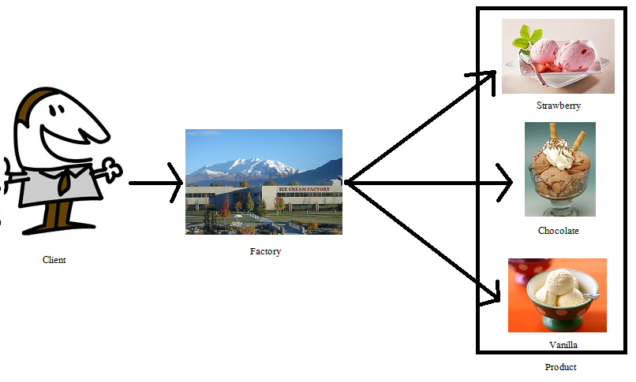
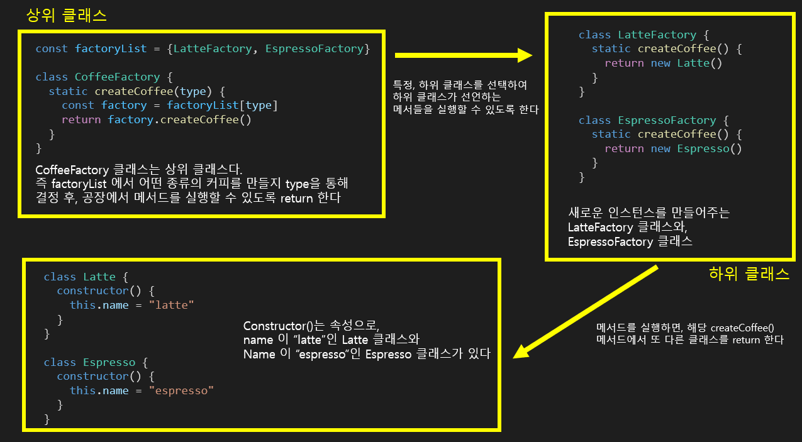

# 1. 디자인 패턴 (싱글톤 패턴 / 팩토리 패턴)

####	싱글톤 패턴, 팩토리 패턴


## 디자인 패턴

> #### 디자인 패턴은 프로그램을 설계할 때에 나타났던 문제점들을 객체 (Objects)간의 상호 관계를 이용하여 해결하려고 만든 '규약' 형태이다.
>
> - 라이브러리, 프레임워크가 있다
>
> #### 로직에 따라 반복적인 패턴을 라이브러리와 프레임 워크에 포함


하나의 코드로 프로그램을 설계할 수 있지만, 추후에 유지 보수를 하기 어렵다

- 한번에 많은 코드를 수정할 때에 번거롭거나, 오히려 에러를 발생 시킬 수 있다


디자인 패턴이라는 규약을 만들어서 **모듈화**를 했다

- 프로그래밍을 더 쉽게 할 수 있다


#### 라이브러리 (Library)

> 공통으로 사용될 수 있는 기능들을 모듈화한 것이다
>
> 폴더명, 파일명 등 규칙이 없어서, 프레임워크에 비해 자유롭다
>
> - 유저가 직접 모듈을 컨트롤할 수 있다 (예. 가위를 가지고 종이를 자를 때)


#### 프레임워크 (Framework)

> 공통으로 사용될 수 있는 기능들을 모듈화한 것이다
>
> 폴더명, 파일명 등 규칙들이 존재한다
>
> - 비행기를 타는 것 (비행기를 탈 수만 있지, 비행기를 직접 조종할 수 없다)


**axios** 라는 라이브러리를 프레임워크, **React** 또는 **Vue** 안에 사용할 수 있다

반대로 프레임워크끼리, 즉 **React**를 **Vue**와 같이 사용할 수 없다


```javascript
axios.get('/user?ID=12345')
	.then(function (response) {
    	// handle success
    	console.log(response);
	})
	.catch(function (error) {
    	// handle error
    	console.log(error)
	})
	.then(function () {
    	//always execute
	})
```

- ##### axios 라이브러리 사용 예시다

  - `.get()`, `.then(function (reponse) {})`, `.catch(function (error) {})` 등 어느 정도 규약은 존재한다
  - 하지만, 어느 정도 규칙으로 정해져 있지만, **React** 또는 **Vue**에서 사용 가능한 형태이다


## 싱글톤 패턴

> #### 하나의 클래스에 오직 하나의 인스턴스만 가지는 패턴이다
>
> #### 주로 데이터베이스 연결 모듈에 많이 사용한다




#### 원래 클래스 부여

- `a`와 `b`는 같은 클래스를 사용하는 다른 객체들이

```javascript
class Dog {
    constructor(name) {
        this.name = name
    }
}

const a = new Dog("Husky")
const b = new Dog("Poodle")
console.log(a === b) // false
```


#### 싱글톤 패턴을 사용

```javascript
class Singleton {
    constructor () {
        if (!Singleton.instance) {
            Singleton.instance = this
        }
        return Singleton.instance
    }
    getInstance () {
        return this.instance
    }
}

const a = new Singleton()
const b = new Singleton()
console.log(a === b) // true
```


### 싱글톤 패턴의 장점

> #### 클래스를 이용할 때마다, 새로운 인스턴스를 만들어내지 않아도 되서, 메모리 비용이 줄어든다


- Network 연결, Database, file system에 요청하는 것은 I/O 바운드라고 한다
- I/O 바운드는 서버에 요청을 하고, 응답을 받아야 하기 때문에 시간이 걸린다
  - 이럴 때 싱글톤 패턴을 이용하면, 한번만 연결을 하면 된다


```javascript
const URL = 'mongodb://localhost:27017/kundolapp'
const createConnection = url => ({"url": url})
class DB {
    constructor(url) {
        if (!DB.instance) {
            DB.instance = createConnection(url)
        }
        return DB.instance
    }
    connect() {
        return this.instance
    }
}

const a = new DB(URL)
const b = new DB(URL)
console.log(a===b)
```

- `a`와 `b`는 싱글톤 패턴에 의해, 따로따로 연결을 안 하고, `DB.instance`, 인스턴스 하나를 기반으로 서버와 연결을 한다


#### 싱글톤의 단점

- ##### TDD (Test Driven Development)

  - TDD를 할 때에는 단위 테스트를 진행한다
  - 단위 테스트는, 테스트가 서로 독립적이어야 하는데, 싱글톤은 미리 생성한 하나의 인스턴스를 기반으로 하여, 테스트를 할때마다 독립적인 인스턴스를 만들기 어렵다
    - 즉 싱글톤에 경우 테스트를 하게 된다면, 순서가 정해져 있다
    - TDD는 어떤 순서든 진행이 가능해야 한다. 즉 싱글톤 패턴을 사용하면 TDD를 하기 어렵



- ##### 의존성이 높아진다

  - 클래스에서 하나의 인스턴스만 가지고 있기 때문에, 클래스가 바뀌면 그 하나의 인스턴스를 가지는 모든 객체들도 같이 바뀌어야 한다




## 팩토리 패턴

> #### 상위 클래스와 하위 클래스가 존재한다
>
> #### 상위 클래스는 중요한 뼈대를 가지면서, 어떠한 하위 클래스를 실행할지 정해준다
>
> - 상위 클래스는 인스턴스 생성 방식에 대한 알 필요가 없다
>
> #### 하위 클래스는 객체 생성에 관한 구체적인 내용을 결정한다






```javascript
class Latte {
  constructor() {
    this.name = "latte"
  }
}

class Espresso {
  constructor() {
    this.name = "espresso"
  }
}

class LatteFactory {
  static createCoffee() {
    return new Latte()
  }
}

class EspressoFactory {
  static createCoffee() {
    return new Espresso()
  }
}

const factoryList = {LatteFactory, EspressoFactory}

class CoffeeFactory {
  static createCoffee(type) {
    const factory = factoryList[type]
    return factory.createCoffee()
  }
}

const main = () => {
  const coffee = CoffeeFactory.createCoffee("LatteFactory")
  console.log(coffee.name)
}

main()
```

