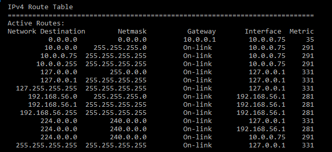
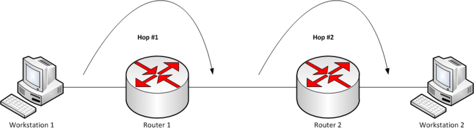

# 14. 라우팅

*CS 노트*

## 라우팅이란?

> #### 라우팅은 네트워크에서 경로를 선택하는 프로세스다
>
> - 더 나아가 라우팅은, 데이터를 보낼 때에 최적의 경로를 선택하여 데이터가 목적지에 도착할 수 있도록 설정을 해준다
> - 예) 네비게이션

#### 네트워크와 네트워크 사이에는 수 많은 노드들이 존재를 한다

#### 그 수 많은 노드들을 거쳐가는데, 최적의 경로를 찾아야 데이터를 더 빠르게 송수신할 수 있다

#### 이것을 라우팅이라 하고, 라우터는 최적의 경로를 설정해주는 기기이다

## 라우팅 테이블

> #### 라우터는 라우팅 테이블을 기반으로 최적의 경로를 선택한다
>
> #### 라우팅 테이블은 네트워크 연결이 포함 되어 있는 리스트다
>
> #### 라우팅 테이블은 IP주소를 기반으로 사용된다

#### 라우팅 테이블은 컴퓨터 네트워크에서 목적지 주소를 목적지에 도달하기 위한 네트워크 노선으로 변환시키는 목적으로 사용된다 - 위키백과

### 라우팅 테이블 구성요소

- ##### Network Destination (네트워크 대상)

  - 목적지의 IP 주소

- ##### Netmask (서브넷 마스트)

  - IP 주소를 부연 설명 (Supporting details)한 것이다

- ##### Gateway

  - 네트워크와 네트워크를 연결해주는 장치다
  - 다음 외부 네트워크를 표기해준다
  - 만약 내부 네트워크이면 위처럼 On-link으로 표시가 된다

- ##### Interface

  - 외부 네트워크로 가기위해 지나가는 장치

- ##### Metric

  - 네트워크를 거쳐 지나가는데 할당되는 비용
  - 최적의 경로를 찾을 수 있다

#### 게이트웨이 (Gateway)

#### 홉 (hope)

> 데이터를 송수신 할 때에, 거쳐가야 하는 네트워크 장비다
>
> 데이터가 출발지와 목적지 사이에서 통과해야 하는 중간 장치들의 개수다

