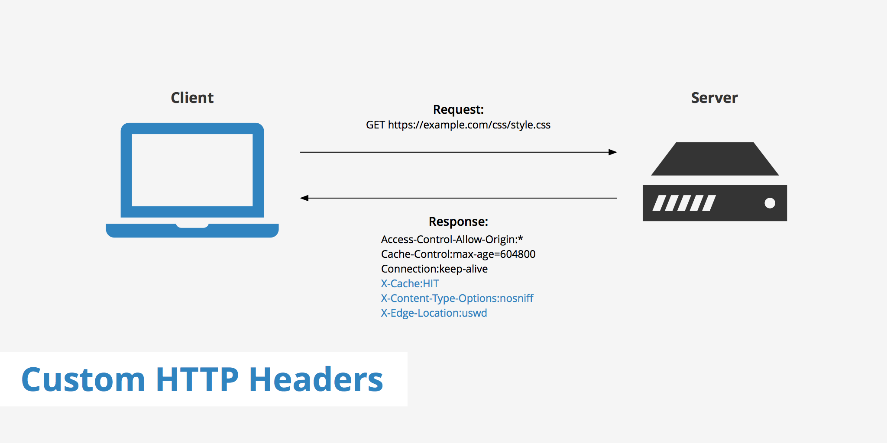
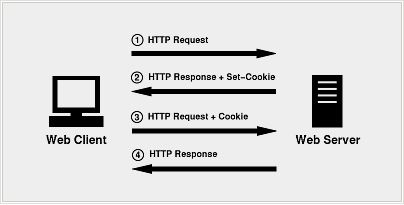

# 20. 웹브라우저의 캐시 [HTTP 해더, 쿠]

*CS 노트*


## HTTP 해더

> #### HTTP 전송에 필요한 모든 부가 정보를 담고 있다
>
> #### 크게 General, Response Headers, Request Headers로 나뉜다



https://en.wikipedia.org/wiki/List_of_HTTP_header_fields


### General

> 요청과 응답 메세지 모두에서 사용 가능한 일반적인 헤더 목록

- 요청한 URL
- 요청한 메서드
- URL 노출 정도 (Referrer Policy) : 보안


### Request Headers

> 클라이언트가 서버에 요청할 때에 설정되는 헤더
>
> 이 외에도 더 많은 필드가 존재한다

- **Accept** : 클라이언트가 요청하는 미디어 타입
- **Accept-Charset** : 클라이언트가 요청하는 문자 인코딩
- **Accept-Encoding** : 클라이언트가 요청하는 압축 인코딩
- **Accept-Language** : 클라이언트가 요청하는 언
- **User-Agent** : 유저 에이전트 애플리케이션 정보를 나타낸다
- **Authorization** : 인증 토큰을 서버로 보낼 때 사용하는 헤더
- **Cookie** : 클라이언트가 서버에서 받은 쿠키를 저장하고, HTTP 요청 시 서버로 전달
- **sec-ch-ua-platform** : 클라이언트가 사용하는 platform (Window, macOS)


### Reponse Headers

> 서버가 클라이언트에게 응답을 보낼 때에, 보내는 헤더
>
> 보안을 위해 서버에 대한 자세한 정보를 포함하지 않는다

- **Server : nginx**
  - 서버는 프록시를 사용하고 있다는 것


## 쿠키 (Cookie)



1. 클라이언트가 HTTP 요청을 한다
2. 서버가 HTTP 응답을 Set-Cookie와 함께 하며 응답을 해준다
   - 응답 헤더에, Set-Cookie 필드에 값을 넣어준 것
3. 클라이언트가 다시 요청을 할 때에는 응답 받은 Cookie 값과 같이 요청을 한다
   - 즉 자동으로 브라우저에 Cookie가 저장된다


#### 쿠키는 클라이언트와 서버에서 조작을 할 수 있지만, 보통 서버에서 만료기한 등을 조작한다

- 클라이언트에서 쿠키를 조작하면 보안 문제가 생길 수 있다
- 주로 개인 정보들을 다루는데, 클라이언트 쪽에서 쿠키를 조작하면, 공격자가 더 쉽게 정보를 가로챌 수 있다
  - 주로 클라이언트보다 서버가 더 보안이 뛰어나다


#### 저장용량은 최대 4kb다


#### 로그인, 장바구니, 사용자 커스터마이징, 사용자 행동분석을 할 때에 사용된다


#### 세션 쿠키 / 영구 쿠키

- **세션 쿠키** : 브라우저가 닫히면, 쿠키가 사라지는 것
- **영구 쿠키** : Expires 또는 Max-Age 속성을 지정해, 특정 시간 동안 쿠키를 저장하고, 그 이후에는 폐기한다


### 문법

```javascript
Set-Cookie: <cookie-name> = <cookie-value>
Set-Cookie: <cookie-name> = <cookie-value> ; Expires=<date>
Set-Cookie: <cookie-name> = <cookie-value> ; Max-Age=<non-zero-digit>
Set-Cookie: <cookie-name> = <cookie-value> ; Domain=<domain-value>
Set-Cookie: <cookie-name> = <cookie-value> ; Path=<path-value>
Set-Cookie: <cookie-name> = <cookie-value> ; Secure
Set-Cookie: <cookie-name> = <cookie-value> ; HttpOnly
Set-Cookie: <cookie-name> = <cookie-value> ; SameSite=Strict
```

- **Secure** : HTTPS로만 쿠키를 주고 받을 수 있는 것인데, 현재 일부 브라우저는 Secure가 작동이 안 된다
  - 이유는 HTTP인 사이트가 Secure를 사용하지 못 하게 막아주기 위한 것이다
- **httponly** : 공격자가 자바스크립트로 빼낼 수 없게 만든다


### 쿠키의 Secure 코딩

- Cookie에 sessionID를 담을 때에 sessionID 기반으로 클라이언트의 개인정보를 유추할 수 없게 해야 한다
- 자바스크립트로 파악할 수 없도록 httponly를 사용해야 한다
- 세션 타임아웃을 걸어서, 계속 로그인이 안 되도록 해야 한다 (특히 금융 관련 사이트)


### 쿠키허용관련 알림장

- 쿠키는 주로 개인 정보를 많이 다루는 것이다
- 그래서 유저들의 개인 정보를 사용한다는 것을 표시하고, 유저들의 동의를 얻어야 한다


## 로컬 스토리지 vs 세션 스토리지 vs 쿠키


### 공통점

- 공통적으로 모두 브라우저에 클라이언트가 요청한 데이터를 저장하는 것이다
  - 추후에 똑같은 데이터를 찾을 때에, 더 빠르게 데이터를 찾을 수 있다
  - 브라우저, 즉 로컬에 데이터를 저장하는 것이기 때문에, 서버에 직접 통신을 안 해도 된다 (서버 과부하를 줄일 수 있다)
- UX를 증가시킬 수 있다
  - 전에 커스텀 했던 정보, 또는 로그인 상태를 유지함으로써, 이후에 클라이언트가 똑같은 과정을 안 겪어도 된다


### 차이점

|                                   |     로컬 스토리지      |  세션 스토리지   |         쿠키          |
| :-------------------------------: | :--------------------: | :--------------: | :-------------------: |
|          최대 저장 용량           |          5mb           |       5mb        |          4kb          |
|           브라우저 허용           |         HTML 5         |      HTML 5      |      HTML 5 + 4       |
|             접근 범위             |           창           |        탭        |          창           |
|             만료 기한             | 영구적 (수동으로 삭제) | 탭을 닫으면 소멸 |     수동으로 설정     |
|        설정할 수 있는 주체        |       클라이언트       |    클라이언트    | 클라이언트 + **서버** |
| 요청과 함께 서버에 자동 전송 유무 |           X            |        X         |           O           |

