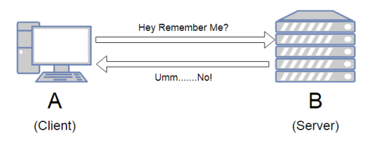

# 21. 로그인 [세션 기반 인증 방식, 토큰 기반 인증 방식]

*CS 노트*

## 세션 기반 인증 방식

> #### HTTP의 특징 중 하나는 stateless 한 것이다
>
> - 위의 그림처럼 한번 요청하고 응답한 사항은, 추후에 다시 요청을 받을 때, 서버에서 기억을 못 한다

#### 즉, 원래는 한번 로그인 했다고 로그인 상태를 유지 시켜주지 않는다

#### 그래서 유저들의 UX을 위해서 사용자들의 정보를 기억하기 위해서 세션을 유지해야 한다

- **세션 (Session)** : 사용자가 인증을 할 때, 서버가 정보를 저장하는 것을 세션이라고 한다. 

.png)

- 클라이언트가 로그인을 요청하면, 서버에서 쿠키에 세션을 생성하고 클라이언트에 응답을 해준다
  - **set-cookie : SESSIONID = XXXXXXXXXXXXXXXXXXXXXXXXXXXXXXXXXXXXXXXXXXX**
- 이후에 클라이언트에서 요청을 보낼 때 마다, 생성한 세션 ID를 헤더로 넣어 데이터를 요청한다
  - **cookie : SESSIONID = XXXXXXXXXXXXXXXXXXXXXXXXXXXXXXXXXXXXXXXXXXX**
  - 즉 요청을 보낼 때 마다, 서버에서 인증된 세션을 확인할 수 있다
  - 세션 확인을 통해, 서버에서 로그인을 계속 유지 시켜줄 수 있다

#### 세션 ID는 DB 또는 웹 서버에 저장이 된다

- 사용자가 늘어나게 되면, 메모리가 늘어나서 서버에 과부하가 될 수 있다

## 토큰 기반 인증 방식

> #### 로그인 할 때 활용이 된다
>
> #### 인증은 토큰 기반 인증을 하지만, 그 외에 컨텐츠는 원래 HTTP의 특징인 stateless한 상태를 유지하는 것이다
>
> - 즉 인증을 해야 할 것들은 한번만 인증하고, 토큰을 통해 정보를 저장
> - 그 외에 것들은 저장을 하지 않는다

.png)

- 사용자가 로그인을 하게 되면 서버에서 사용자 인증을 한다
- 사용자 인증이 되면 서버는 **JWT (Json Web Token) 토큰**을 생성하고, 사용자에게 응답을 한다
- 이후 J**WT 토큰**을 HTTP Header-Authorization 또는 HTTP Header-Cookie에 담아, 사용자는 서버에게 데이터를 요청하고 응답을 한다
  - 서버는 JWT 토큰이 검증이 된 토큰인지 확인을 하고 데이터를 응답한다

### JWT (Json Web Token) 토큰이란?

> Header, Payload, Signature로 이루어져 있다

#### Header

- typ (종류) : 토큰의 타입을 지정한다
- alg : 해싱 알고리즘을 지정한다. 이 알고리즘은 **Signature**부분에 사용된다

#### Payload (내용)

- 데이터, 토큰 발급자, 토큰 유효 기간을 설정할 수 있다

#### Signature

- Header와 Payload의 값을 BASE64로 인코딩하고, 인코딩한 값을 비밀키로 이용하여 **Header**의 **alg**에 지정한 알고리즘 기반으로 해싱을 한 후 BASE64로 인코딩하여 생성한 값이다

  1. Header + Payload (BASE64로 인코딩)

  2. 비밀키를 이용하여 1번을 Header에서 정의한 알고리즘 기반으로 해싱
  3. 2번에서 나온 값을 다시 BASE64로 인코딩

### 장점

- 토큰 안에 사용자 인증에 관련된 데이터를 넣을 수 있다
  - 즉 다른 저장소에 데이터를 저장할 필요가 없다
- 경량화가 되어 있다
- JWT 토큰은 JSON을 기반으로 만들어진 토큰이다. 즉 토큰을 디코딩 하여 쉽게 파싱을 할 수 있다

### 단점

- 토큰이 너무 커지면 서버에 영향을 미칠 수 있다

- 다른 사람이 토큰을 탈취할 때에, 토큰을 디코딩하여, 토큰에 있는 내용을 읽을 수 있다

### Access Token, Refresh Token

- **Access Token**
  - 사용자를 인증을 하는 토큰이다
  - 만료 기간이 매우 짧다 (해커가 토큰을 사용 못 하게 한다)

- **Refresh Token**
  - access token이 만료되거나 잘못된 토큰이면 refresh token이 사용자를 검증해준다
  - 검증된 사용자이면, access token을 재발급 해준다

> Access Token을 이용하여 유저들은 서버에 인증을 한다. 하지만 Access Token의 만료 기간이 짧다. 즉 로그인을 하고 Access Token이 사라질 때마다, 다시 로그인을 해야 한다.
>
> 하지만 Refresh Token은 Access Token이 만료되면, 사용자들 다시 검증해 준다. 검증이 될 때에, Access Token을 재발급 해 준다. 그리고 Access Token은 해당 유저가 인증된 유저인 것을 서버에게 알리게 되는 것이
