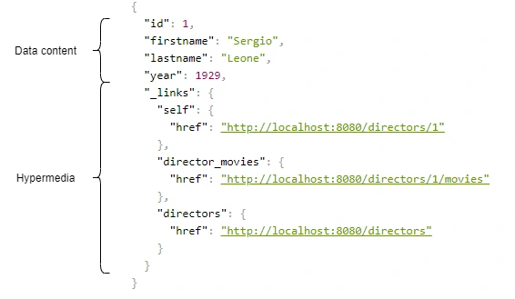

# 22. HTTP [상태코드, 메서드, REST API]

*CS 노트*

## HTTP 상태코드

> #### 서버의 응답을 나타내는 HTTP 상태코드다

#### 1XX (정보)

- 서버가 요청을 잘 받았다는 것을 의미
  - 100 : 상태가 괜찮으며 클라이언트가 계속해서 요청하거나 요청이 완료된 경우에는 무시해도 된다는 정보를 알려줌

#### 2XX (성공)

- 서버가 요청을 잘 받고, 응답까지 클라이언트에게 잘 했다는 것
  - 200 OK : 요청이 성공적
  - 201 Created : 요청이 성공적으로 이루어지고, 그 결과 새로운 리소스가 생성되었다는 것

#### 3XX (리다이렉션)

- 서버가 클라이언트에서, 추가적인 작업을 요청하는 것
  - 301 Moved_Permanently : 요청한 리소스의 URI가 변경되었다는 

#### 4XX (클라이언트 오류)

- 클라이언트의 요청이 잘 못 되었을 때
  - 400 Bad Request : 클라이언트의 요청을 이해할 수 없는 것
  - 401 Unauthorized : 해당 유저가 인증이 안 되었다는 것
  - 404 Not Found : 요청한 데이터를 찾을 수 없는 것

#### 5XX (서버 오류)

- 서버가 클라이언트의 요청을 처리하지 못 할 때
  - 500 Internal Server Error : 서버 내부에서 오류가 발 생
  - 502 Bad Gateway : 게이트웨이 또는 프록시 서버에서의 오류
  - 504 Gateway Timeout : 게이트웨이 또는 프록시 서버에서 Timeout 시간 내에 클라이언트의 요청을 처리하지 못 함

## HTTP 메서드

### GET vs POST

- **GET** : 데이터를 읽는 것
  - URL을 기반으로 데이터를 요구하고, 성공을 하면 HTTP 상태코드 200을 반환한다
  - 캐싱이 가능 하다
  - URL에 파라미터가 존재한다
  - 주로 민감한 정보를 전달할 때 사용하지 않는다 (사용자 이름, 비밀 번호)

- **POST** : 데이터를 생성
  - 회원가입, 로그인 등
  - url이 아닌 HTTP Body를 통해 데이터를 전달한다
  - 성공을 하면 상태코드 201을 반환한다 / 데이터를 생성하지 않을 때에는 200을 반환한다
  - 캐싱 불가능
  - URL에 파라미터로 남지 않는다
  - 민감한 정보를 전달할 때 사용한다 

### PUT vs PATCH

> 데이터를 수정할 때 사용된다

- **PUT** : 데이터 전체를 업데이트 하는 것이다
  - 이미 데이터가 존재하지 않으면, 그냥 데이터를 추가한다
  - 반대로 데이터가 이미 존재하면, 새로 만든 데이터와 교체를 한다

- **PATCH** : 데이터 일부만 업데이트 하는 것이다
  - 데이터를 바꾸고 싶으면, 일부분의 데이터를 선택하고, 그 데이터만 업데이트하면 된다

## REST API

> #### API : Application Programming Interface
>
> #### 소프트웨어와 소프트웨어 사이에서 데이터를 전송하는 프로그램

### REST API

> Representational State Transfer의 약자이
>
> RESTful한 API로, 웹의 장점을 잘 살린 아키텍처이다
>
> Uniform-Interface를 갖는다

#### Uniform-Interface

- 자원들이 각각 독립적인 인터페이스를 갖는다
  - 웹 페이지가 변경이 되어도, 원래 있던 웹 페이지는 제대로 작동한다

- **Self-descriptive Message**
  - MIME Type에 맞춰 표현이 된 메세지를 HTTP 헤더를 통해 명시된다

- **HATEOAS (Hypermedia As The Engine of Application State) 구조**

  

  - 어떤 URL에서 어떤 데이터를 원했는지 명시해준
  - 링크를 통해서 애플리케이션의 상태 전이가 가능해야 한다
  - 링크 안에 자기 자신에 대한 정보가 담겨져 있다

- **Stateless**
  - HTTP 자체가 stateless하기 때문에, REST API도 Stateless 상태에서만 활용이 가능하다

- **Cacheable**
  - 캐싱이 가능하다
  - 웹 표준 HTTP 프로토콜 그대로 사용해서 웹에서 사용하는 기존의 인프라를 그대로 활용할 수 있다

- **Server-Client 구조**
  - 자원이 있는 쪽이 Server, 자원을 요청하는 곳이 Client가 된다

- **Layered System (계층화)**
  - 계층 구조로 아키텍처를 만들 수 있다

### URI (Uniform Resource Identifier) 규칙

- 수정, 삭제, 추가, 조회 / put, delete, post, get
  - 동사로 동작을 HTTP 메소드로 이용한다
- URI는 명사로 만든다
  - `'GET books/1'`  : 1번 책을 조회하는 것

