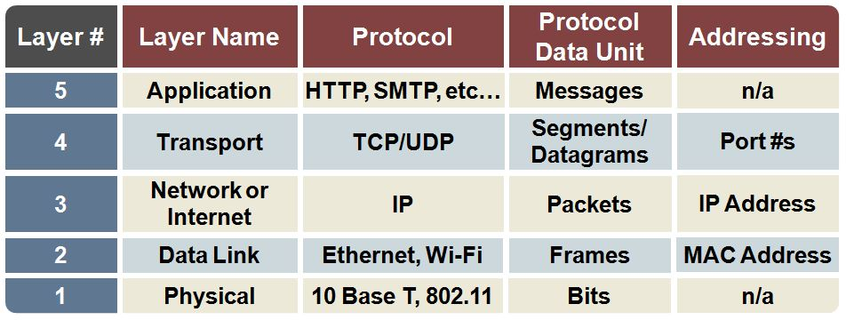
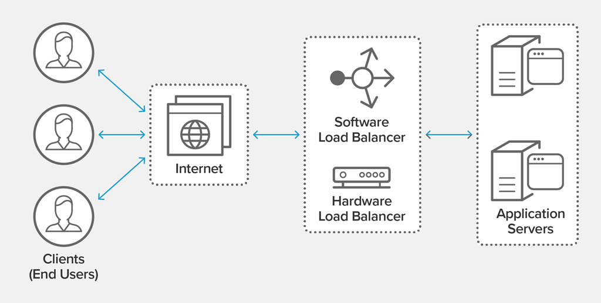
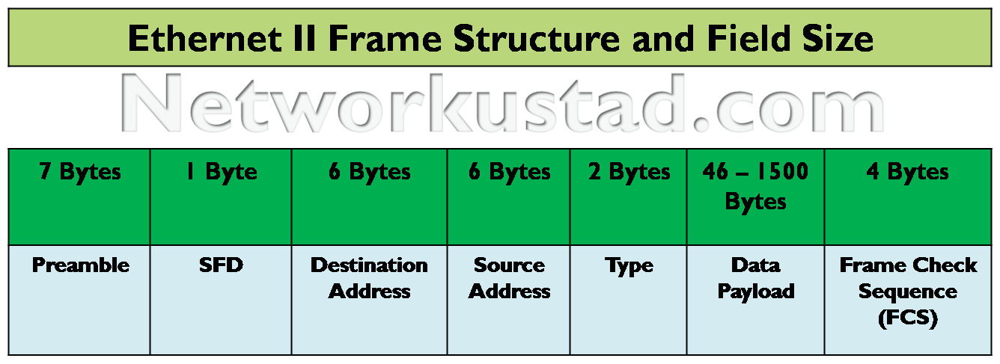

# 23. 네트워크를 이루는 장치

*CS 노트*

#### 네트워크 기기는 각 계층별로 나뉠 수 있다

- 어플리케이션 계층 : L7 스위치
- 전송 계층 : L4 스위치
- 인터넷 계층 (네트워크 계층) : 라우터 L3 스위치
- 데이터 링크 계층 : L2 스위치, 브리지
- 물리 계층 : NIC, 리피터, AP

#### 상위 계층을 처리하는 기기는 하위 계층도 처리할 수 있지만, 그 반대는 불가하다

## 어플리케이션 계층

> #### L7 스위치

#### L7 스위치는 로드밸런서라고도 한다

- 로드밸런서는 URL, 서버, 캐시, 쿠키들을 기반으로 트래픽을 분산시킨다
- 그리고 바이러스나 불필요한 외부 데이터를 필터링을 한다
- 헬스 체크를 주기적으로 하여 정상적인 서버 또는 비정상적인 서버를 판별한다
  - 헬스 체크는 L4 스위치에서도 한다

#### 로드밸런서의 서버 이중화를 통해 서비스 유지를 시켜줄 수 있다

- 하나의 서버가 장애가 걸리면, 다른 서버가 돌아가고 있기 때문에, 이용자들은 계속 서비스를 이용할 수 있다

## 전송 계층

> #### L4 스위치

#### 어플리케이션 계층의 L7 스위치와 매우 유사하다

- 로드밸런서의 이점을 가지고 있다

#### IP와 포트 기반으로 트래픽을 분산한다

- 스트리밍 관련 서비스가 불가하고, 메세지를 기반으로 인식하지 못 한다

## 인터넷 계층

> #### 라우터 와 L3 스위치

#### 라우터는 라우팅을 위한 장비다

- 네트워크 간의 연결, 분할을 구분 시켜줄 수 있따
- 네트워크 간, 데이터를 주고 받을 때에 제일 좋은 경로를 찾아준다

#### L3 스위치는 L2 스위치 기능과 라우팅을 해준다 - IP 기반이다

-  L3 스위치를 라우터라고 말해도 된다 
- 소프트웨어 기반, 그리고 하드웨어 기반 라우팅이 있는데, L3 스위치는 하드웨어 기반 라우팅을 하게 해준

## 데이터 링크 계층

> #### 이더넷 프레임을 통해 에러 확인, 흐름 제어, 접근 제어를 담당한다
>
> #### L2 스위치 / 브리지

#### L2 스위치는 MAC 주소를 기반으로 패킷 전송을 담당한다

- IP 주소는 읽지 못 한다
- MAC 주소가 테이블에 없으면, 전체 포트에 보낸다
  - MAC 주소 테이블은 일정 시간이 지나가면 공간을 위해 없어진다

#### 브리지

- 다른 LAN, 즉 다른 포트들을 연결해준다
  - LAN과 LAN, 또는 포트와 포트 사이에 다리 역할을 해준

### 추가: 이더넷 프레임

- **Preamble** : 이더넷 프레임의 시작을 알림
- **SFD (start Frame Delimiter)** : 다음 바이트부터 MAC 주소 필드임을 알림
- **Destination Address (DMAC) / Source Address (SMAC)** : 송수신 MAC 주소
- **Type** : IP프로토콜을 정의 (IPv4 또는 IPv6)
- **Payload** : 전달 받은 데이터
- **Frame Check Sequence** : 에러 확

## 물리 계층

> #### 무선 또는 유선 LAN을 가지고 0 또는 1로 이루어진 데이터를 보내는 계층
>
> #### NIC / 리피터 / AP

#### NIC (Network Interface Card)

- 인터넷을 연결하는데 필요한 장치다
- 컴퓨터 내에 설치가 되어 있

#### 리피터

- 약해진 신호를 증폭해주는 장치다

#### AP (Access Point)

- 패킷을 복사해주는 기기다
