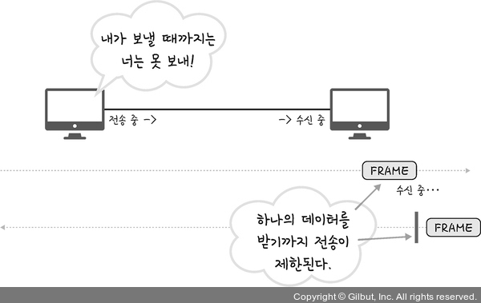
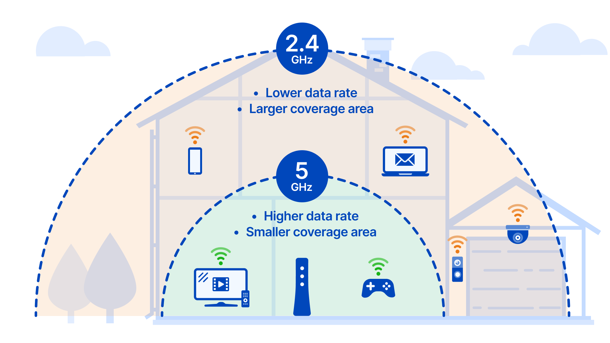

# 24. 유선/무선 LAN

*CS 노트*

## 유선 LAN

### 전이중화 통신 (Full Duplex)

- 송신하는 경로, 수신하는 경로가 따로 나뉘어져 데이터를 주고 받는다
- 현재 사용하는 통신 방법이다
- IEEE 802.3이라는 프로토콜을 따른다
- 근거리 통신망 기술이다

.png)

### CSMA/CD

- 반이중화 통신을 사용한다
- 송신 또는 수신 경로가 딱 하나 밖에 없다
  - 즉 데이터를 주고 받을 때 데이터끼리 충돌이 일어났다
  - 충돌이 일어나면, 데이터를 보낼 수 없다
- 그래서 중간에 충돌이 일어나면, 일정 시간 이후 데이터를 재전송하는 방식이다

### 유선 LAN을 이루는 케이블

- **트위스트 페어 케이블**
  - 구리선을 두 개씩 꼬아서 묶은 케이블이다
  - 구리선을 실드 처리하면 STP, 안 하면 UTP라고 한다
  - 흔히 LAN 케이블이라고 한다

- **광섬유 케이블**
  - 레이저를 이용해서 통신하여, 통신 속도가 훨씬 빠르고 장거리 송신이 가능하다
  - 빛이 내부에서 반사되면서 전징하는 방식이다

## 무선 LAN

### 반이중화 통신

- 반이중화 통신은 IEEE 802.11 프로토콜을 따른다
- 통신을 할 때에 한 방향으로만 통신을 할 수 있다
- 한 장치가 신호를 보내고, 상대 장치에게 도달할 때까지 기다려야 한다
  - 그래야 충돌을 피할 수 있다

### CSMA/CA

- 출돌을 미리 예방하는 것이

  - 데이터를 송신하기 전, 무선 매체를 살핀다

  - 캐리어 감지 : 회선이 비어 있는지 확인한다 

  - IFS (Inter FrameSpace) : 데이터를 보내기 전에, 랜덤한 시간 동안 기다렸다가 데이터를 송신한다

### 와이파이

- 와이파이는 유선에서 주고 받는 신호를, 무선 LAN 신호로 바꿔주는 기술이다
- 이를 사용하기 위해서는 AP (Access Point), 무선 접속 장치가 있어야 한다
- 무선 LAN을 이용하는 기술은 블루투스도 있다

### BSS

- 기본 서비스의 집합이다
- BSS 내에 있는 AP들과 장치들이 서로 통신이 가능한 구조다

### ESS

- BSS의 그룹이라고 생각하면 된다

### 무선 LAN을 이루는 주파수

- 2.4GHz와 5GHz가 있다
  - **2.4GHz**
    - 더 넓은 범위를 차지할 수 있다
    - 장애물에 강한 특성을 가지고 있고, 호환성이 좋다
  - **5GHz**
    - 사용할 수 있는 채널 수도 많다
    - 속도가 굉장히 빠르다
    - 깨끗한 전파 환경을 구축할 수 있다
    - 하지만 장애물에 약하고, 범위가 2.4GHz 보다 작다
