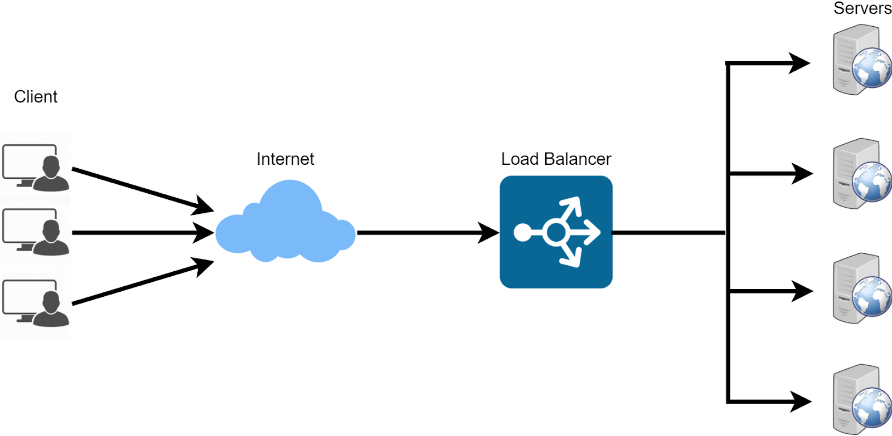
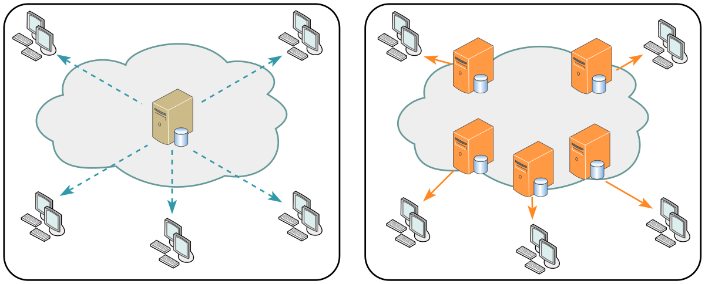

# 25. 대규모 트래픽 해결방법

*CS 노트*

## 서버 과부하란?

> #### 서버에 접속하는 사람들이 폭발적으로 증가하여 트래픽이 급격하게 증가한 경우

- 이럴 경우 서버의 성능이 저하된다
- 500 번 대 에러 메세지가 뜬

## 모니터링

> #### 서버 과부하의 원인은 정말 많지만, 그 중에 하나가 자원의 한계점 도달이다
>
> - 즉 CPU 같은 자원의 사용량이 한계점에 도달했거나, 메모리가 부족할 때 서버 과부하 상태가 된다

#### 그래서 자원들을 모니터링 하면서, 적절하게 용량을 할당을 시켜줄 수 있다

- **AWS 오토스케일링**
  - cloud watch를 통해 어플리케이션을 모니터링하고, 자동으로 자원의 용량을 조정한다
  - 예) 메모리, GPU, CPU 증가
- 그 외에 서버를 모니터링 하며, 자원의 용량을 할당시켜준다

#### 모니터링을 하면, 어느 페이지에서 어떤 트래픽이 일어났는지 확인 할 수 있다

- 반대로, 어느 페이지가 활용도가 낮은지 확인하고, 개선할 수도 있다

## 로드밸런서

#### 모니터링을 통한 오토스케일링은 빠르지만 시간이 걸린다

#### 그래서 로드밸런서를 앞 단에 이용하여 트래픽을 분산 시키는 것이다

- 오토스케일링을 하면, 이용자들은 짧더라도 서버가 만들어지는 시간을 기다려야 한다
  - 예) 1차선만 있는 도로가 막히자, 급하게 2차선을 만드는 것
- 로드밸런스를 통해, 이용자들은 들어가려는 서버가 과부하 상태면, 다른 서버로 들어가면 된다
  - 예) 4차선이 있는 고속도로에서 1차선이 막히면, 덜 막히는 2차선으로 차선만 변경하면 된다

## 블랙스완 프로토콜

> #### 시스템이 다운될 때 사용되는 프로토콜이다

1. 영향을 받은 시스템과 각 시스템의 상대적 위험 수준을 확인
2. 해당 시스템 때문에 영향을 받을 다른 시스템의 팀들에게 위험에 대해 알림
3. 모든 시스템을 패치
4. 복원을 위한 계획과 대응 과정을 파트너 또는 고객에게 전달

## 서킷 브레이커

#### 장바구니, 정보 입력, 결제는 서로 의존하는 관계

- 즉, 장바구니에 문제가 생기면 연쇄적으로 정보 입력과 결제 페이지도 장애가 발생할 수 있다

- 하나라도 장애가 발생한다면, 서킷 브레이커를 통해 유저들이 그 이후의 기능들을 사용 못 하게 막는다
- 서킷 브레이커는 서버를 해결하는 것이 아닌, 에러가 생기면, 기능을 차단해버리는 것이다

#### 서버에 요청을 계속 보냈지만, 응답을 제대로 안 보내주는 경우는 서버에 장애가 발생했다는 것이다

- 해당 서버로 인해, 다른 서비스도 악영향을 미칠 수 있다
- 이렇게 서킷 브레이커에서 서버에 장애가 발생했다고 느끼면, 서킷 브레이커가 열린다
- 서킷 브레이커가 열렸다는 것은, 서킷 브레이커가 중간에서 클라이언트의 요청을 받는 것을 막는 것이다

#### 서킷 브레이커의 상태값

- **closed** : 요청 실패율이 낮음. 서버 정상
- **open** : 요청을 서버로 전송하지 않는다. 서버 장애
- **half-open** : 서버가 장애일 수 있다. 즉 장애가 풀리면 **closed**를 유지하고, 안 풀리면 **open**으로 바꾼다

## 컨텐츠 확인

### 불필요한 컨텐츠 제거

- 사용자가 요청을 했을 때, 사용자가 필요한 컨텐츠보다 더 많은 데이터를 제공할 수 있다
  - 사용자가 1명, 2명이면 괜찮은데, 사용자 수가 증가하면, 그만큼 불필요한 데이터가 훨씬 많아지는 것이다
  - 그래서 사용자가 정말 필요한 컨텐츠만 볼 수 있도록 설정을 해야 한다
  - 예시) 
    - 사용자는 옷에 대한 사이즈만 필요하다 / 서버는 사이즈, 색상, 가격을 응답 해준다
    - 100명의 사용자가 옷에 대한 사이즈만 필요로 한다는 것은 100개의 데이터만 있으면 된다
    - 하지만 서버는 100명의 사용자에게 300개의 데이터를 보내주게 된다
    - 즉, 서버에서 색상, 가격만 제거를 하면, 사용자에게 필요한 데이터만 응답하면서, 데이터 전송 속도를 훨씬 빠르게 만들 수 있다
- **불필요한 쿼리 제거**

### CDN을 통한 컨텐츠 제공

> #### CDN은 메인 서버를 대신하여, 엔드 유저와 가까운 물리적 위치 및 네트워크에서 엔드 유저 요청에 응답하는 것이다
>
> - 엔드 유저는, 서비스를 이용하는 일반 사람이다

#### 메인 서버에서 모든 요청을 처리하면, 서버 과부하가 걸릴 수 있다

#### 그래서 메인 서버 대신, CDN을 통해 서버 네트워크를 분산시킨다

### 컨텐츠 캐싱

- 메인 서버가 응답을 하는 것보단, 캐시에서 응답을 읽어 네트워크 요청에 관한 비용을 모두 제거한다
- 즉 메인 서버가 요청을 처리하는 것이 아니

### 컨텐츠 압축

- 응답을 보낼 때에, 컨텐츠를 압축시켜서 응답을 보낸다

### 컨텐츠의 우하한 저하 (미리 준비된 응답)

- 컨텐츠 또는 기능을 일시적으로 줄이는 것이다
- 응답하는 양이 줄어들어서 일시적으로 서버 과부하를 막을 수 있다
