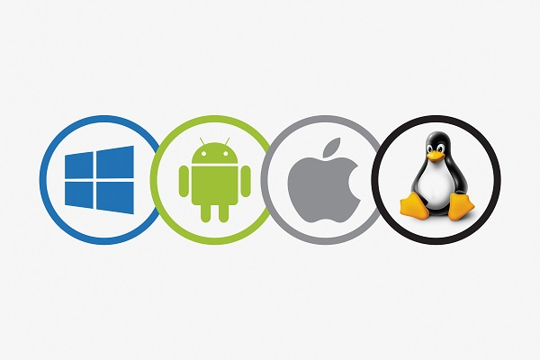
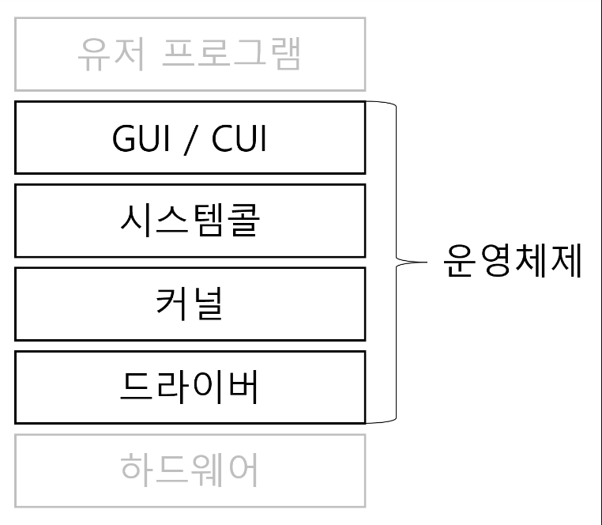
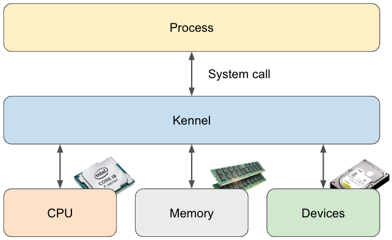
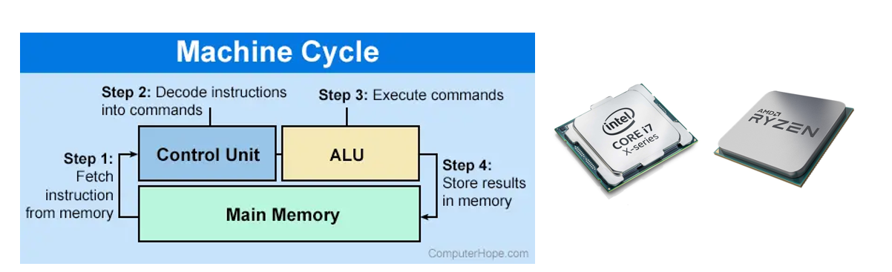
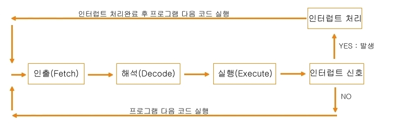
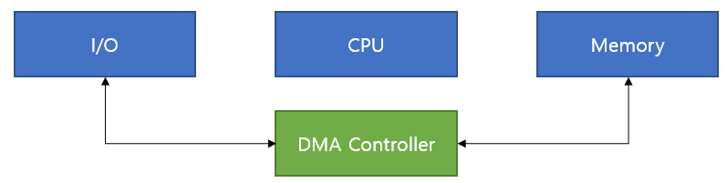
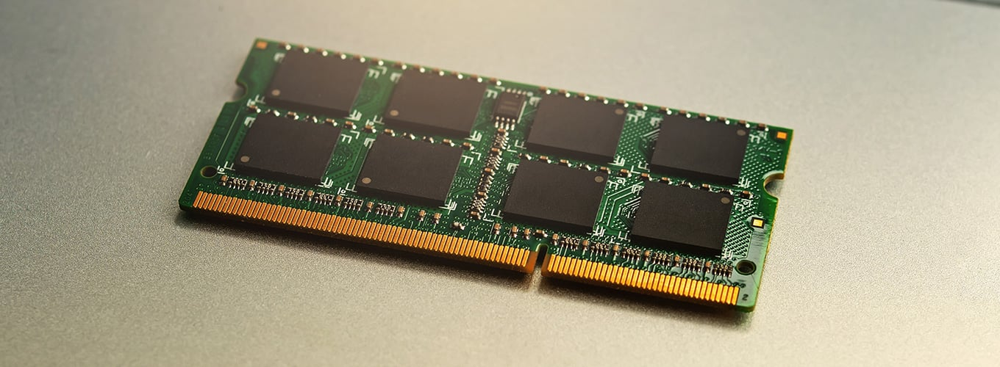

# 26. 운영체제

*CS 노트*

## 운영체제

#### 운영체제(OS, Operation System)는 사용자들이 컴퓨터를 더 편리하고 효율적으로 사용할 수 있도록, 컴퓨터의 하드웨어와 소프트웨어 자원을 관리해주는 시스템 소프트웨어다.

### 운영체제의 역할

- **자원 관리** : 컴퓨터 시스템 자원을 효율적으로 관리한다
  - **CPU 스케줄링과 프로세스 관리 : CPU 소유권을 프로세스에 할당을 하는 것을 관리한다**
    - 여기서 프로세스는, 메인 메모리에 할당 되어, 실행 상태인 프로그램을 말하는 것이다
    - 여러 프로세스가 열려있다면, 운영체제는 CPU 소유권 각각의 프로세스에게 할당을 한다
  - **메모리 관리 : 프로세스에 메모리를 할당하는 것을 관리한다**
    - 메모리는 한정적이라서, 효율적으로 할당을 해야 한다
  - **디스크 파일 관리 : 파일 보관 방법을 관리한다**
  - **I/O 디바이스 관리 : 키보드, 마우스 같은 디바이스들과 컴퓨터 간의 데이터를 송수신 하는 것을 관리**

- **자원 보호** : 다른 사용자가 데이터를 삭제 또는 접근하지 못 하도록 컴퓨터 자원을 보호해준다

- **인터페이스 제공** : 사용자들이 편하게 기기를 이용할 수 있도록 하드웨어 인터페이스와 사용자 인터페이스를 제공해준다

### 운영체제의 구조

#### GUI / CUI

> 전자 장치와 상호 작용 하는 방법이다

- **Graphic User Interface** : 클릭, 아이콘 등 사용자들이 보기 편할 수 있도록, 단순한 동작들을 통해 전자 장치와 상호 작용을 한다
- **Command User Interface** : 오직 명령어로 사용자가 전자 장치와 상호 작용을 하는 것이다

#### 시스템콜

> 운영체제에서 커널에 접근하기 위한 인터페이스며 유저 프로그램이 운영체제의 서비스를 받기 위한 커널 함수를 호출할 때 사용된다

1. 유저가 `Open()`을 통해 I/O 요청 트랩을 발동한다
2. I/O 요청이 확인이 되면 시스템콜을 통해 유저 모드에서 커널 모드로 변환이 된다
3. 커널 모드에서, 커널 함수를 통해 요청을 실행하게 된다

**유저 모드** : 유저가 접근할 수 있는 영역이며 컴퓨터 자원을 함부로 접근할 수 없다

**커널 함수** : 커널 모드에 있는 여러가지의 함수다

**modebit** : 시스템 콜이 작동 될 때 modebit을 통해 유저 모드와 커널 모드를 구분한다

- 1은 유저모드
- 0은 커널 모드다

#### 커널

> 운영 체제의 핵심이 되는 컴퓨터 프로그램이다. 
>
> 메모리 위에서 하드웨어와 응용 프로그램 사이에서 인터페이스를 제공하는 역할과 컴퓨터 자원들을 관리하는 역할을 한다
>
> 사용자와 상호 작용은 하지 않지만, 운영체제에서 핵심 역할을 하고 있

 

#### 드라이버

> 하드웨어를 제어하는 소프트웨어다

## 컴퓨터의 요소

> 컴퓨터는 CPU, DMA 컨트롤러, 메모리, 타이머, 디바이스 컨트롤러 등으로 이루어져 있다

### CPU (Central Processing Unit)

> #### 운영 체제에서 가장 중요한 부분이고, 운영 체제의 뇌라고 할 수 있다
>
> #### 메모리에 존재하는 명령어들을 해석해서 실행한다
>
> - 명령어에 따라 데이터를 인출, 처리, 쓰기를 한
>
> #### 산술논리연산장치, 제어 장치, 레지스터로 구성되어 있다

step 1에서, 메모리에 올려졌던 값은 레지스터에 올라가게 된다

그리고 step 3 이후, 계산된 값은 다시 레지스터에 올려지면서 메인 메모리에 전달이 된다

#### 산술논리연산장치 (Arithmetic Logic Unit, ALU)

- 연산을 담당하는 하드웨어 모듈이다
- 덧셈, 뺄셈 같은 두 숫자의 산술연산과 배타적 논리합, 논리곱 같은 논리연산을 계산하는 디지털 회로

#### 제어장치 (Control Unit, CU)

- 프로세서의 조작을 지시하며, I/O 장치 간 통신 및 조율을 제어한다
- 명령어들을 읽고 해석하며 데이터 처리를 위한 순서를 결정한다

#### 레지스터

- CPU 안의 임시 기억 장치다 (CPU 안의 작은 메모리)
- CPU와 직접적으로 연결이 되어 연산 속도는 메모리보다 훨씬 빠르다
- CPU는 저장 장치가 아니기에, 레지스터를 거쳐 데이터를 전달한다

> #### 인터럽트
>
> - 어떤 신호가 들어 왔을 때, CPU를 잠깐 정지시키고, 우선순위가 높은 일부터 처리하는 것이다
>
> 
>
> 하드웨어 인터럽트
>
> - 키보드 또는 마우스 등을 연결하거나 I/O 디바이스에서 발생하는 인터럽트를 말한다
>
> 소프트웨어 인터럽트
>
> - 프로세스 오류 등으로 프로세스가 시스템콜을 호출할 때 발동 된

### DMA (Direct Memory Access) 컨트롤러

- I/0 디바이스가 메모리에 접근을 할 수 있도록 도와주는 장치다
- CPU 부하를 막기 위해, CPU의 보조 역할을 한다 (CPU에는 많은 인터럽트 요청이 들어온다)
  - 여기서 DMA 컨트롤러는 CPU와 DMA 컨트롤러가 한번에 똑같은 일을 하는 것을 방지해 주는 역할을 한다

### 메모리

> RAM (Random Access Memory)를 메모리라고도 한다
>
> 전자회로에서 데이터, 상태, 명령어들을 기록하는 장치다

- CPU가 계산을 하면, RAM 또는 메모리는 계산한 데이터를 저장하는 역할을 한다
- 메모리가 크면 클 수록, 더 많은 작업을 할 수 있다

### 타이머

- 프로그램의 실행 시간이 너무 오랫동안 지속되는 것을 멈추기 위해 타이머를 걸어놨다
  - 실행 시간이 오래 걸린다는 것은, 프로그램에 문제가 생겼다는 것이다
- 무한 루프에 빠지게 되면, 평생 계산을 해야 하고, 그 계산한 값들 때문에 컴퓨터에 과부하가 걸릴 수 있다

### 디바이스 컨트롤러

- I/O 디바이스들의 작은 CPU다
