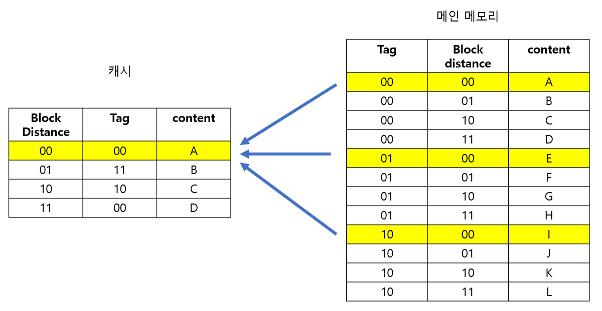

# 27. 운영체제 [메모리, 캐시]

*CS 노트*

## 메모리 계층

> 레지스터, 캐시는 CPU 내부에 존재한다
>
> 메인 메모리는 RAM을 가리키고, 주기억장치다
>
> - 일부 하드 디스크의 메모리를 복사해서, 임시 저장 후, CPU에 빠르게 전달을 한

#### 레지스터는 속도가 빠르지만, 용량이 적다

#### 하드 디스크는 속도는 느리지만, 용량이 많다

#### 이런 점들을 보완하기 위해, 메모리 계층 구조를 사용한다

## 캐시

> 데이터를 미리 저장해 놓은 임시 저장소이다
>
> 빠른 장치와 느린 장치 사이에서 속도 차이를 줄이는 역할을 하는 메모리다
>
> 예를 들어서 CPU와 메모리 속도 차이가 많이 나기 때문에, 레지스터를 **캐싱 계층**으로 둬서, 속도 차이에서 나타나는 병목 현상을 줄인다
>
> - 메인 메모리도 캐시 메모리와 하드 디스크 (보조 기억 장치)의 캐싱 계층이라고 할 수 있다

### 지역성의 원리

> 캐시 계층이 아닌, 캐시를 직접 설정할 때에는 자주 사용하는 데이터를 기반으로 임시 저장을 한다

#### 시간 지역성

- 최근 사용한 데이터를 다시 접근하는 것이다

#### 공간 지역성

- 최근 사용한 데이터의 공간에 접근을 하는 것이다

#### 캐시 히트와 캐시 미스

.png)

- 캐시에서 찾고자 하는 데이터를 찾으면 캐시 히트다
- 반대로 캐시에서 찾고자 하는 데이터를 못 찾고, RAM (주 메모리)에서 새로운 데이터를 찾을 때는 캐시 미스다
  - 데이터 스와핑이 이루어질 수 있다

### 웹 브라우저의 캐시

> 웹 브라우저의 캐시, 즉 소프트워에 캐시에는 대표적으로 쿠키, 로컬 스토리지, 세션 스토리지가 있다

#### 쿠키

- 주로 민감한 데이터를 다룬다
  - 예) 사용자 정보
- key와 value로 사용자의 행동 패턴 또는 정보를 저장하는 저장소 역할을 한다
- 그리고 만료 기한이 있고, 4KB까지 저장을 할 수 있다

#### 로컬 스토리지

- key와 value로 데이터를 저장한다

- 10MB까지 저장할 수 있으며, 사용자가 데이터를 삭제하는 것이 아니면 만료 기한이 없다

#### 세션 스토리지

- key와 value로 데이터를 저장한다

- 탭이 닫히면 데이터가 자동으로 사라진다
- 5MB까지 저장이 가능하다

### 캐시 매핑

> 캐시의 메모리는 작다
>
> 즉 메인 메모리에 저장되어 있는 데이터 일부 만을 임시로 저장을 시켜놓을 수 있다
>
> **여기서 메인 메모리의 일부 데이터를 캐시에 저장하는 것을 캐시 매핑이라고 한다**

#### 직접 매핑 (Directed Mapping)

- 블록 별로 나눌 수 있다
  - 태그 **00**끼리 하나의 블록이 되는 것이다
- 캐시 안에 블록 별로 하나의 데이터를 메인 메모리에서 꺼내 올 수 있다
  - 만약에 **A, E, I** 라는 데이터를 사용하고 싶다면, 3번을 스와핑을 해줘야 한다
  - **A, E, I** 는 같은 **00** 블록을 사용하기 때문에, 캐시 안에 다른 블록에 저장을 할 수 없다
  - 즉 **A**를 가지고 오고, 다음에는 **E**로 스와핑을 하고, **I**로 스와핑을 해야 한다
- 반대로 **A, B, C, D**를 필요로 하면, 한번에 데이터를 가지고 올 수 있다
  - 다 다른 블록에 존재한다

#### 연관 매핑 (Associative Mapping)

- 그냥 블록이나 어느 데이터 상관 없이 캐시에 올리는 것이다
- 스와핑이 적고, 충돌이 적다
- 하지만, 캐시의 모든 블록을 탐색해야 해서, 느리다

#### 집합 연관 매핑 (Set Associative Mapping)

- 직접 매핑과 연관 매핑을 합친 것
- 직접 매핑처럼, 집합으로 순서를 일치시킨다
- 위와 같이 **세트 1**에는 주소가 **0**인 데이터를 집어 넣을 수 있다
  - 그리고 그것을 기반으로 데이터를 매핑하면 된다

