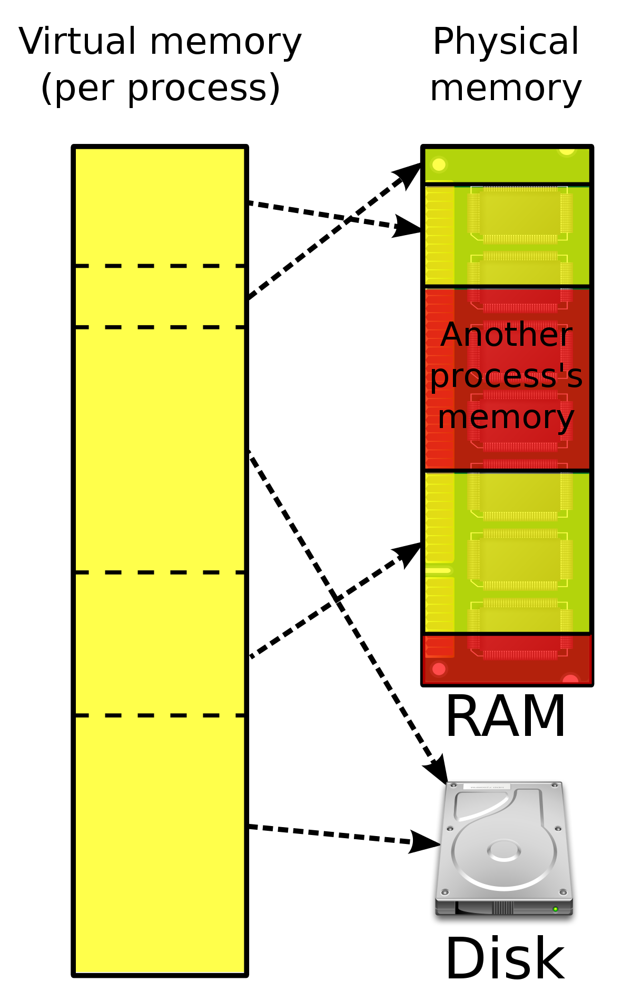
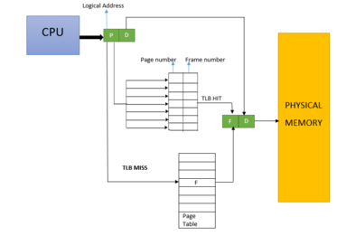
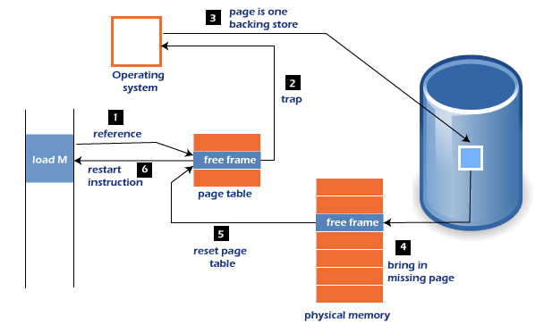
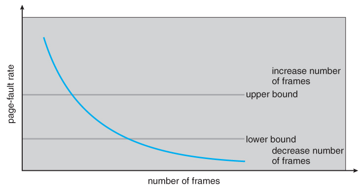

# 28. 운영체제 [가상메모리, 스와핑, 페이지폴트, 스레싱, 메모리 할당]

*CS 노트*

## 가상 메모리

> #### 메모리 관리 기법의 하나로 기계에 실제 이용 가능한 기억 자원을 이상적으로 추상화하여 사용자들에게 매우 큰 (주) 메모리로 보이게 만드는 것이다
>
> #### 주로 멀티테스킹 운영 체제에서 사용되고, 주 기억 장치 (RAM) 보다 큰 메모리 영역을 제공하는 방법으로도 사용된다

#### 가상으로 가상 주소 또는 논리 주소가 주어지고, 실제 메모리 상에는 물리 주소 또는 실 주소가 있다

- 여기서 가상 주소는 MMU(Memory Management Unit), 메모리 관리 장치를 통해 실제 주소로 변환된다
- TLB, '페이지 테이블'을 기반으로 가상 주소에서 물리 주소로 변환이 된다
  - TLB는 메모리와 CPU 사이에 있는 캐시다

### 스와핑

> 가상 메모리에는 존재하지만, 실제 RAM에 존재하지 않은 데이터를 접근하면 페이지 폴트가 발생한다
>
> 이때 RAM에 사용하지 않는 영역과, 필요한 영역을 하드 디스크와 바꾸는 것을 스와핑이라고 한다
>
> - 이렇게 스와핑이 일어나면, 페이지 폴트가 없는 것처럼 진행될 수 있

**페이지** : 가상 메모리를 사용하는 최소 크기 단위

**프레임** : 실제 메모리를 사용하는 최소 크기 단위

### 페이지 폴트

> 스와핑에서 설명했던 것과 같이, 가상 메모리에는 존재하는 데이터인데, RAM에는 없는 데이터가 있을 때 발생하는 것이다

1. 페이지가 접근이 허용되는지 안 되는지 확인을 한다
2. 접근이 허용이 안 될 경우, 트랩을 발동시키면서, 모든 프로세스가 중단된다
3. 시스템 내에 프레임을 프레임 리스트에서 찾는다
4. 물리 메모리에 없었던 페이지를 넣는다
5. 페이지 테이블에 없었던 페이지를 넣어 최신화 한다
6. 다시 작동을 시킨다

### 스레싱 (Thrashing)

> 페이지 폴트가 너무 많이 일어날 때를 의미한다
>
> 페이지 폴트가 너무 많을 경우, 스와핑이 증가한다는 것인데, 이때 컴퓨터의 성능 저하로 이어진다

#### 스와핑을 할 때에는 CPU 이용률이 낮아지고, 운영체제에서는 CPU가 일을 안 하는 줄 알고, 일을 계속 주게 된다

- 이게 계속 반복이 되면서 스레싱이 일어난다

#### 메모리를 늘리거나, HDD에서 SDD로 넘어가며 스레싱을 해결할 수 있따

#### 작업 세트

- 과거에 사용했던 이력을 통해 페이지 집합을 만들어 미리 메모리에 로드를 하는 것이다
- 예전에 사용했던 페이지 집합을 가지고 미리 메모리에 로드를 할 경우, 탐색이 줄어들고, 스와핑도 줄일 수 있다

#### PFF (Page Fault Frequency)

## 메모리 할당

> #### 메모리에 프로그램을 할당할 때에 시작 메모리 위치, 메모리의 할당 크기를 기반으로 할당을 한다
>
> #### 메모리 할당은 연속 할당과, 불연속 할당으로 나뉜다

### 연속 할당

- 연속된 하나의 큰 메모리에서 프로세스에 메모리를 할당시켜주는 것이다
- 프로세스가 순차적으로 공강에 할당이 되는 것이다

#### 고정 분할 방식

- 메모리를 미리 나누어 관리한다
- 메모리가 이미 나누어졌기 때문에, 프로그램을 넣을 때 공간보다 작아서 남는 공간이 생기거나, 커서 못 넣는 경우가 있을 수 있다

> **내부 단편화** : 아래의 그림에서 적재할 프로세스 20MB가 있는데 빈 공간 A와 빈 공간 B에 넣으면, 남는 메모리가 생긴다. 이것이 내부 단편화다
>
> **외부 단편화** : 프로그램이 더 커서 메모리 안에 못 들어가는 경우
>
> **홀** : 할당할 수 있는 비어 있는 메모리 공간을 뜻한다

#### 가변 분할 방식

- 프로그램의 크기에 맞게 동적으로 메모리를 나누는 것이다

- 내부 단편화는 발생하지 않지만 외부 단편화는 발생할 수 있다

> **최초적합** :  위에서 아래로 빈 공간, 홀을 찾으면서, 제일 첫 번째 홀을 찾는 것이다
>
> **최적적합** :  프로세스 크기가 더 크면서, 남은 공간이 제일 적은 공간이다
>
> **최악적합** : 프로세스 크기가 더 크면서, 남은 공간이 제일 많은 공간이다

### 불연속 할당

- 순차적으로 메모리를 할당하는 것이 아니다
- 하나의 프로세스가 물리적인 메모리의 여러 위치에 분산되어 올라갈 수 있는 메모리 할당 기법이다

#### 페이징

- 동일한 크기의 페이지 단위로 나누어 메모리의 서로 다른 위치에 프로세스를 할당하는 것이다
- 들어오는 프로세스를 나눠서 메모리에 올려 놓는 것이라서 홀에 대한 문제는 없어진다
- 하지만, 메모리에 분산되서 저장한 프로세스를 찾으려면, 주소 변환 절차가 연속할당 방식에 비해 복잡해진다

#### 세그멘테이션

- 세그먼트 단위로 나누는 것이다
- 코드와 데이터를 기반으로, 종류별로 나누는 것이다
  - 프로세스는 코드, 데이터, 스택, 힙으로 나눌 수 있는데, 각각 코드, 데이터, 스택, 힙 별로 나누는 것이다
  - 공유와 보안 측면에서 좋다 / 주소 변환도 복잡해지지 않는다
  - 홀 크기가 균일하지 않다

#### 페이지드 세그멘테이션

- 페이지와 세그멘테이션을 합친 것이다
- 공유와 보안을 의미 단위의 세그먼트로 나누고, 물리적 메모리는 페이지로 나눈다

### 페이지 교체 알고리즘

> 메모리가 한정적이라서 스와핑이 많이 일어난다
>
> 하지만 스와핑이 너무 많이 일어나면, 문제가 생길 수 있기 때문에, 페이지 교체 알고리즘을 통해 스와핑을 최소화 시킨다

#### 오프라인 알고리즘

- 제일 좋은 방법을 제공하는 알고리즘
- 미래에 참조되는 페이지와 현재 할당하는 페이지를 바꾸는 알고리즘이다
  - 미래에 사용될 프로세스를, 현재 할당되는 페이지와 스와핑을 하는 것이다
  - 하지만 미래에 사용될 프로세스를 정확하게 예측할 수 없다

#### FIFO (First In First Out)

- 가장 먼저 들어온 페이지를, 스와핑을 할 때에, 제일 먼저 스와핑을 한

#### LRU (Least Recently Used)

- 참조가 가장 오래된 페이지를 바꾸는 것이다

#### NUR (Not Used Recently)

- LRU에서 발전된 알고리즘이다
- 1과 0을 가진 비트를 사용하는데, 0은 최근에 참조되지 않았을 때, 1은 최근에 참조되었을 때를 의미한다

#### LFU (Least Frequently Used)

- 참조 횟수가 가장 적은 페이지를 교체하는 것이다
