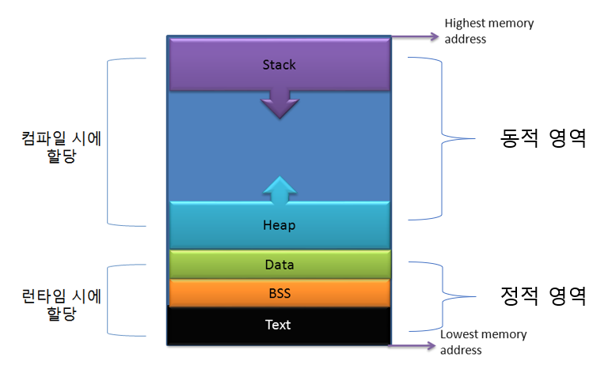

# 29. 운영체제 [프로세스, 스레드]

*CS 노트*

## 프로세스와 스레드

> #### 프로세스는 메모리 상에서 실행 중인 프로그램 (컴퓨터가 어떤 일을 하고 있는 상태)
>
> - 크롬도 열고, 워드를 열어서 공부를 하며 워드에 공부한 내용을 기록하는 것
>
> #### 스레드는 이 프로세스 안에서 실행되는 흐름 단위 (한 프로세스 내에서 여러 작업들이 동시 진행되는 것)
>
> - 크롬을 열어서, 동영상을 다운로드 받으면서, 뉴스를 보고, 노래를 듣는 것

#### 스레드는 싱글 스레드 프로세스 또는 멀티 스레드 프로세스를 가지고 있다

- 스레드는 실행 가능한 가장 작은 단위다

#### 프로세스는 코드, 데이터, 스택, 힙 메모리 영역을 기반으로 작업을 한다

- 자신만의 고유 공간과 자원을 할당 받아 사용할 수 있다 (다른 프로세스와 통신하기 위해서는 **IPC**를 사용한다)

#### 스레드는 프로세스 내의 스택 메모리 영역을 제외한 다른 메모리 영역을 프로세스 내 다른 스레드들과 공유를 한다

-  다른 스레드와 공간과 자원을 공유하면서 사용한다 (다른 스레드와의 정보 공유가 쉽다)

## 프로세스와 컴파일 과정

.png)

- **컴파일러**란 사람이 사용한 언어를 컴퓨터 언어로 중간에서 바꿔 주는 역할을 한다
- Java, C 언어 기반의 프로그램을 의미한다
  - 중간에 컴퓨터 언어로 번역되는 과정이 있어, **스크립트 언어**보다 더 빠르게 컴퓨터 언어로 더 빠르게 번역을 한다 (진행 속도가 더 빠름)
  - Python, Javascript처럼, 스크립트 언어는 중간 번역을 하는 것이 없어 실행 속도가 조금 더 느리다

#### 전처리

- 전치리기를 통해 소스 코드 파일 **(*.c)**을 전처리된 소스 코드 파일 **(*.i)**로 변환하는 과정
- **주석 제거** : 소스 코드에서 모든 주석을 제거한다 (컴퓨터는 읽을 필요가 없는 내용들이다)
- **헤더 파일 삽입** : #include 지시문을 발견하면 해당하는 헤더 파일을 찾아 헤더 파일에 있는 모든 내용을 복사해서 소스 코드에 삽입한다
- **매크로 치환 및 적용** : #define 된 내용으로 치환한다. 즉 매크로 이름을 찾아서 정의한 값으로 전부 바꿔준다

#### 컴파일러

- 컴파일러를 통해 전처리된 소스 코드 파일**(*.i)**를 어셈블리어 파일 **(*.s)**로 바꿔준다
- 오류 처리, 코드 최적화 작업이 이루어진

#### 어셈블러

- 목적 코드 (object code)로 변환된다 **(*.o)**

#### 링커

- 목적 코드는 라이브러리와 링크되어 '실행 가능한 파일'이 된다

>  #### 정적 라이브러리와 동적 라이브러리
>
> - **정적 라이브러리**
>   - 프로그램 빌드 시 라이브러리가 제공하는 모든 코드를 실행 파일에 넣는 것이다
>   - 외부 의존도가 낮지만, 메모리는 증가한다
> - **동적 라이브러리**
>   - 프로그램을 실행할 때만 DLL이라는 함수 정보를 통해 라이브러리를 참조하는 것이다
>   - 메모리 효율성이 뛰어나지만, 외부 의존도가 높아진다

## 프로세스의 메모리 구조

> #### 프로그램이 실행되기 위해서는 프로그램이 메모리에 로드(Load) 되어야 한다
>
> - 그리고 프로그램에서 사용되는 변수들을 저장할 메모리가 필요하다
>
> #### 프로그램이 운영체제로부터 할당 받는 메모리 공간을 메모리 구조라고 한다
>
> - 스택 영역 / 힙 영역 / 데이터 영역 / 코드 영역

### 스택 영역

> 함수의 호출과 관계되는 지역 변수와 매개변수가 저장되는 임시적인 영역이다

- 스택 영역은 함수 호출과 함께 할당이 되면, 함수 호출이 완료가 되면 없어진다
- 함수가 재귀적으로 호출되어 크기가 늘어날 것을 대비해서, 스택과 힙 영역 사이에 공간을 비워 놓는다
- 동적인 특징을 가지고 있다

### 힙 영역

> 사용자가 직접 관리할 수 있는 메모리 영역이면서, 꼭 실행이 되어야 하는 메모리 영역이다
>
> 즉 프로그래머가 할당/ 해제하는 메모리 공간이다

- 동적 할당할 때 사용되며 런타임 시 크기가 결정된다

#### 스택과 힙은 같은 공간을 공유한다. 그래서 스택은 위쪽 주소부터 할당이 되면, 힘은 아래 주소부터 할당이 된다. 여기서 스택과 힙의 서로의 공간을 침범을 할 수도 있다

### 데이터 영역

> Data 영역과 , BSS 영역으로 나뉜다
>
> 프로그램의 시작 동시에 메모리가 할당이 되며, 종료 후에는 메모리가 없어진다

- 프로그램의 전역 변수와 정적 변수가 저장되는 영역이다

### 코드 / 텍스트 영역

- 실행하는 프로그램의 코드가 저장되는 영역이다
- CPU는 코드 영역에 저장된 명령어를 하나씩 가져가서 처리를 한다

> **정적 할당**
>
> - **컴파일 단계**에서 메모리 공간을 할당 받는 것이다
>
> 
>
> **동적할당**
>
> - **실행 단계 / 런타임 단계**에서 메모리 공간을 할당 받는 것이다

