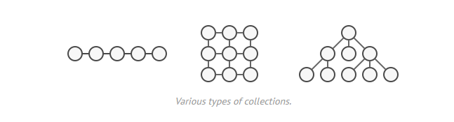
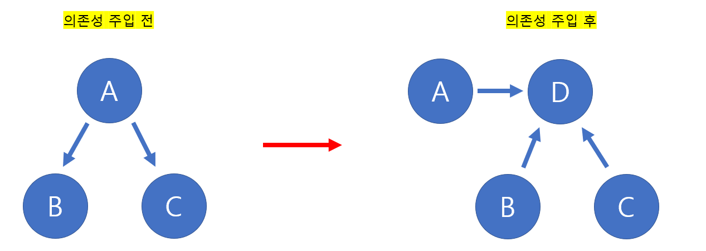

# 2. 디자인 패턴 (이터레이터 패턴, 의존성 주입)

#### 이터레이터 패턴, 의존성 주입

## 이터레이터 패턴 (iterator Pattern)

> #### 이터레이터를 사용하여 콜렉션의 요소들에 접근하는 디자인 패턴이다
>
> #### 즉 순회만 할 수 있다면, 어떠한 자료 구조든 이터레이터라는 하나의 인터페이스로 순회가 가능하다
>
> #### 한번에 여러 자료 구조를 순회할 수 있다

- **콜랙션** : 컨테이너라고도 불리면서, 배열, 트리 등, 동일한 요소들의 집합을 말한다
- **이터레이터 프로토콜** : 순회가 가능한 객체들을 순회할 때 쓰이는 규칙
- **이터러블한 객체** : 반복 가능한 객체로 배열을 일반화한 객체

## 의존성 주입

[참고](https://velog.io/@chobe1/%ED%8C%8C%EC%9D%B4%EC%8D%AC-Dependency-Injection-%EC%9D%98%EC%A1%B4%EC%84%B1-%EC%A3%BC%EC%9E%85)

> #### 의존 관계란, 서로 의존하는 것이다.
>
> - 즉 하나가 바뀌면, 다른 하나도 꼭 바뀌어 하는 것

- **의존성 주입 전**
  - A 와 B, A와 C 는 서로 의존하고 있다
  - 즉 A가 바뀌면 B와 C 모두 바뀌어야 한다
  - C가 바뀌면, A도 바뀌고 B도 바뀌어야 한다
- **의존성 주입 후**
  - D가 중간 허브 역할을 한다
  - D에서 B와 C의 인스턴스를 만들어 A가 사용을 할 수 있도록 해준

> 원래는 A가 B 또는 C를 직접 생성했다
>
> 의존성 주입을 하면 외부에서 B클래스의, 또는 C클래스의 인스턴스를 생성해서 주입해 주는 것이다
>
> - 즉 D를 통해서 B와 C의 인스턴스를 등록하고, A가 그 인스턴스를 사용하는 것이다

#### 의존 관계 역전 원칙 (*위키백과*)

- 상위 모듈은 하위 모듈에 의존해서는 안 된다. 상위 모듈과 하위 모듈 모두 추상화에 의존해야 한다
- 추상화는 세부 사항에 의존해서는 안된다. 세부사항이 추상화에 의존해야 한다

