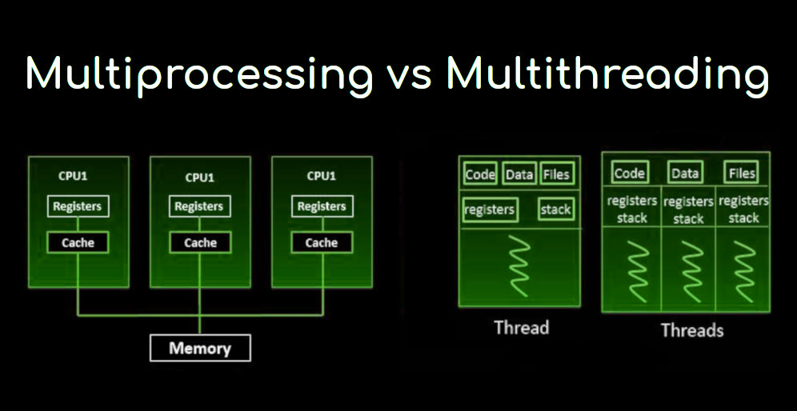

# 31. 운영체제 [멀티 프로세싱, 멀티 스레]

*출처 : 면접을 위한 CS전공지식 노트(책 / 강의)*

## 멀티프로세싱

> #### 여러 개의 프로세서가 일을 수행하는 것이다

#### 프로세스 같은 경우, 메모리를 다른 프로세스와 공유를 하지 않는다

- 하나 이상의 일을 병렬로 처리할 수 있다

- 프로세스의 메모리 일부에 문제가 생겨도, 다른 프로세스를 이용하여 처리할 수 있어 신뢰성이 높다

### 웹 브라우저의 멀티 프로세스

> 아래의 프로세스를 통해 웹 브라우저가 작동이 된다

- **브라우저 프로세스**
  - 주소 표시줄, 북마크, 방향 버튼, 네트워크 요청이나 파일 접근 같은 권한 담당
- **렌더러 프로세스**
  - 웹 사이트의 보이는 모든 것을 제어한다
- **플러그인 프로세스**
  - 웹 사이트의 필요한 플러그인을 제어한다
- **GPU 프로세스**
  - GPU를 이용해 화면에 그리는 부분을 제어한다

### IPC (Inter Process Communication)

> #### 프로세서끼리 정보를 공유 및 관리하는 메커니즘이다
>
> #### 공유 메모리, 파일, 소켓, 익명 파이프, 명명 파이프, 메세지 큐가 있다

#### 공유 메모리

> 공유 메모리를 이용해서 데이터를 주고 받는 것이다

- 메모리 자체를 공유하는 것이기 때문에, 불필요한 데이터 복사의 오버헤드가 발생하지 않는다
- **장점** : 커널 의존성이 적어 속도가 빠르고, 통신이 자유롭다
- **단점** : 자원과 데이터를 공유하는 것이라서 유요한 데이터를 잘 전달하기 위해서 동기화가 필요하다
- 하드웨어 관점에서 공유 메모리는 CPU 입장에서 RAM이 된다

#### 파일

- 디스크에 저장된 데이터 또는 파일 서버에서 제공한 데이터를 통해 데이터를 공유한다

#### 소켓

- 네트워크 상에서 프로세스 간에 통신하는 방식이다
- Local 그리고 Remote 통신이 가능하다
- TCP와 UDP가 있다

#### 익명 파이프

- 프로세스 간에 FIFO (FIrst In First Out) 방식으로 읽히는 임시 공간인 파이프를 기반으로 데이터를 주고 받는다
- 단방향 방식의 읽기 전용과 쓰기 전용 파이프를 만들어서 작동한다
- 부모, 자식 프로세스 간에만 사용할 수 있고, 다른 네트워크 상에서는 사용이 불가하다

#### 명명된 파이프

- 파이프 서버와 하나 이상의 파이프 클라이언트 간의 통신을 위한 명명된 단방향 또는 이중 파이프
- 서버용 파이프와 클라이언트용 파이프로 구분해서 작동하며 하나의 인스턴스를 열거나 여러 개의 인스턴스를 기반으로 통신한다

#### 메세지 큐

- 큐 데이터 구조 형태로 관리하는 것이다
- 고정 크기의 메세지를 연결 리스트를 통해 통신하는 방식
- 커널에서 전역적으로 관리되며 다른 IPC 방식에 비해서 사용 방법이 매우 직관적이고 간단하다
- 공유 메모리의 대안으로 많이 사용한다

.png)

## 멀티 스레딩

> #### 프로세스 내 작업을 여러 개의 스레드로 처리하는 기법이다
>
> - 스레드끼리 서로 자원을 공유를 할 수 있어 효율성이 높다
> - 메모리 구조에서 스레드들끼리 코드, 데이터, 힙을 서로 공유를 한다
> - 단 하나의 프로세스 안에 있는 스레드들끼리 공유가 가능하다

#### 웹 브라우저의 멀티 스레딩

- **렌더러 프로세스**
  - 메인 스레드 / 워커 스레드 / 컴포지터 스레드 / 레스터 스레드가 존재한다
