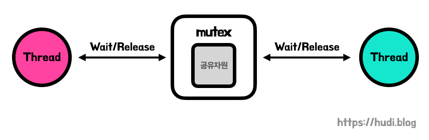
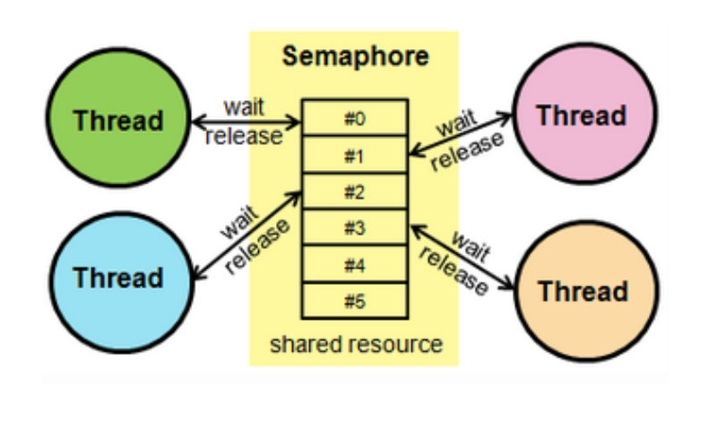

# 32. 운영체제 [공유 자원, 임계 영역]

*출처 : 면접을 위한 CS전공지식 노트(책 / 강의)*

## 공유 자원

> 공유 자원 : Shared resource

#### 여러 프로세스, 스레드가 공동으로 이용하는 모니터, 프린터, 변수, 메모리, 파일, 데이터 등의 자원

- 경쟁 상태 (Race condition) : 두 개 이상의 프로세스가 동시에 읽거나 쓰는 상황
  - 두 개 이상의 프로세스가 동시에 접근을 할 경우, 결과값에 영향을 줄 수 있다

- 원래는 결과값이 20만원이 아니라 35만원이어야 한다
- 하지만 **프로세스 P1과 프로세스 P2**가 동시에 접근하면서, 타이밍이 꼬여 20만원으로 결과값이 나왔다

## 임계 영역

#### 공유 자원 접근 순서에 따라 실행 결과가 달라지는 프로그램의 코드 영역

- 임계 영역 안에서 경쟁 상태 (race condition)이 일어난다

#### 공유자원을 해결하기 위해 세마포어, 뮤텍스, 모니터가 있다

- 이 방법들 모두 **상호 배제, 한정 대기, 융통성**이라는 조건을 만족한다
  - **상호 배제**
    - 한 프로세서가 임계 영역에 들어가면, 다른 프로세스는 들어갈 수 없다
  - **한정 대기**
    - 상호 배제 때문에 뒤에 기다리고 있는 프로세서들은 무한으로 대기할 수 없다
  - **융통성**
    - 임계 구역에 프로세스가 없으면, 어느 프로세스든 들어갈 수 있다

### 뮤텍스 (Mutex)

- 잠금 또는 잠금 해제 상태를 가진다 / **lock(), unlock()**
- 위의 이미지 같은 경우 **lock()**은 **Wait** 그리고 **unlock()**은 **Release**이다
  - 프로세스나 스레드가 공유 자원을 **lock()** 상태를 설정하여 코드 영역에 접근한다
  - 다른 프로세스나 스레드는 **lock()** 상태일 때에, 잠긴 코드 영역에 접근할 수 없다
  - 다른 프로세스나 스레드는 공유 자원이 **unlock()** 상태가 될 때, 코드 영역에 접근할 수 있다

> 화장실 칸에는 사람 한 명씩 들어갈 수 있다
>
> 한 칸을 사용할 때마다, 문을 잠가 두어, 다른 사람들이 못 들어오도록 한다
>
> 그 칸을 다 사용하고 난 후, 문이 열리고, 이때 다른 사람도 이용이 가능하다

### 세마포어 (Semaphore)

> 일반화된 뮤텍스다

- 여러 개의 프로세스에 의해서 공유되는 자원의 접근 제어를 위한 도구다
- **wait()** 와 signal()로 공유 자원에 대한 접근을 처리한다
  - **wait()** : 임계 구역에 들어가기 전, 자신의 차례가 올 때까지 기다리는 함 수
  - **signal()** : 임계 구역을 나갈 때, 다음 프로세스로 순서를 넘겨주는 함수

#### 바이너리 세마포어

- 0과 1의 두 가지 값만 가질 수 있다
- 뮤텍스와 매우 유사하여, 뮤텍스를 바이너리 세마포어라고 할 수 있다
  - 하지만 뮤텍스는 lock(), unlock() 기반으로, 잠금 메커니즘이 들어가 있다
  - 반대로 바이너리 세마포어는 시그널, 신호 기반으로 상호배제가 일어나는 신호 메커니즘이 들어간 객체이다

#### 카운팅 세마포어

- 여러 개의 값을 가질 수 있는 세마포어이며, 여러 자원에 대한 접근을 제어하는데 사용한다

> #### 뮤텍스 vs 세마포어
>
> - 세마포어에는 조건 변수가 없고, 프로세스가 세마포어 값을 수정할 때 다른 프로세스는 동시에 세마포어 값을 수정할 수 없다
> - 뮤텍스는 한 개의 프로세스 또는 스레드만 임계 영역에 접근할 수 있지만, 세마포어는 여러 개의 임계 영역 접근을 처리할 수 있다

### 모니터

- 공유 자원에 대한 접근 인터페이스를 제공한다
- 모니터 큐에서 프로세스들을 관리하고, 순차적으로 공유 자원에 접근 할 수 있도록 해준다
- 모니터는 세마포어보다 구현하기 쉽고, 상호 배제도 자동이다

## 교착 상태

> #### Deadlock, 둘 이상의 프로세스들이 자원을 점유한 상태에서 서로 다른 프로세스가 점유하고 있는 자원을 요구하며 무한정 기다리는 현상이다

### 교착 상태의 원인

- **상호 배제**
  - 한 프로세스가 이미 자원을 독점하고 있어, 다른 프로세스가 접근이 불가한 상태
- **점유 대기**
  - 자원을 최소한 하나 보유하고, 다른 프로세스에 할당된 자원을 점유하기 위해 대기하는 프로세스가 존재해야 한다
- **비선점**
  - 이미 할당된 자원은, 강제적으로 가지고 올 수 없다
- **환형 대기**
  - 프로세스 A와 프로세스 B가 있으면, 둘이 서로가 가지고 있는 자원을 요구하는 상황

### 교착 상태의 해결 방법

- 자원을 할당할 때, 교착 상태가 일어나지 않도록 설계를 한다 (매우 어려움)
- 교착 상태 가능성이 없을 때만 자원을 할당한다
  - 프로세스당 요청할 자원들의 최대치를 통해 자원 할당 가능 여부를 파악하는 '은행원 알고리즘을 사용한다'
- 교착 상태가 발생하면 사이클이 있는지 찾아보고 이에 관련된 프로세스를 한 개씩 지운다
- 교착 상태는 매우 드물기 때문에, 교착 상태가 발생하면 사용자가 작업을 그냥 종료한다 (응답 없음)

